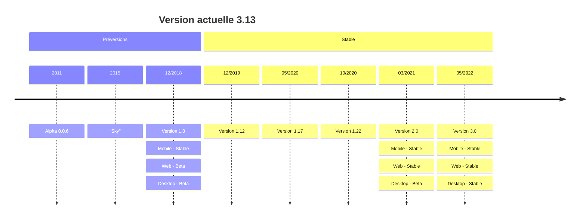
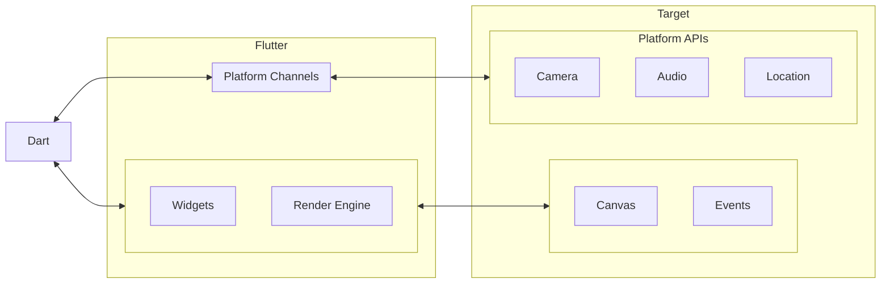
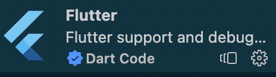
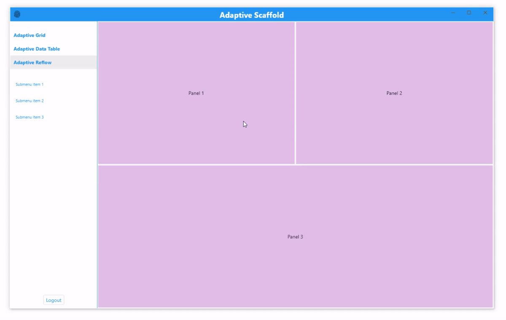
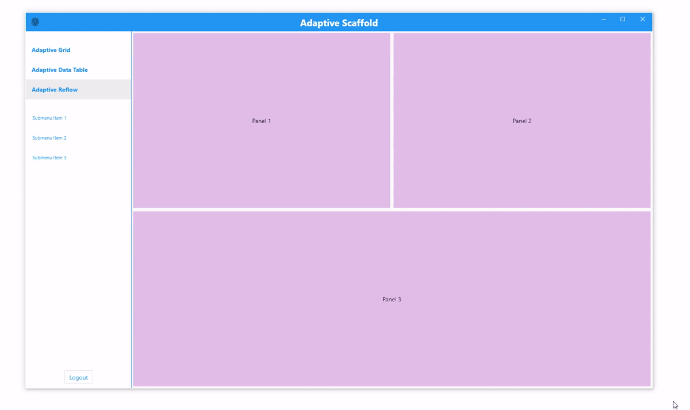
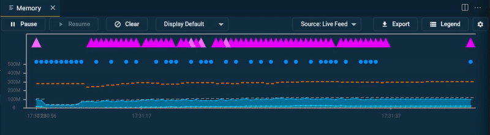
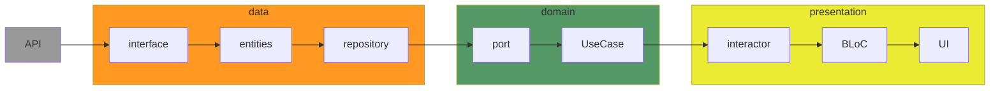

# 1 - Introduction

## 1.1 - Flutter: un peu de théorie

Flutter est un Framework développé par Google et permettant de développer des interfaces graphiques iOS, Android, Web, MacOS, Windows, Linux et Fuchsia à partir du même code source. Il fût dévoilé officiellement sous le nom de Sky en 2015, sa première version finale (1.0) fût déployée le 4 décembre 2018. A aujourd’hui, nous en sommes à la version 3.7 qui propose une expérience stable pour iOS, Android, Web, MacOS et Windows (Linux est encore en Beta)

Le framework fonctionne un peu comme nos moteurs de jeu Unity et Unreal Engine, le rendu est géré via le moteur graphique Skia et un accès aux SDK spécifiques aux plateformes gérées pour l’accès au matériel (Audio, Caméra, GPS, biométrie, etc)

Pour la partie graphique, nous avons le choix entre le moteur Cupertino (ressemblant à iOS) ou Material (Material Design de Google). Au cours de cette formation, nous ne verrons que la bibliothèque Material.





## 1.2 - Comment installer Flutter

L’OS à choisir est principalement lié à la cible de votre application : 

- Si vous voulez déployer pour iOS, padOS ou MacOS, préférez un Mac pour la présence de XCode
- Si vous souhaitez déployer sur le Windows Store, préférez un PC sous Windows 10 ou plus

Il est possible de déployer à partir du même code source vers les OS Apple et Microsoft mais il vous faudra deux machines

**MacOS**

En pré-requis, vous devez avoir installé XCode et ses outils de ligne de commande mais aussi avoir une licence développeur pour publier votre application.

Pour les Mac avec processeur Apple, vous devez avoir l’outillage de conversion Rosetta 

```bash
sudo softwareupdate --install-rosetta --agree-to-license
```

Avant toute chose, il faut préparer son environnement avec les commandes suivantes

```bash
$ sudo xcode-select --switch /Applications/Xcode.app/Contents/Developer
$ sudo xcodebuild -runFirstLaunch
```

Si vous n’avez pas encore installé Homebrew, je vous le conseille vivement, voici comment l’installer :

```bash
$ /bin/bash -c "$(curl -fsSL https://raw.githubusercontent.com/Homebrew/install/HEAD/install.sh)"
```

Une fois Homebrew installé, vous pouvez installer Cocoapods, si ce n’est pas déjà fait, et flutter

```bash
$ brew update
$ brew upgrade
$ brew install cocoapods
$ brew install flutter
$ flutter doctor
```

**Windows**

Quelques pré-requis matériels :

- Windows 10, 11 ou plus
- 2 Go d’espace libre

Voici les outils à installer :

- [PowerShell 5.0](https://docs.microsoft.com/en-us/powershell/scripting/install/installing-windows-powershell) ou plus
- [Git pour Windows](https://git-scm.com/download/win) 2+ avec ses outils de ligne de commande
- [Visual Studio 2022](https://visualstudio.microsoft.com/downloads/) ou [Visual Studio Build Tools 2022](https://visualstudio.microsoft.com/downloads/#build-tools-for-visual-studio-2022)

Vous pouvez maintenant télécharger la dernière version Stable du Framework adaptée à votre Système d’exploitation

[Flutter SDK releases](https://docs.flutter.dev/development/tools/sdk/releases)

Pour l’installer, il faut :

1. Décompresser le fichier zip vers un répertoire sans espace (de préférence, le dossier utilisateur directement ou vers un sous dossier `developpement`)
2. Ajouter le répertoire `<dossier flutter décompressé>/bin` au `PATH`
3. Lancer la commande `$ flutter doctor` et suivre les instructions restantes

Il est maintenant possible d’installer votre IDE préféré :

**Visual Studio Code**

1. Télécharger [VS Code](https://code.visualstudio.com/)
2. Installer les plugins [Flutter](https://marketplace.visualstudio.com/items?itemName=Dart-Code.flutter) et [Dart](https://marketplace.visualstudio.com/items?itemName=Dart-Code.dart-code)




**Android Studio ou IntelliJ**

1. Vous pouvez télécharger, au choix :
    - [Android Studio](https://developer.android.com/studio)
    - [IntelliJ Community](https://www.jetbrains.com/idea/download/)
    - [IntelliJ ULTIMATE](https://www.jetbrains.com/idea/download/)
2. Installer les plugin [Flutter](https://plugins.jetbrains.com/plugin/index?xmlId=io.flutter) et [Dart](https://plugins.jetbrains.com/plugin/index?xmlId=Dart)


<aside>
⚠️ Si vous obtenez l’erreur `Unable to find bundled Java version`

Vous devez, en premier lieu, vérifier votre variable d’environnement **JAVA_HOME** et ajouter le répertoire bin au **PATH**. Plus d’info sur la [documentation officielle Java](https://docs.oracle.com/en/java/javase/19/install/overview-jdk-installation.html).

Puis lancer ces lignes de commandes selon votre système d’exploitation :

Linux

```bash
cd ~/android-studio/
ln -s jbr jre
```

Windows

```bash
cd C:\Program Files\Android\Android Studio
mklink /D "jre" "jbr"
```

Mac OS

```bash
cd /Applications/Android\ Studio.app/Contents
ln -s jbr jre
```

</aside>

# 2 - Le Dart

## 2.1 - Fondamentaux

En Dart, comme dans d’autres langages (C++, Objective C, C#) tout votre code passera par une **fonction principale** appelée ***main***.

Le **code Dart qui s’exécutera** dans votre application ou votre page sera celui placé à **l’intérieur de cette fonction**.

```dart
void main() {
  print('Hello, World!');
}
```

Le langage Dart utilise la **Programmation Orientée Objet**(**POO**) comme d’autres langages plus anciens comme le **C++**, le **Swift** ou encore le **PHP**

Nous avons donc des classes

```dart
void main() {
  Startuper person = new Startuper();
  person.name = 'Elon Musk';
  person.company = 'SpaceX';
  print(person.createSentence());
}

class Startuper {
  String name = '';
  String company = '';
  
  String createSentence() {
    return '$name a créé $company';
  }
}
```

et de l’héritage

```dart
class Vehicle {
  String carCompany = '';
  String carModel = '';
  
  String getCompanyAndModel() {
    return 'La $carModel de chez $carCompany';
  }
}

class Car extends Vehicle {
  int seatNumber = 0;

  String getSeatNumber() {
    return '${this.getCompanyAndModel()} a $seatNumber sièges';
  }
}
```

## 2.2 - Variables, opérateurs et fonctions

La déclaration des variables se fait via le mot clé `var`

**Les conditions**

```dart
int age = 25;
if (age >= 18) {
  print('il est majeur');
} else {
  print('il est mineur');
}
```

**For**

```dart
for (int month = 1; month <= 12; month++) {
  print(month);
}
```

**ForEach**

```dart
List startups = ['Apple', 'Google', 'Facebook', 'Amazon'];
for (String name in startups) {
  print(name);
}

startups.forEach((name) => print(name));
```

**while**

```dart
int nombre = 0;
while(nombre < 6) { 
  print(nombre);
  nombre++; 
}

int i = 0;
List startups = ['Apple', 'Google', 'Facebook', 'Amazon'];
do {
  print('La startup ${startups[i]} se trouve à la case $i');
  i++;
} while (i < startups.length);
```

**Fonctions**

```dart
num soustraction(num nombre1, num nombre2) {
  return nombre1 - nombre2;
}

num multiplication(num nombre1, num nombre2) {
  return nombre1 * nombre2;
}

num division(num nombre1, num nombre2) {
  return nombre1 / nombre2;
}
```

## 2.3 - Les tests unitaires

La première chose est de déclarer l’outillage de tests unitaires

```yaml
dev_dependencies:
  flutter_test:
    sdk: flutter
```

Créons notre fichier de test

```bash
counter_app/
  lib/
    counter.dart
  test/
    counter_test.dart
```

Commençons par notre test

```dart
// Import the test package and Counter class
import 'package:counter_app/counter.dart';
import 'package:test/test.dart';

void main() {
  test('Counter value should be incremented', () {
    final counter = Counter();

    counter.increment();

    expect(counter.value, 1);
  });
}
```

En suivant le principe du test first, notre classe devrait ressembler à ça

```dart
class Counter {
  int value = 0;

  void increment() => value++;
}
```

Ajoutons plus de tests et faisons un groupe de tests

```dart
import 'package:counter_app/counter.dart';
import 'package:test/test.dart';

void main() {
  group('Counter', () {
    test('value should start at 0', () {
      expect(Counter().value, 0);
    });

    test('value should be incremented', () {
      final counter = Counter();

      counter.increment();

      expect(counter.value, 1);
    });

    test('value should be decremented', () {
      final counter = Counter();

      counter.decrement();

      expect(counter.value, -1);
    });
  });
}
```

Pour que nos tests passent au vert, nous devons apporter ces correctifs:

```dart
class Counter {
  int value = 0;

  void increment() => value++;

  void decrement() => value--;
}
```

### 2.3.1 - Snapshots

Pour vérifier la stabilité et la cohérence des Widgets, les tests snapshots sont particulièrement pratiques. Les tests snapshot permettent de capturer une image de l'état actuel d'un widget et de la comparer à une image de référence pour détecter les changements visuels. Cela permet de s'assurer que les modifications apportées au code n'ont pas affecté l'apparence du widget de manière inattendue.

Pour l’exemple, supposons que nous ayons un widget nommé `MyWidget`

```dart
class MyWidget extends StatelessWidget {
  final String text;
  MyWidget({required this.text});
  @override
  Widget build(BuildContext context) {
    return Text(text);
  }
}
```

Maintenant, créons notre test snapshot

```dart
import 'package:flutter_test/flutter_test.dart';
import 'package:flutter/material.dart';
import 'package:flutter/rendering.dart';
import 'package:flutter/services.dart';
import 'package:golden_toolkit/golden_toolkit.dart';
import 'package:my_app/my_widget.dart';

void main() {
  testWidgets('MyWidget should match snapshot', (WidgetTester tester) async {
    await tester.pumpWidgetBuilder(MyWidget(text: 'Hello'));
    await expectLater(find.byType(MyWidget), matchesGoldenFile('my_widget.png'));
  });
}
```

Dans ce code, nous avons utilisé le package **`golden_toolkit`** pour générer le test snapshot. La fonction **`pumpWidgetBuilder`** permet de créer le widget **`MyWidget`** avec le texte 'Hello', et la fonction **`matchesGoldenFile`** permet de vérifier que le widget correspond à l'image de référence **`my_widget.png`**.

# 3 - Les bases de Flutter

## 3.1 - Utilisation du CLI

### 3.1.1 - Flutter Doctor

Tout commence avec un `flutter doctor` ou `flutter doctor -v` pour plus de détails

Vous pouvez mettre à jour avec `flutter upgrade`

### 3.1.2 - Créer son application

```bash
flutter create mon_app
```

Attention, les nom de projet doivent être en minuscule sans caractère spécial ni accent autre que `_`

Nous pouvons aussi créer une application dans le répertoire courant

```powershell
flutter create .
```

### 3.1.3 - Packages pub.dev

(expliquer repositories, pub points, installation, mise à jour)

- Installer les packages du pubspec.yml avec `flutter pub get`
- Installer un nouveau package avec `flutter pub add <nom du package>`

Il est possible aussi d’utiliser des dépendances dans le code via

```yaml
dependencies:
  plugin1:
    path: ../plugin1/
```

Ou directement depuis un autre repository git

```yaml
dependencies:
  package1:
    git:
      url: git://github.com/flutter/packages.git
      path: packages/package1
```

La gestion des versions est proche de npm

```yaml
dependencies:
  url_launcher: '>=5.4.0 <6.0.0'
	collection: '^5.4.0'
```

## 3.2 - Notre première application

### 3.2.1 - Les Widgets

Un widget est l'élément de base dans une application Flutter. Un widget est une classe qui décrit comment doit être rendu un élément d'interface utilisateur (UI) dans l'application. Il peut s'agir d'un bouton, d'un champ de saisie de texte, d'une image ou de tout autre élément d'interface utilisateur.

Chaque widget a un ensemble de propriétés qui peuvent être utilisées pour personnaliser son apparence et son comportement, telles que la couleur, la taille, le texte, etc. Les widgets peuvent être imbriqués les uns dans les autres pour créer des structures d'interface utilisateur plus complexes.

Il existe deux types de widgets en Flutter : les widgets d'état et les widgets sans état. Les widgets sans état ne changent pas en fonction des interactions de l'utilisateur ou des changements de données, tandis que les widgets d'état peuvent changer leur apparence ou leur comportement en réponse à ces événements.

Il existe deux styles de conception différents dans le framework Flutter de Google : Cupertino et Material

Cupertino est le style de conception utilisé par Apple pour ses applications iOS. Il est souvent associé à des éléments de conception tels que des bordures arrondies, des couleurs vives et des icônes simples. Dans Flutter, Cupertino fournit des widgets qui imitent l'apparence et le comportement des widgets iOS. Les widgets Cupertino sont souvent utilisés pour créer des applications qui ont une apparence native sur les appareils Apple, tels que les iPhones et les iPads.

D'autre part, Material est le style de conception utilisé par Google pour ses applications Android. Il est basé sur des concepts tels que les surfaces, les ombres et les animations. Les widgets Material dans Flutter fournissent des éléments d'interface utilisateur tels que des boutons, des textes et des menus qui sont conçus pour ressembler aux widgets Android. Les applications Flutter qui utilisent des widgets Material ont une apparence native sur les appareils Android.

En résumé, la différence entre Cupertino et Material est que Cupertino imite le style de conception d'Apple pour iOS, tandis que Material imite le style de conception de Google pour Android.

```dart
import 'package:flutter/cupertino.dart';

class CupertinoTextExample extends StatelessWidget {
  @override
  Widget build(BuildContext context) {
    return CupertinoPageScaffold(
      navigationBar: CupertinoNavigationBar(
        middle: Text('Cupertino Text Example'),
      ),
      child: Center(
        child: Text(
          'Hello, World!',
          style: CupertinoTheme.of(context).textTheme.navLargeTitleTextStyle,
        ),
      ),
    );
  }
}
```

Dans cet exemple, nous avons utilisé le widget **`Text`** dans un **`CupertinoPageScaffold`** avec une barre de navigation **`CupertinoNavigationBar`**. Le style du texte est défini en utilisant le **`CupertinoTheme`** de l'application.

```dart
import 'package:flutter/material.dart';

class MaterialTextExample extends StatelessWidget {
  @override
  Widget build(BuildContext context) {
    return Scaffold(
      appBar: AppBar(
        title: Text('Material Text Example'),
      ),
      body: Center(
        child: Text(
          'Hello, World!',
          style: Theme.of(context).textTheme.headline4,
        ),
      ),
    );
  }
}
```

Dans cet exemple, nous avons utilisé le widget **`Text`** dans un **`Scaffold`** avec une **`AppBar`**. Le style du texte est défini en utilisant le **`Theme`** de l'application.

Pour mettre en page et gérer le Layout, il existe les widgets de base `Container` , `Column`, `Row` et `Stack`

**Container**

Le widget **`Container`** est un widget qui peut être utilisé pour définir une boîte rectangulaire décorative ou pour envelopper d'autres widgets. Il peut être utilisé pour définir des propriétés telles que la couleur de fond, la marge, le rembourrage, la bordure et la forme de la boîte.

**Column et Row**

Les widgets **`Column`** et **`Row`** sont utilisés pour organiser les widgets verticalement et horizontalement, respectivement. Les enfants de **`Column`** ou de **`Row`** sont disposés en fonction de leur ordre dans la liste et de la propriété **`mainAxisAlignment`**, qui définit comment les enfants sont alignés dans la direction principale (verticale pour **`Column`** et horizontale pour **`Row`**). Les propriétés **`crossAxisAlignment`** définissent comment les enfants sont alignés dans la direction transversale (horizontale pour **`Column`** et verticale pour **`Row`**).

**Stack**

Le widget **`Stack`** est utilisé pour empiler des widgets les uns sur les autres. Les enfants de **`Stack`** sont disposés en fonction de leur ordre dans la liste et de la propriété **`alignment`**, qui définit comment les enfants sont alignés les uns par rapport aux autres.

En utilisant ces widgets ensemble, vous pouvez créer des mises en page personnalisées en contrôlant la disposition et la position des widgets dans la fenêtre. Voici un exemple simple pour montrer comment vous pouvez les utiliser ensemble :

```dart
Container(
  color: Colors.grey[300],
  child: Column(
    mainAxisAlignment: MainAxisAlignment.center,
    children: [
      Row(
        mainAxisAlignment: MainAxisAlignment.spaceAround,
        children: [
          Text('Item 1'),
          Text('Item 2'),
          Text('Item 3'),
        ],
      ),
      SizedBox(height: 20),
      Stack(
        alignment: Alignment.center,
        children: [
          Container(
            width: 150,
            height: 150,
            color: Colors.red,
          ),
          Text('Stacked Text'),
        ],
      ),
    ],
  ),
)
```

Dans cet exemple, j’ai créé une **`Column`** avec deux enfants : une **`Row`** avec trois enfants et un **`Stack`** avec un **`Container`**et un **`Text`**. La propriété **`mainAxisAlignment`** de la **`Column`** est définie sur **`MainAxisAlignment.center`** pour centrer les enfants verticalement. La propriété **`mainAxisAlignment`** de la **`Row`** est définie sur **`MainAxisAlignment.spaceAround`** pour répartir les enfants horizontalement avec un espace égal entre eux. La propriété **`alignment`** du **`Stack`** est définie sur **`Alignment.center`** pour centrer les enfants les uns sur les autres.

Il existe, bien sûr, d’autres Widgets de base pour gérer la mise en page :

- Le widget **`Expanded`** est utilisé pour agrandir un enfant dans une **`Row`**, une **`Column`** ou un **`Flex`** pour remplir l'espace disponible dans la direction principale. Il est souvent utilisé en combinaison avec des widgets tels que **`Row`** ou **`Column`** pour étirer un enfant pour occuper tout l'espace restant.
- Le widget **`Flexible`** est similaire au widget **`Expanded`**, mais il permet également à l'enfant de se rétrécir pour s'adapter à l'espace disponible. Il est souvent utilisé pour créer des mises en page plus flexibles où les widgets peuvent s'adapter à différentes tailles d'écran.
- Le widget **`SizedBox`** est utilisé pour créer un espace vide avec une taille spécifique. Il peut être utilisé pour ajouter un espace vertical ou horizontal entre les widgets ou pour créer un espace vide à l'intérieur d'un widget.
- Le widget **`AspectRatio`** est utilisé pour maintenir un rapport d'aspect spécifique entre la largeur et la hauteur d'un enfant. Il peut être utilisé pour garantir que les images ou les vidéos sont affichées avec les bonnes proportions dans une mise en page.
- Le widget **`SingleChildScrollView`** est utilisé pour créer une vue déroulante qui permet à l'utilisateur de faire défiler le contenu d'un widget qui est trop grand pour tenir à l'écran. Il est souvent utilisé pour les listes ou les conteneurs qui contiennent beaucoup de contenu.

Si vous souhaitez en savoir plus sur la façon dont les widgets créent le rendu, j’ai rédigé un article sur Medium :

[Flutter, dessine-moi un Widget !](https://medium.com/just-tech-it-now/flutter-dessine-moi-un-widget-95a4dc5e1a6)

### 3.2.2 - Responsive Design

Le responsive design est une approche de conception et de développement de sites web et d'applications qui vise à créer des interfaces qui s'adaptent de manière fluide et efficace à différents appareils et tailles d'écran. L'objectif principal est de fournir une expérience utilisateur optimale, quelle que soit la plateforme utilisée, que ce soit un ordinateur de bureau, une tablette ou un smartphone.

La construction d'interfaces adaptatives consiste à concevoir et à développer des interfaces utilisateur qui s'ajustent automatiquement en fonction des caractéristiques de l'appareil et de l'espace d'affichage disponibles. Cela implique généralement l'utilisation de techniques de mise en page flexibles, de grilles fluides, de médias adaptatifs et d'autres outils et méthodes pour garantir que l'interface s'affiche correctement et de manière conviviale sur une variété de résolutions et de tailles d'écran.

L'objectif de la construction d'interfaces adaptatives est de créer des expériences utilisateur cohérentes et intuitives, quel que soit le périphérique utilisé par l'utilisateur. Cela nécessite une planification et une conception attentives, ainsi que l'utilisation de techniques de développement appropriées pour garantir une mise en page et une présentation adaptatives des contenus et des fonctionnalités.

**Layout Widgets**

Si vous avez déjà développé des applications ou des sites web, vous êtes probablement familier avec la création d'interfaces adaptatives. Heureusement pour les développeurs Flutter, il existe un large ensemble de widgets qui facilitent cette tâche.

Voici certains des widgets de mise en page les plus utiles de Flutter :

Single child (un seul enfant)

- [Align](https://api.flutter.dev/flutter/widgets/Align-class.html) : Aligne un enfant à l'intérieur de lui-même. Prend une valeur double entre -1 et 1 pour l'alignement vertical et horizontal.
- [AspectRatio](https://api.flutter.dev/flutter/widgets/AspectRatio-class.html) : Tente de dimensionner l'enfant selon un ratio d'aspect spécifique.
- [ConstrainedBox](https://api.flutter.dev/flutter/widgets/ConstrainedBox-class.html) : Impose des contraintes de taille sur son enfant, offrant un contrôle sur la taille minimale ou maximale.
- [CustomSingleChildLayout](https://api.flutter.dev/flutter/widgets/CustomSingleChildLayout-class.html) : Utilise une fonction déléguée pour positionner un seul enfant. Le délégué peut déterminer les contraintes de mise en page et le positionnement de l'enfant.
- [Expanded](https://api.flutter.dev/flutter/widgets/Expanded-class.html) et [Flexible](https://api.flutter.dev/flutter/widgets/Flexible-class.html) : Permettent à un enfant d'un `Row` ou d'un `Column` de se rétrécir ou de s'étendre pour remplir tout l'espace disponible.
- [FractionallySizedBox](https://api.flutter.dev/flutter/widgets/FractionallySizedBox-class.html) : Dimensionne son enfant à une fraction de l'espace disponible.
- [LayoutBuilder](https://api.flutter.dev/flutter/widgets/LayoutBuilder-class.html) : Construit un widget qui peut se réorganiser en fonction de la taille de ses parents.
- [SingleChildScrollView](https://api.flutter.dev/flutter/widgets/SingleChildScrollView-class.html) : Ajoute un défilement à un seul enfant. Souvent utilisé avec un `Row` ou un `Column`.

Multichild (plusieurs enfants)

- [Column](https://api.flutter.dev/flutter/widgets/Column-class.html), [Row](https://api.flutter.dev/flutter/widgets/Row-class.html) et [Flex](https://api.flutter.dev/flutter/widgets/Flex-class.html) : Positionnent les enfants dans une ligne horizontale ou verticale unique. Les widgets `Column` et `Row` étendent tous deux le widget `Flex`.
- [CustomMultiChildLayout](https://api.flutter.dev/flutter/widgets/CustomMultiChildLayout-class.html) : Utilise une fonction déléguée pour positionner plusieurs enfants lors de la phase de mise en page.
- [Flow](https://api.flutter.dev/flutter/widgets/Flow-class.html) : Similaire à `CustomMultiChildLayout`, mais plus efficace car il est effectué lors de la phase de dessin plutôt que de la phase de mise en page.
- `[ListView](https://api.flutter.dev/flutter/widgets/ListView-class.html)`, `[GridView](https://api.flutter.dev/flutter/widgets/GridView-class.html)`, et `[CustomScrollView](https://api.flutter.dev/flutter/widgets/CustomScrollView-class.html)` : Fournissent des listes défilables d'enfants.
- [Stack](https://api.flutter.dev/flutter/widgets/Stack-class.html) : Superpose et positionne plusieurs enfants par rapport aux bords du `Stack`. Fonctionne de manière similaire à "position: fixed" en CSS.
- [Table](https://api.flutter.dev/flutter/widgets/Table-class.html) : Utilise un algorithme de mise en page de tableau classique pour ses enfants, en combinant plusieurs lignes et colonnes.
- [Wrap](https://api.flutter.dev/flutter/widgets/Wrap-class.html) : Affiche ses enfants dans plusieurs lignes ou colonnes.

Pour découvrir plus de widgets disponibles et des exemples de code, consultez la documentation sur les [widgets de mise en page (Layout widgets)](https://docs.flutter.dev/ui/widgets/layout).

**Densité visuelle**

Les différents dispositifs d'entrée offrent divers niveaux de précision, qui nécessitent des zones de frappe de différentes tailles. La classe VisualDensity de Flutter facilite l'ajustement de la densité de vos vues sur l'ensemble de l'application, par exemple, en rendant un bouton plus grand (et donc plus facile à toucher) sur un dispositif tactile.

Lorsque vous changez la VisualDensity de votre MaterialApp, les MaterialComponents qui la supportent animent leurs densités pour correspondre. Par défaut, les densités horizontales et verticales sont réglées sur 0.0, mais vous pouvez régler les densités sur n'importe quelle valeur négative ou positive que vous voulez. En passant entre différentes densités, vous pouvez facilement ajuster votre interface utilisateur :



Pour définir une densité visuelle personnalisée, injectez la densité dans le thème de votre `MaterialApp` :

```dart
double densityAmt = touchMode ? 0.0 : -1.0;
VisualDensity density =
    VisualDensity(horizontal: densityAmt, vertical: densityAmt);
return MaterialApp(
  theme: ThemeData(visualDensity: density),
  home: MainAppScaffold(),
  debugShowCheckedModeBanner: false,
);

```

Pour utiliser `VisualDensity` dans vos propres vues, vous pouvez le récupérer ainsi :

```dart
VisualDensity density = Theme.of(context).visualDensity;

```

Non seulement le conteneur réagit automatiquement aux changements de densité, mais il s'anime également lorsqu'il change. Cela permet de lier vos composants personnalisés aux composants intégrés, pour obtenir un effet de transition fluide dans toute l'application.

Comme indiqué, `VisualDensity` est sans unité, donc il peut avoir différentes significations pour différentes vues. Dans cet exemple, une unité de densité équivaut à 6 pixels, mais cela dépend entièrement de vos vues. Le fait qu'il soit sans unité le rend très polyvalent, et il devrait fonctionner dans la plupart des contextes.

Il convient de noter que les composants de Material utilisent généralement une valeur d'environ 4 pixels logiques pour chaque unité de densité visuelle. Pour plus d'informations sur les composants pris en charge, consultez l'API `VisualDensity`. Pour plus d'informations sur les principes de densité en général, consultez le [guide Material Design](https://m2.material.io/design/layout/applying-density.html#usage).

**Layout contextuel**

- **ATTENTION !**
    
    
    

Si vous avez besoin de plus que des changements de densité et que vous ne trouvez pas de widget qui fait ce dont vous avez besoin, vous pouvez adopter une approche plus procédurale pour ajuster les paramètres, calculer les tailles, échanger des widgets ou restructurer complètement votre interface utilisateur pour s'adapter à un format spécifique.

Points de rupture basés sur l'écran
La forme la plus simple de mises en page procédurales utilise des points de rupture basés sur l'écran. Dans Flutter, cela peut être fait avec l'API `MediaQuery`. Il n'y a pas de règles strictes pour les tailles à utiliser ici, mais voici des valeurs générales :

```dart
class FormFactor {
  static double desktop = 900;
  static double tablet = 600;
  static double handset = 300;
}

```

En utilisant des points de rupture, vous pouvez mettre en place un système simple pour déterminer le type de périphérique :

```dart
ScreenType getFormFactor(BuildContext context) {
  // Utilisez .shortestSide pour détecter le type de périphérique indépendamment de l'orientation
  double deviceWidth = MediaQuery.sizeOf(context).shortestSide;
  if (deviceWidth > FormFactor.desktop) return ScreenType.Desktop;
  if (deviceWidth > FormFactor.tablet) return ScreenType.Tablet;
  if (deviceWidth > FormFactor.handset) return ScreenType.Handset;
  return ScreenType.Watch;
}

```

En alternative, vous pouvez l'abstraire davantage et le définir en fonction de petit à grand :

```dart
enum ScreenSize { Small, Normal, Large, ExtraLarge }

ScreenSize getSize(BuildContext context) {
  double deviceWidth = MediaQuery.sizeOf(context).shortestSide;
  if (deviceWidth > 900) return ScreenSize.ExtraLarge;
  if (deviceWidth > 600) return ScreenSize.Large;
  if (deviceWidth > 300) return ScreenSize.Normal;
  return ScreenSize.Small;
}

```

Les points de rupture basés sur l'écran sont le mieux utilisés pour prendre des décisions au niveau supérieur de votre application. Les changements tels que la densité visuelle, les marges ou les tailles de police sont mieux définis de manière globale.

Vous pouvez également utiliser des points de rupture basés sur l'écran pour réorganiser vos arbres de widgets de niveau supérieur. Par exemple, vous pouvez passer d'une disposition verticale à une disposition horizontale lorsque l'utilisateur n'est pas sur un téléphone :

```dart
bool isHandset = MediaQuery.sizeOf(context).width < 600;
return Flex(
    children: [Text('Foo'), Text('Bar'), Text('Baz')],
    direction: isHandset ? Axis.vertical : Axis.horizontal);

```

Dans un autre widget, vous pouvez également échanger certains des enfants complètement :

```dart
Widget foo = Row(
  children: [
    ...isHandset ? _getHandsetChildren() : _getNormalChildren(),
  ],
);

```

Utilisez `LayoutBuilder`pour une flexibilité supplémentaire
Bien que la vérification de la taille totale de l'écran soit idéale pour les pages en plein écran ou pour prendre des décisions de mise en page globales, ce n'est souvent pas idéal pour les sous-vues imbriquées. Souvent, les sous-vues ont leurs propres points de rupture internes et ne se soucient que de l'espace dont elles disposent pour être affichées.

La manière la plus simple de gérer cela dans Flutter est d'utiliser la classe `LayoutBuilder`. LayoutBuilder permet à un widget de répondre aux contraintes de taille locales entrantes, ce qui rend le widget plus polyvalent que s'il dépendait d'une valeur globale.

L'exemple précédent pourrait être réécrit en utilisant `LayoutBuilder` :

```dart
Widget foo = LayoutBuilder(
    builder: (context, constraints) {
  bool useVerticalLayout = constraints.maxWidth < 400;
  return Flex(
    children: [
      Text('Hello'),
      Text('World'),
    ],
    direction: useVerticalLayout ? Axis.vertical : Axis.horizontal,
  );
});

```

Ce widget peut maintenant être utilisé dans un panneau latéral, une boîte de dialogue ou même une vue en plein écran, et adapter sa mise en page à l'espace disponible.

Segmentation des périphériques
Il y a des moments où vous souhaitez prendre des décisions de mise en page en fonction de la plateforme réelle sur laquelle vous êtes, quelle que soit la taille. Par exemple, lors de la création d'une barre de titre personnalisée, vous devrez peut-être vérifier le type de système d'exploitation et ajuster la mise en page de votre barre de titre afin qu'elle ne soit pas recouverte par les boutons de fenêtre natifs.

Pour déterminer la combinaison de plateformes sur laquelle vous vous trouvez, vous pouvez utiliser l'API `Platform` avec la valeur `kIsWeb` :

```dart
bool get isMobileDevice => !kIsWeb && (Platform.isIOS || Platform.isAndroid);
bool get isDesktopDevice =>
    !kIsWeb && (Platform.isMacOS || Platform.isWindows || Platform.isLinux);
bool get isMobileDeviceOrWeb => kIsWeb || isMobileDevice;
bool get isDesktopDeviceOrWeb => kIsWeb || isDesktopDevice;

```

L'API Platform ne peut pas être utilisée dans les versions Web sans générer d'exception, car le package [dart.io](http://dart.io/) n'est pas pris en charge pour la cible Web. Par conséquent, ce code vérifie d'abord si c'est une version Web, et grâce à l'évaluation paresseuse, Dart n'appellera jamais Platform sur les cibles Web.

**Single Source of Truth**

Il vous sera probablement plus facile de maintenir vos vues si vous créez une seule source de vérité pour les valeurs de style comme le padding, l'espacement, la forme des coins, les tailles de police, etc. Cela peut être fait facilement avec quelques classes d'aide :

```dart
class Marges {
  static const double tresPetit = 3;
  static const double petit = 4;
  static const double moyen = 5;
  static const double grand = 10;
  static const double tresGrand = 20;
  // etc
}

class Polices {
  static const String raleway = 'Raleway';
  // etc
}

class StylesTexte {
  static const TextStyle raleway = const TextStyle(
    fontFamily: Polices.raleway,
  );
  static TextStyle texteBouton1 =
      TextStyle(fontWeight: FontWeight.bold, fontSize: 14);
  static TextStyle texteBouton2 =
      TextStyle(fontWeight: FontWeight.normal, fontSize: 11);
  static TextStyle h1 = TextStyle(fontWeight: FontWeight.bold, fontSize: 22);
  static TextStyle h2 = TextStyle(fontWeight: FontWeight.bold, fontSize: 16);
  static late TextStyle corps1 = raleway.copyWith(color: Color(0xFF42A5F5));
  // etc
}

```

Ces constantes peuvent ensuite être utilisées à la place de valeurs numériques codées en dur :

```dart
return Padding(
  padding: EdgeInsets.all(Marges.petit),
  child: Text('Bonjour!', style: StylesTexte.corps1),
);

```

Avec toutes les vues qui référencent les mêmes règles de système de design partagé, elles ont tendance à avoir un meilleur aspect et à être plus cohérentes. Modifier ou ajuster une valeur pour une plateforme spécifique peut être fait en un seul endroit, au lieu d'utiliser une recherche et un remplacement susceptibles d'erreur. L'utilisation de règles partagées a l'avantage supplémentaire d'aider à faire respecter la cohérence du côté du design.

Certaines catégories communes de système de design qui peuvent être représentées de cette manière sont :

- Les timings d'animation
- Les tailles et les points de rupture
- Les marges et les padding
- Le rayon des coins
- Les ombres
- Les traits
- Les familles de polices, les tailles et les styles

Comme la plupart des règles, il y a des exceptions : des valeurs uniques qui ne sont utilisées nulle part ailleurs dans l'application. Il n'y a pas grand intérêt à encombrer les règles de style avec ces valeurs, mais il vaut la peine de considérer si elles devraient être dérivées d'une valeur existante (par exemple, padding + 1.0). Vous devriez également surveiller la réutilisation ou la duplication des mêmes valeurs sémantiques. Ces valeurs devraient probablement être ajoutées à l'ensemble de règles de style global.

**Concevoir selon les forces de chaque format**

Au-delà de la taille de l'écran, vous devriez également passer du temps à considérer les forces et les faiblesses uniques de différents formats. Il n'est pas toujours idéal que votre application multiplateforme offre des fonctionnalités identiques partout. Réfléchissez si cela a du sens de se concentrer sur des capacités spécifiques, ou même de supprimer certaines fonctionnalités, sur certaines catégories de dispositifs.

Par exemple, les appareils mobiles sont portables et ont des caméras, mais ils ne sont pas bien adaptés pour un travail créatif détaillé. Avec cela à l'esprit, vous pourriez vous concentrer davantage sur la capture de contenu et le marquage avec des données de localisation pour une interface utilisateur mobile, mais vous concentrer sur l'organisation ou la manipulation de ce contenu pour une interface utilisateur de tablette ou de bureau.

Un autre exemple est l'exploitation de la facilité de partage extrêmement basse du web. Si vous déployez une application web, décidez quels liens profonds soutenir, et concevez vos itinéraires de navigation en tenant compte de ceux-ci.

La clé à retenir ici est de réfléchir à ce que chaque plateforme fait de mieux et de voir s'il y a des capacités uniques que vous pouvez exploiter.

**Ciblez le desktop pour tester rapidement**

L'une des méthodes les plus efficaces pour tester des interfaces adaptatives consiste à tirer parti des cibles de construction de desktop.

Lors de l'exécution sur desktop, vous pouvez facilement redimensionner la fenêtre pendant que l'application fonctionne pour prévisualiser différentes tailles d'écran. Cela, combiné avec le rechargement à chaud, peut considérablement accélérer le développement d'une interface utilisateur réactive.



**Touch first**

La construction d'une excellente interface utilisateur tactile peut souvent être plus difficile qu'une interface utilisateur de bureau traditionnelle, en partie à cause du manque d'accélérateurs d'entrée comme le clic droit, la molette de défilement ou les raccourcis clavier.

Une façon d'aborder ce défi est de se concentrer initialement sur une excellente interface utilisateur orientée tactile. Vous pouvez toujours faire la plupart de vos tests en utilisant la cible de bureau pour sa vitesse d'itération. Mais, n'oubliez pas de passer fréquemment à un appareil mobile pour vérifier que tout semble correct.

Une fois que vous avez peaufiné l'interface tactile, vous pouvez ajuster la densité visuelle pour les utilisateurs de la souris, puis superposer toutes les entrées supplémentaires. Abordez ces autres entrées comme des accélérateurs — des alternatives qui rendent une tâche plus rapide. La chose importante à considérer est ce qu'un utilisateur attend lorsqu'il utilise un dispositif d'entrée particulier, et travaillez à refléter cela dans votre application.

### 3.2.2 - Essayons avec une première application

Créons une liste d’articles, un peu comme le ferait Facebook…

Créez un nouveau projet Flutter en utilisant la commande :

```bash
flutter create mon_appli_articles
```

Accédez au répertoire de votre projet

```bash
cd mon_appli_articles
```

Ouvrez le fichier **`lib/main.dart`** dans votre éditeur de code

Remplacez le contenu du fichier **`main.dart`** par le code suivant :

```dart
import 'package:flutter/material.dart';

void main() {
  runApp(MonAppliArticles());
}

class MonAppliArticles extends StatelessWidget {
  @override
  Widget build(BuildContext context) {
    return MaterialApp(
      title: 'Liste d\'articles',
      theme: ThemeData(
        primarySwatch: Colors.blue,
      ),
      home: ListeArticles(),
    );
  }
}

class ListeArticles extends StatefulWidget {
  @override
  _ListeArticlesState createState() => _ListeArticlesState();
}

class _ListeArticlesState extends State<ListeArticles> {
  List<Article> articles = [
    Article(
      titre: 'Article 1',
      contenu: 'Ceci est le contenu de l\'article 1.',
    ),
    Article(
      titre: 'Article 2',
      contenu: 'Ceci est le contenu de l\'article 2.',
    ),
    // Ajoutez d'autres articles ici
  ];

  @override
  Widget build(BuildContext context) {
    return Scaffold(
      appBar: AppBar(
        title: Text('Liste d\'articles'),
      ),
      body: ListView.builder(
        itemCount: articles.length,
        itemBuilder: (context, index) {
          return Card(
            child: ListTile(
              title: Text(articles[index].titre),
              subtitle: Text(articles[index].contenu),
            ),
          );
        },
      ),
    );
  }
}

class Article {
  final String titre;
  final String contenu;

  Article({required this.titre, required this.contenu});
}
```

Ce code crée une application Flutter avec une liste d'articles affichés sous forme de cartes, similaires à Facebook. Les articles sont stockés dans une liste d'objets **`Article`** avec un titre et un contenu. Vous pouvez ajouter autant d'articles que vous le souhaitez en modifiant la liste **`articles`**.

Nous utilisons ici un `ListView.builder` plutôt qu’un `Column`pour plusieurs raisons :

1. **Gestion de la mémoire et performances :** **`ListView.builder`** utilise une technique appelée "lazy loading" pour construire et afficher les éléments de la liste. Cela signifie qu'il ne construit que les éléments qui sont actuellement visibles à l'écran, et quelques-uns supplémentaires dans les deux sens pour un défilement fluide. Lorsque vous faites défiler la liste, les éléments qui ne sont plus visibles sont recyclés et réutilisés pour construire de nouveaux éléments. Cela permet d'économiser de la mémoire et d'améliorer les performances, surtout lorsque vous affichez une longue liste d'éléments.
2. **Défilement intégré :** **`ListView.builder`** prend en charge le défilement par défaut, ce qui signifie que vous n'avez pas besoin d'utiliser un widget **`SingleChildScrollView`** pour permettre le défilement de la liste. En revanche, **`Column`** n'a pas de défilement intégré, vous devrez donc l'envelopper dans un **`SingleChildScrollView`** pour permettre le défilement.
3. **Construction à la demande :** Comme mentionné précédemment, **`ListView.builder`** ne construit que les éléments visibles à l'écran et quelques-uns supplémentaires. Cela peut être particulièrement utile si vous chargez des données à partir d'une API ou d'une source externe, car vous pouvez charger et afficher les éléments au fur et à mesure qu'ils sont nécessaires.

En résumé, **`ListView.builder`** est un choix plus performant et plus adapté pour afficher de longues listes d'éléments, car il gère la mémoire et les performances de manière optimisée. Cependant, si vous avez une liste courte et statique d'éléments qui tiennent tous à l'écran sans défilement, vous pouvez utiliser **`Column`**.

Bien sur, dans cet exemple nous utilisons des données statiques pour stocker nos articles. Dans une application destinée à la production, voici quelques solutions les plus courantes :

1. **API distante / Backend:** Vous pouvez créer un backend pour votre application en utilisant des technologies telles que Node.js, Django, Ruby on Rails ou tout autre framework backend pour stocker et gérer vos articles. L'application Flutter peut envoyer des requêtes HTTP à l'API pour récupérer, créer, mettre à jour et supprimer des articles.
2. **Firebase Realtime Database ou Cloud Firestore:** Firebase offre des services de base de données en temps réel et Cloud Firestore pour stocker et synchroniser des données entre les utilisateurs et les appareils en temps réel. Vous pouvez utiliser ces services pour stocker vos articles et les récupérer facilement dans votre application Flutter avec les SDK Firebase.
3. **Shared Preferences / Hive / Sembast:** Pour une solution locale sur l'appareil, vous pouvez utiliser Shared Preferences, Hive ou Sembast pour stocker vos articles. Shared Preferences est un moyen simple de stocker des données clé-valeur, tandis que Hive et Sembast sont des bases de données NoSQL qui peuvent être utilisées pour stocker des données structurées, telles que des objets d'article.
4. **SQLite:** SQLite est une base de données SQL locale et légère qui peut être utilisée pour stocker des données structurées. Vous pouvez utiliser le package **`sqflite`** pour intégrer SQLite à votre application Flutter et stocker vos articles dans une base de données locale.

Le choix de l'outil dépendra de vos besoins, de la complexité de votre application et de la manière dont vous souhaitez gérer les données des articles. Si vous souhaitez une solution en temps réel avec des fonctionnalités avancées, Firebase Realtime Database ou Cloud Firestore serait un bon choix. Si vous préférez une solution locale simple, Shared Preferences, Hive, Sembast ou SQLite pourrait être plus adapté.

<aside>
 **`ListTile`** est un widget Flutter qui est couramment utilisé pour représenter une seule ligne d'information dans une liste, généralement à l'intérieur d'un **`ListView`**. **`ListTile`** est très pratique pour présenter des éléments de liste structurés et faciles à lire.

Un **`ListTile`** typique inclut généralement les propriétés suivantes :

1. **`leading`**: Un widget placé au début de la tuile (à gauche pour les langues LTR, à droite pour les langues RTL). Il est généralement utilisé pour afficher une icône ou une image miniature.
2. **`title`**: Un widget placé après le widget **`leading`** (ou au début si **`leading`** n'est pas défini). Il est généralement utilisé pour afficher le texte principal de la tuile, comme un titre ou un nom.
3. **`subtitle`**: Un widget placé sous le widget **`title`**. Il est généralement utilisé pour afficher des informations supplémentaires ou secondaires, comme une description ou une date.
4. **`trailing`**: Un widget placé à la fin de la tuile (à droite pour les langues LTR, à gauche pour les langues RTL). Il est généralement utilisé pour afficher des actions secondaires, telles que des boutons ou des icônes d'action.

**`ListTile`** est également interactif, ce qui signifie que vous pouvez ajouter des actions lorsqu'il est tapoté, pressé longuement, etc. Les propriétés **`onTap`** et **`onLongPress`** sont utilisées pour ajouter des gestionnaires d'événements pour ces actions.

```dart
ListTile(
  leading: Icon(Icons.article),
  title: Text('Titre de l\'article'),
  subtitle: Text('Sous-titre ou description de l\'article'),
  trailing: Icon(Icons.more_vert),
  onTap: () {
    print('Article tapoté');
  },
  onLongPress: () {
    print('Article pressé longuement');
  },
)
```

Dans cet exemple, un **`ListTile`** est créé avec une icône, un titre, un sous-titre et une icône d'action. Lorsque l'utilisateur tapote ou presse longuement sur la tuile, des messages sont imprimés dans la console.

</aside>

### 3.2.3 - Animations

- Transitions avec Widget Hero
    
    *Documentation officielle : [https://docs.flutter.dev/development/ui/animations/hero-animations](https://docs.flutter.dev/development/ui/animations/hero-animations)*
    
    Le widget **`Hero`** dans Flutter est utilisé pour créer des animations de transition fluides entre deux écrans lorsqu'un élément commun est présent sur les deux écrans. Voici comment créer une animation de transition simple avec le widget **`Hero`**:
    
    1. Créez deux écrans (également appelés pages ou routes) dans votre application Flutter.
    2. Ajoutez un widget **`Hero`** sur le premier écran, en l'enveloppant autour de l'élément que vous souhaitez animer.
    3. Attribuez un identifiant unique au widget **`Hero`** en utilisant la propriété **`tag`**.
    4. Créez un deuxième écran avec un widget **`Hero`** ayant le même identifiant **`tag`**.
    5. Naviguez entre les deux écrans en utilisant le widget **`Navigator`**.
    
    **Écran 1 (main.dart) :**
    
    ```dart
    import 'package:flutter/material.dart';
    import 'package:your_package_name/second_screen.dart';
    
    void main() {
      runApp(MaterialApp(
        home: FirstScreen(),
      ));
    }
    
    class FirstScreen extends StatelessWidget {
      @override
      Widget build(BuildContext context) {
        return Scaffold(
          appBar: AppBar(
            title: Text('Premier écran'),
          ),
          body: Center(
            child: InkWell(
              onTap: () {
                Navigator.push(
                  context,
                  MaterialPageRoute(builder: (context) => SecondScreen()),
                );
              },
              child: Hero(
                tag: 'example-hero',
                child: Container(
                  width: 100,
                  height: 100,
                  color: Colors.red,
                ),
              ),
            ),
          ),
        );
      }
    }
    ```
    
    **Écran 2 (second_screen.dart) :**
    
    ```dart
    import 'package:flutter/material.dart';
    
    class SecondScreen extends StatelessWidget {
      @override
      Widget build(BuildContext context) {
        return Scaffold(
          appBar: AppBar(
            title: Text('Deuxième écran'),
          ),
          body: Center(
            child: Hero(
              tag: 'example-hero',
              child: Container(
                width: 200,
                height: 200,
                color: Colors.red,
              ),
            ),
          ),
        );
      }
    }
    ```
    
    Dans cet exemple, nous avons créé deux écrans, **`FirstScreen`** et **`SecondScreen`**. Sur le premier écran, nous avons un widget **`Container`** enveloppé dans un widget **`Hero`** avec un tag **`'example-hero'`**. Lorsque l'utilisateur appuie sur le widget **`Container`**, l'application navigue vers le deuxième écran qui contient également un widget **`Hero`** avec le même tag **`'example-hero'`**.
    
    Lors de la navigation entre les écrans, Flutter détecte automatiquement les widgets **`Hero`** ayant le même tag et crée une animation de transition entre eux. Dans cet exemple, le **`Container`** rouge s'agrandit et se rétrécit lors de la navigation entre les deux écrans.
    
- Animations de composants avec Widget Animator
    
    *Lien du package: [https://pub.dev/packages/animator](https://pub.dev/packages/animator)*
    
    Le package **`animator`** est un package Flutter qui simplifie la création d'animations en utilisant les animations implicites et les transitions. Pour utiliser le package **`animator`**, suivez ces étapes :
    
    1. Ajoutez le package **`animator`** à votre projet en ajoutant cette ligne à votre fichier **`pubspec.yaml`** sous **`dependencies`** :
        
        ```dart
        dependencies:
          flutter:
            sdk: flutter
          animator: ^3.2.0
        ```
        
    2. Exécutez la commande **`flutter packages get`** pour installer le package.
    3. Importez le package dans le fichier où vous souhaitez l'utiliser :
        
        ```dart
        import 'package:animator/animator.dart';
        ```
        
    4. 1. Utilisez le widget **`Animator`** pour créer des animations. Voici un exemple d'utilisation du package **`animator`** pour animer un widget **`Container`** :
        
        ```dart
        import 'package:flutter/material.dart';
        import 'package:animator/animator.dart';
        
        void main() {
          runApp(MaterialApp(home: MyApp()));
        }
        
        class MyApp extends StatelessWidget {
          @override
          Widget build(BuildContext context) {
            return Scaffold(
              appBar: AppBar(title: Text('Exemple Animator')),
              body: Center(
                child: Animator<double>(
                  tween: Tween<double>(begin: 0, end: 2 * 3.141592),
                  duration: Duration(seconds: 2),
                  cycles: 0,
                  builder: (context, animatorState, child) => Transform.rotate(
                    angle: animatorState.value,
                    child: Container(
                      width: 100,
                      height: 100,
                      color: Colors.blue,
                    ),
                  ),
                ),
              ),
            );
          }
        }
        ```
        
    
    Dans cet exemple, nous utilisons le widget **`Animator<double>`** pour créer une animation de rotation. Nous définissons une **`Tween<double>`** pour animer les valeurs entre 0 et 2π (un tour complet), avec une durée de 2 secondes. La propriété **`cycles`** est définie sur 0, ce qui signifie que l'animation tournera en boucle indéfiniment. Le **`builder`** prend en compte le contexte, l'état de l'animateur et un widget enfant, et retourne un widget **`Transform.rotate`** avec l'angle défini par la valeur de l'état de l'animateur.
    
    Vous pouvez personnaliser l'animation en utilisant différentes propriétés et méthodes fournies par le package **`animator`**, telles que la vitesse, les courbes d'animation, les retards, les écouteurs d'état, etc. Consultez la documentation du package pour en savoir plus sur les fonctionnalités et les options disponibles.
    

Flutter offre plusieurs outils et méthodes pour créer de belles animations dans vos applications. Nous en avons vu deux ici mais il en existe d’autres.

En voici une liste un peu plus complète :

1. **TweenAnimationBuilder:** Ce widget simplifie la création d'animations impliquant des valeurs interpolées (tweens) entre une valeur de début et une valeur de fin sur une durée spécifiée.
2. **AnimatedContainer, AnimatedOpacity, AnimatedPositioned, etc.:** Ces widgets sont des versions animées de widgets communs qui permettent d'animer certaines propriétés, telles que la taille, la position ou l'opacité.
3. **AnimationController:** C'est le cœur des animations explicites dans Flutter. Il vous permet de contrôler les animations, y compris la lecture, la pause, l'arrêt, l'inversion et la personnalisation de la durée et des courbes d'animation.
4. **Curves:** Les courbes d'animation déterminent le rythme des animations. Flutter fournit une liste de courbes prédéfinies, telles que **`Curves.linear`**, **`Curves.easeInOut`**, **`Curves.bounceIn`**, etc., pour personnaliser l'accélération et la décélération de vos animations.
5. **Tween:** Les objets **`Tween`** sont utilisés pour définir une interpolation entre une valeur de début et une valeur de fin. Ils peuvent être utilisés avec **`AnimationController`** pour créer des animations personnalisées.
6. **Hero:** Comme nous l’avons vu, le widget **`Hero`** permet de créer des animations de transition entre deux écrans lorsqu'un élément commun est présent sur les deux écrans. Il est particulièrement utile pour créer des animations fluides lors de la navigation.
7. **Flare/Rive:** Rive (anciennement Flare) est un outil tiers qui vous permet de créer des animations vectorielles et des illustrations interactives directement dans votre application Flutter. Rive offre un éditeur graphique en ligne pour créer des animations et les exporter pour être utilisées dans votre projet Flutter.
8. **Lottie:** Lottie est une bibliothèque développée par Airbnb qui permet de lire des animations After Effects exportées en JSON. Vous pouvez utiliser le package **`lottie`** pour Flutter afin d'intégrer facilement des animations Lottie dans votre application.
9. **PageView et PageController:** Ces widgets vous permettent de créer des animations de défilement personnalisées entre plusieurs pages ou écrans, avec une prise en charge intégrée des gestes de balayage et des animations de transition fluides.
10. **CustomPainter et CustomClipper:** Ces classes vous permettent de créer des animations en dessinant ou en rognant des formes et des motifs personnalisés à l'aide de l'API de dessin de Flutter. Vous pouvez les combiner avec des animations pour créer des effets visuels uniques et personnalisés.
11. **Animator:** Comme nous l’avons vu, le package **`animator`** est un package Flutter qui simplifie la création d'animations en utilisant les animations implicites et les transitions.
12. **animated_background:** Permet d’ajouter des systèmes d’animation de votre fond de Scaffold ou autre container. Il n’anime pas de la même façon que les packages nommés plus haut, mais crée une sorte d’image animée en arrière plan de votre Widget.

Ces outils et méthodes peuvent être combinés de différentes manières pour créer des animations complexes et attrayantes dans vos applications Flutter. La meilleure façon de maîtriser ces techniques est de les essayer et de les expérimenter dans vos projets. La documentation de Flutter propose de nombreux exemples et tutoriels pour vous aider à démarrer avec les animations.

Nous pouvons aussi animer le contenu sans créer d’animation en tant que tel. L’effet parallaxe en est le fait exemple : un effet de parallaxe crée une illusion de profondeur en déplaçant des éléments à des vitesses différentes lors du défilement ou de l'interaction de l'utilisateur. 

Voici comment créer un effet de parallaxe simple dans Flutter en utilisant **`Stack`** et **`ListView`** :

1. Créez une nouvelle application Flutter et ouvrez le fichier **`lib/main.dart`**.
2. Remplacez le code existant par le code suivant :
    
    ```dart
    import 'package:flutter/material.dart';
    
    void main() {
      runApp(MaterialApp(
        home: ParallaxEffect(),
      ));
    }
    
    class ParallaxEffect extends StatelessWidget {
      @override
      Widget build(BuildContext context) {
        return Scaffold(
          appBar: AppBar(
            title: Text('Effet Parallaxe'),
          ),
          body: Stack(
            children: [
              ParallaxBackground(),
              ListView.builder(
                itemCount: 30,
                itemBuilder: (context, index) {
                  return ListTile(
                    title: Text('Elément $index'),
                  );
                },
              ),
            ],
          ),
        );
      }
    }
    
    class ParallaxBackground extends StatefulWidget {
      @override
      _ParallaxBackgroundState createState() => _ParallaxBackgroundState();
    }
    
    class _ParallaxBackgroundState extends State<ParallaxBackground> {
      final ScrollController scrollController = ScrollController();
    
      @override
      void initState() {
        super.initState();
        scrollController.addListener(() {
          setState(() {});
        });
      }
    
      @override
      void dispose() {
        scrollController.dispose();
        super.dispose();
      }
    
      @override
      Widget build(BuildContext context) {
        return Positioned(
          top: -0.3 * scrollController.offset,
          left: 0,
          right: 0,
          bottom: 0,
          child: Image.network(
            'https://images.unsplash.com/photo-1592194996308-7b43878e84a6?crop=entropy&cs=tinysrgb&fit=max&fm=jpg&ixid=MXwyMjg5NzB8MHwxfGFsbHwxMnwxfHx8fHx8fHx8fHwxNjEyMjA1MzE&ixlib=rb-1.2.1&q=80&w=400',
            fit: BoxFit.cover,
          ),
        );
      }
    }
    ```
    

Dans cet exemple, nous avons créé une application Flutter avec un effet de parallaxe simple. La classe **`ParallaxEffect`** est un **`StatelessWidget`** qui contient un **`Scaffold`** avec une **`Stack`**. La **`Stack`** contient un widget **`ParallaxBackground`** et une **`ListView`**. Le widget **`ParallaxBackground`** est un **`StatefulWidget`** qui gère l'animation de l'image d'arrière-plan.

Nous avons ajouté un **`ScrollController`** dans **`_ParallaxBackgroundState`** pour écouter les événements de défilement. Dans la méthode **`build`**, nous avons utilisé un widget **`Positioned`** pour déplacer l'image d'arrière-plan en fonction de l'offset du défilement. Nous avons défini **`top`** avec une valeur de **`-0.3 * scrollController.offset`**. Le facteur **`-0.3`** détermine la vitesse de l'effet parallaxe. Vous pouvez ajuster cette valeur pour obtenir un effet de parallaxe plus rapide ou plus lent.

Lorsque vous faites défiler la **`ListView`**, l'image d'arrière-plan se déplace à une vitesse différente, créant un effet de parallaxe.

L'effet de parallaxe dans cet exemple est assez simple et basique. Vous pouvez l'améliorer et le personnaliser en ajoutant des couches supplémentaires, en ajustant les vitesses de défilement et en expérimentant avec différentes animations pour créer un effet de parallaxe plus impressionnant et attrayant. L’important reste d’expérimenter.

# 4 - Utiliser Firebase

## 4.1 - Configurer Firebase pour Flutter

## **Étape 1** : Installez les outils de ligne de commande requis

1. [I](https://firebase.google.com/docs/cli?hl=fr#setup_update_cli)nstallez le CLI Firebase
    
    ```dart
    curl -sL https://firebase.tools | bash
    ```
    
2. Connectez-vous à Firebase à l'aide de votre compte Google en exécutant la commande suivante :
    
    ```
    firebase login
    ```
    
3. Installez la CLI FlutterFire en exécutant la commande suivante depuis n'importe quel répertoire :
    
    ```
    dart pub global activate flutterfire_cli
    ```
    

## **Étape 2** : Configurez vos applications pour utiliser Firebase

Utilisez la CLI FlutterFire pour configurer vos applications Flutter pour qu'elles se connectent à Firebase.

Depuis votre répertoire de projet Flutter, exécutez la commande suivante pour démarrer le workflow de configuration de l'application :

```dart
flutterfire configure
```

- **Que fait la commande `flutterfire configure` ?**
    
    Le flux de travail `flutterfire configure` effectue les opérations suivantes :
    
    - Vous demande de sélectionner les plates-formes (iOS, Android, Web) prises en charge dans votre application Flutter. Pour chaque plate-forme sélectionnée, la CLI FlutterFire crée une nouvelle application Firebase dans votre projet Firebase.
        
        Vous pouvez choisir d'utiliser un projet Firebase existant ou de créer un nouveau projet Firebase. Si vous avez déjà des applications enregistrées dans un projet Firebase existant, la CLI FlutterFire tentera de les faire correspondre en fonction de la configuration actuelle de votre projet Flutter.
        
        > **Remarque :** Voici quelques conseils sur la configuration et la gestion de votre projet Firebase :
            ◦ Consultez nos [bonnes pratiques](https://firebase.google.com/docs/projects/dev-workflows/general-best-practices?hl=fr) pour ajouter des applications à un projet Firebase, y compris comment gérer plusieurs variantes.
            ◦ [Activez Google Analytics](https://support.google.com/firebase/answer/9289399?hl=fr#linkga) dans votre projet, ce qui vous permet d'avoir une expérience optimale avec de nombreux produits Firebase, comme Crashlytics et Remote Config.
        > 
    - Crée un fichier de configuration Firebase ( `firebase_options.dart` ) et l'ajoute à votre répertoire `lib/` .
        
        > **Remarque :** Ce fichier de configuration Firebase contient des identifiants uniques, mais non secrets, pour chaque plate-forme que vous avez sélectionnée.Consultez [Comprendre les projets Firebase](https://firebase.google.com/docs/projects/learn-more?hl=fr#config-files-objects) pour en savoir plus sur ce fichier de configuration.
        > 
    - *(pour Crashlytics ou Performance Monitoring sur Android)* Ajoute les plugins Gradle spécifiques au produit requis à votre application Flutter.
        
        > **Remarque :** Pour que la CLI FlutterFire ajoute le plug-in Gradle approprié, le plug-in Flutter du produit doit déjà être importé dans votre application Flutter.
        > 

<aside>
⚠️ Après cette exécution initiale de **flutterfire configure**, vous devez réexécuter la commande chaque fois que vous :

- Commencez à prendre en charge une nouvelle plate-forme dans votre application Flutter.
- Commencez à utiliser un nouveau service ou produit Firebase dans votre application Flutter, surtout si vous commencez à vous connecter avec Google, Crashlytics, Performance Monitoring ou Realtime Database.

La réexécution de la commande garantit que la configuration Firebase de votre application Flutter est à jour et (pour Android) ajoute automatiquement tous les plugins Gradle requis à votre application.

</aside>

## **Étape 3** : Initialisez Firebase dans votre application

1. Depuis le répertoire de votre projet Flutter, exécutez la commande suivante pour installer le plugin principal :
    
    ```bash
    flutter pub add firebase_core
    ```
    
2. Depuis le répertoire de votre projet Flutter, exécutez la commande suivante pour vous assurer que la configuration Firebase de votre application Flutter est à jour :
    
    ```bash
    flutterfire configure
    ```
    
3. Dans votre fichier `lib/main.dart` , importez le plug-in principal Firebase et le fichier de configuration que vous avez généré précédemment :
    
    ```dart
    import 'package:firebase_core/firebase_core.dart';
    import 'firebase_options.dart';
    ```
    
4. Toujours dans votre fichier `lib/main.dart` , initialisez Firebase à l'aide de l'objet `DefaultFirebaseOptions` exporté par le fichier de configuration :
    
    ```dart
    await Firebase.initializeApp(
      options: DefaultFirebaseOptions.currentPlatform,
    );
    ```
    
5. Reconstruisez votre application Flutter :
    
    ```bash
    flutter run
    ```
    

## **Étape 4** : Ajouter des plugins Firebase

Vous accédez à Firebase dans votre application Flutter via les différents [plugins Firebase Flutter](https://firebase.google.com/docs/flutter/setup?hl=fr&platform=ios#available-plugins) , un pour chaque produit Firebase (par exemple : Cloud Firestore, Authentication, Analytics, etc.).

Étant donné que Flutter est un framework multiplateforme, chaque plug-in Firebase est applicable aux plates-formes Apple, Android et Web. Ainsi, si vous ajoutez un plug-in Firebase à votre application Flutter, il sera utilisé par les versions Apple, Android et Web de votre application.

Voici comment ajouter un plug-in Firebase Flutter :

1. Depuis le répertoire de votre projet Flutter, exécutez la commande suivante :
    
    ```bash
    flutter pub add <Nom du plugin>
    ```
    
2. Depuis le répertoire de votre projet Flutter, exécutez la commande suivante :
    
    ```bash
    flutterfire configure
    ```
    
    L'exécution de cette commande garantit que la configuration Firebase de votre application Flutter est à jour et, pour Crashlytics et Performance Monitoring sur Android, ajoute les plug-ins Gradle requis à votre application.
    
3. Une fois terminé, reconstruisez votre projet Flutter :
    
    ```bash
    flutter run
    ```
    

Vous êtes prêt ! Vos applications Flutter sont enregistrées et configurées pour utiliser Firebase.

### Plugins disponibles

| Produit | Nom du plug-in | iOS | Android | web | Autre pomme(macOS, etc...) |
| --- | --- | --- | --- | --- | --- |
| https://firebase.google.com/docs/analytics/get-started?platform=flutter&hl=fr | firebase_analytics |  |  |  | bêta |
| https://firebase.google.com/docs/app-check/flutter/default-providers?hl=fr | firebase_app_check |  |  |  | bêta |
| https://firebase.google.com/docs/auth/flutter/start?hl=fr | firebase_auth |  |  |  | bêta |
| https://firebase.google.com/docs/firestore/quickstart?hl=fr | cloud_firestore |  |  |  | bêta |
| https://firebase.google.com/docs/functions/get-started?hl=fr | cloud_functions |  |  |  | bêta |
| https://firebase.google.com/docs/cloud-messaging/flutter/client?hl=fr | firebase_messaging |  |  |  | bêta |
| https://firebase.google.com/docs/storage/flutter/start?hl=fr | firebase_storage |  |  |  | bêta |
| https://firebase.google.com/docs/crashlytics/get-started?platform=flutter&hl=fr | firebase_crashlytics |  |  |  | bêta |
| https://firebase.google.com/docs/dynamic-links/flutter/create?hl=fr | firebase_dynamic_links |  |  |  |  |
| https://firebase.google.com/docs/in-app-messaging/get-started?platform=flutter&hl=fr | firebase_in_app_messaging |  |  |  |  |
| https://firebase.google.com/docs/projects/manage-installations?hl=fr | firebase_app_installations |  |  |  | bêta |
| https://firebase.google.com/docs/ml/flutter/use-custom-models?hl=fr | firebase_ml_model_downloader |  |  |  | bêta |
| https://firebase.google.com/docs/perf-mon/flutter/get-started?hl=fr | firebase_performance |  |  |  |  |
| https://firebase.google.com/docs/database/flutter/start?hl=fr | firebase_database |  |  |  | bêta |
| https://firebase.google.com/docs/remote-config/get-started?platform=flutter&hl=fr | firebase_remote_config |  |  |  | bêta |

## 4.2 - Créer une Todolist avec Firestore

1. **Créer un modèle de données ToDo**
    
    ```dart
    class ToDo {
      String id;
      String title;
      bool isDone;
    
      ToDo({required this.id, required this.title, required this.isDone});
    
      factory ToDo.fromFirestore(DocumentSnapshot doc) {
        Map data = doc.data()!;
        return ToDo(
          id: doc.id,
          title: data['title'] ?? '',
          isDone: data['isDone'] ?? false,
        );
      }
    }
    
    ```
    
2. **Créer une classe de service Firestore**
    
    ```dart
    class FirestoreService {
      FirebaseFirestore _db = FirebaseFirestore.instance;
    
      Future<void> saveToDo(ToDo toDo) {
        return _db.collection('todos').doc(toDo.id).set(toDo.toJson());
      }
    
      Stream<List<ToDo>> getToDos() {
        return _db.collection('todos').snapshots().map((snapshot) => snapshot.docs.map((doc) => ToDo.fromFirestore(doc)).toList());
      }
    
      Future<void> removeToDo(String toDoId){
        return _db.collection('todos').doc(toDoId).delete();
      }
    }
    
    ```
    
3. **Créer une interface utilisateur**
    
    ```dart
    class ToDoList extends StatelessWidget {
      @override
      Widget build(BuildContext context) {
        return Scaffold(
          appBar: AppBar(title: Text('To Do List')),
          body: StreamBuilder(
            stream: FirestoreService().getToDos(),
            builder: (BuildContext context, AsyncSnapshot<List<ToDo>> snapshot) {
              if (snapshot.hasError || !snapshot.hasData)
                return CircularProgressIndicator();
              return ListView.builder(
                itemCount: snapshot.data!.length,
                itemBuilder: (BuildContext context, int index) {
                  ToDo toDo = snapshot.data![index];
                  return ListTile(
                    title: Text(toDo.title),
                    trailing: Checkbox(
                      value: toDo.isDone,
                      onChanged: (bool? value) {
                        toDo.isDone = value!;
                        FirestoreService().saveToDo(toDo);
                      },
                    ),
                  );
                },
              );
            },
          ),
          floatingActionButton: FloatingActionButton(
            child: Icon(Icons.add),
            onPressed: () {
              _createNewToDo(context);
            },
          ),
        );
      }
    
      void _createNewToDo(BuildContext context) {
        showDialog(
          context: context,
          builder: (context) {
            String _toDoTitle = '';
            return AlertDialog(
              title: Text('New ToDo'),
              content: TextField(
                onChanged: (value) {
                  _toDoTitle = value;
                },
                decoration: InputDecoration(hintText: "ToDo Title"),
              ),
              actions: <Widget>[
                FlatButton(
                  child: Text('Save'),
                  onPressed: () {
                    if (_toDoTitle.isNotEmpty) {
                      var newToDo = ToDo(id: DateTime.now().toString(), title: _toDoTitle, isDone: false);
                      FirestoreService().saveToDo(newToDo);
                    }
                    Navigator.pop(context);
                  },
                )
              ],
            );
          },
        );
      }
    }
    
    ```
    

Dans cet exemple, nous avons une liste de tâches affichées dans un `ListView`. Les données sont récupérées en temps réel grâce à `StreamBuilder`. L'utilisateur peut marquer les tâches comme terminées en utilisant une `Checkbox`. De plus, une nouvelle tâche peut être ajoutée en utilisant le bouton flottant.

## 4.3 - Créer une page de Connexion / Inscription via mail

1. **Ajoutez les dépendances nécessaires à votre `pubspec.yaml`**
    
    ```yaml
    dependencies:
      flutter:
        sdk: flutter
      firebase_core:
      firebase_auth: 
    ```
    
2. **Créez une classe AuthService**
    
    Cette classe contiendra les fonctions nécessaires pour l'inscription, la connexion et la déconnexion.
    
    ```dart
    import 'package:firebase_auth/firebase_auth.dart';
    
    class AuthService {
      final FirebaseAuth _auth = FirebaseAuth.instance;
    
      // Inscription avec email et mot de passe
      Future<User?> registerWithEmailAndPassword(String email, String password) async {
        try {
          UserCredential result = await _auth.createUserWithEmailAndPassword(email: email, password: password);
          User? user = result.user;
          return user;
        } catch (e) {
          print(e.toString());
          return null;
        }
      }
    
      // Connexion avec email et mot de passe
      Future<User?> signInWithEmailAndPassword(String email, String password) async {
        try {
          UserCredential result = await _auth.signInWithEmailAndPassword(email: email, password: password);
          User? user = result.user;
          return user;
        } catch (e) {
          print(e.toString());
          return null;
        }
      }
    
      // Déconnexion
      Future signOut() async {
        try {
          return await _auth.signOut();
        } catch (e) {
          print(e.toString());
          return null;
        }
      }
    }
    
    ```
    
3. **Créez une classe AuthService**
    
    Cette classe contiendra les fonctions nécessaires pour l'inscription, la connexion et la déconnexion.
    
    ```dart
    import 'package:firebase_auth/firebase_auth.dart';
    
    class AuthService {
      final FirebaseAuth _auth = FirebaseAuth.instance;
    
      // Inscription avec email et mot de passe
      Future<User?> registerWithEmailAndPassword(String email, String password) async {
        try {
          UserCredential result = await _auth.createUserWithEmailAndPassword(email: email, password: password);
          User? user = result.user;
          return user;
        } catch (e) {
          print(e.toString());
          return null;
        }
      }
    
      // Connexion avec email et mot de passe
      Future<User?> signInWithEmailAndPassword(String email, String password) async {
        try {
          UserCredential result = await _auth.signInWithEmailAndPassword(email: email, password: password);
          User? user = result.user;
          return user;
        } catch (e) {
          print(e.toString());
          return null;
        }
      }
    
      // Déconnexion
      Future signOut() async {
        try {
          return await _auth.signOut();
        } catch (e) {
          print(e.toString());
          return null;
        }
      }
    }
    
    ```
    
4. **Créez une interface utilisateur pour l'inscription et la connexion**
    
    ```dart
    import 'package:flutter/material.dart';
    import 'package:your_package_name/services/auth.dart';
    
    class SignIn extends StatefulWidget {
      @override
      _SignInState createState() => _SignInState();
    }
    
    class _SignInState extends State<SignIn> {
      final AuthService _auth = AuthService();
      final _formKey = GlobalKey<FormState>();
    
      String email = '';
      String password = '';
      String error = '';
    
      @override
      Widget build(BuildContext context) {
        return Scaffold(
          appBar: AppBar(
            title: Text('Sign in to our app'),
            actions: <Widget>[],
          ),
          body: Container(
            padding: EdgeInsets.symmetric(vertical: 20.0, horizontal: 50.0),
            child: Form(
              key: _formKey,
              child: Column(
                children: <Widget>[
                  SizedBox(height: 20.0),
                  TextFormField(
                    onChanged: (val) {
                      setState(() => email = val);
                    },
                  ),
                  SizedBox(height: 20.0),
                  TextFormField(
                    obscureText: true,
                    onChanged: (val) {
                      setState(() => password = val);
                    },
                  ),
                  SizedBox(height: 20.0),
                  RaisedButton(
                    onPressed: () async {
                      if (_formKey.currentState!.validate()) {
                        dynamic result = await _auth.signInWithEmailAndPassword(email, password);
                        if (result == null) {
                          setState(() => error = 'Could not sign in with those credentials');
                        } else {
                          // Go to home screen
                        }
                      }
                    },
                    child: Text('Sign In'),
                  ),
                  SizedBox(height: 12.0),
                  Text(
                    error,
                    style: TextStyle(color: Colors.red, fontSize: 14.0),
                  )
                ],
              ),
            ),
          ),
        );
      }
    }
    
    ```
    

## 4.4 - Gérer la photo de profil avec Firebase Storage

Gérer une photo de profil avec Firebase Storage peut être divisé en plusieurs parties:

1. **Choisir une photo à partir de la galerie ou prendre une photo avec l'appareil photo de l'appareil**
2. **Télécharger la photo sur Firebase Storage**
3. **Récupérer l'URL de la photo et l'enregistrer dans Firestore**

Pour ce faire, vous pouvez utiliser les packages `image_picker` pour choisir une image, et `firebase_storage` pour le téléchargement de l'image. Pour cet exemple, j'ai ajouté une fonctionnalité pour permettre à l'utilisateur de choisir une photo de profil lors de l'inscription.

1. **Ajoutez les dépendances à votre fichier `pubspec.yaml`:**
    
    ```yaml
    dependencies:
      flutter:
        sdk: flutter
      image_picker: 
      firebase_storage: 
    
    ```
    
2. **Créer un service de stockage**
    
    Créez une nouvelle classe `StorageService` qui a une méthode `uploadProfilePic` pour gérer le téléchargement de l'image.
    
    ```dart
    import 'dart:io';
    import 'package:firebase_storage/firebase_storage.dart';
    import 'package:flutter/foundation.dart';
    
    class StorageService {
      final FirebaseStorage _storage = FirebaseStorage.instance;
    
      Future<String> uploadProfilePic(String uid, File imageFile) async {
        TaskSnapshot snapshot = await _storage
            .ref()
            .child('profile_pics/$uid')
            .putFile(imageFile);
    
        if (snapshot.state == TaskState.success) {
          return await snapshot.ref.getDownloadURL();
        } else {
          throw Exception('Error uploading profile picture');
        }
      }
    }
    
    ```
    
3. **Modifier le widget d'inscription**
    
    Mettez à jour votre widget d'inscription pour permettre à l'utilisateur de choisir une photo de profil.
    
    ```dart
    import 'dart:io';
    import 'package:image_picker/image_picker.dart';
    
    class Register extends StatefulWidget {
      @override
      _RegisterState createState() => _RegisterState();
    }
    
    class _RegisterState extends State<Register> {
      final AuthService _auth = AuthService();
      final StorageService _storageService = StorageService();
      final _formKey = GlobalKey<FormState>();
      final ImagePicker _picker = ImagePicker();
    
      String email = '';
      String password = '';
      String error = '';
      File? _profilePic;
    
      Future<void> _chooseProfilePic() async {
        final XFile? image = await _picker.pickImage(source: ImageSource.gallery);
    
        setState(() {
          _profilePic = File(image!.path);
        });
      }
    
      @override
      Widget build(BuildContext context) {
        return Scaffold(
          appBar: AppBar(
            title: Text('Register to our app'),
            actions: <Widget>[],
          ),
          body: Container(
            padding: EdgeInsets.symmetric(vertical: 20.0, horizontal: 50.0),
            child: Form(
              key: _formKey,
              child: Column(
                children: <Widget>[
                  if (_profilePic != null) Image.file(_profilePic!),
                  ElevatedButton(
                    onPressed: _chooseProfilePic,
                    child: Text('Choose profile pic'),
                  ),
                  SizedBox(height: 20.0),
                  // Rest of the form fields...
                ],
              ),
            ),
          ),
        );
      }
    }
    
    ```
    
    Dans cet exemple, j'ai ajouté un bouton pour permettre à l'utilisateur de choisir une photo à partir de leur galerie. Cette photo est ensuite affichée à l'utilisateur.
    
4. **Modifier la méthode d'inscription**
    
    Ensuite, vous devrez mettre à jour votre méthode `registerWithEmailAndPassword` pour prendre en compte l'ajout de la photo de profil.
    
    ```dart
    Future registerWithEmailAndPassword(String email, String password, File profilePic) async {
      try {
        UserCredential result = await _auth.createUserWithEmailAndPassword(email: email, password: password);
        User? user = result.user;
    
        // Upload profile pic and get download URL
        String profilePicUrl = await _storageService.uploadProfilePic(user!.uid, profilePic);
    
        // Update Firestore with new user's info
        await DatabaseService(uid: user.uid).updateUserData('New user', profilePicUrl);
    
        return _userFromFirebaseUser(user);
      } catch (error) {
        print(error.toString());
        return null;
      }
    }
    
    ```
    

Et voilà ! Lorsque l'utilisateur s'inscrit, ils peuvent choisir une photo de profil, qui est ensuite téléchargée sur Firebase Storage et l'URL de téléchargement est stockée dans Firestore avec le reste des informations de l'utilisateur.

# 5 - [TD]Créer une application de messagerie temps réel

## 5.1 - TD : Définition du besoin

Dans ce TD, vous allez construire une application de messagerie en temps réel avec Flutter et Firebase. Cette application permettra aux utilisateurs de s'inscrire, de se connecter et d'envoyer des messages textuels en temps réel à d'autres utilisateurs. De plus, les utilisateurs pourront visualiser leurs conversations précédentes et les messages reçus en temps réel.

**Fonctionnalités clés :**

1. **Authentification d'utilisateur :** Les utilisateurs doivent être capables de s'inscrire avec un email et un mot de passe, et de se connecter avec les mêmes informations. Il doit y avoir une validation d'entrée pour les champs d'inscription et de connexion pour garantir la sécurité de l'utilisateur. L'état de connexion de l'utilisateur doit être maintenu, de sorte qu'ils ne doivent se connecter qu'une seule fois à moins qu'ils ne se déconnectent explicitement.
2. **Interface de chat en temps réel :** Les utilisateurs doivent être capables de sélectionner un autre utilisateur et de commencer une conversation avec eux. Les messages envoyés doivent apparaître en temps réel sans avoir besoin de rafraîchir l'application. Chaque message doit avoir un horodatage pour indiquer quand il a été envoyé.
3. **Liste des conversations :** Les utilisateurs doivent être capables de voir une liste de leurs conversations précédentes. Sélectionner une conversation de cette liste ouvrira la conversation correspondante.

**Architecture de l'application :**

L'application sera construite avec une architecture MVVM (Modèle-Vue-Modèle de conception) pour séparer la logique de l'interface utilisateur de la logique métier.

**Technologies à utiliser :**

1. **Flutter** : Pour le développement de l'application.
2. **Firebase Auth** : Pour gérer l'authentification des utilisateurs.
3. **Cloud Firestore** : Pour stocker et récupérer les données en temps réel.
4. **Firebase Storage** : Pour stocker et récupérer les images de profil des utilisateurs.

La durée estimée pour ce TD est de 6 à 8 heures.

## 5.2 - TD : Correction

1. **Authentification d'utilisateur avec Firebase**
    
    Nous allons utiliser `firebase_auth` pour gérer l'authentification des utilisateurs. Voici comment vous pouvez créer une classe de service d'authentification pour gérer l'inscription et la connexion.
    
    ```dart
    import 'package:firebase_auth/firebase_auth.dart';
    
    class AuthService {
      final FirebaseAuth _auth = FirebaseAuth.instance;
    
      // Inscription
      Future registerWithEmailAndPassword(String email, String password) async {
        try {
          UserCredential result = await _auth.createUserWithEmailAndPassword(
              email: email, password: password);
          User? user = result.user;
          return user;
        } catch (e) {
          print(e.toString());
          return null;
        }
      }
    
      // Connexion
      Future signInWithEmailAndPassword(String email, String password) async {
        try {
          UserCredential result = await _auth.signInWithEmailAndPassword(
              email: email, password: password);
          User? user = result.user;
          return user;
        } catch (e) {
          print(e.toString());
          return null;
        }
      }
    }
    
    ```
    
    Ensuite, créez des écrans de connexion et d'inscription qui utilisent ce service.
    
2. **Créer une interface de chat en temps réel avec Cloud Firestore**
    
    Nous allons utiliser `cloud_firestore` pour stocker et récupérer les messages en temps réel. Chaque message sera un document dans une collection "messages" dans Firestore, avec des champs pour l'expéditeur, le destinataire, le texte du message et l'horodatage.
    
    Vous pouvez envoyer un message avec une fonction comme celle-ci :
    
    ```dart
    Future<void> sendMessage(String toUser, String content) async {
      final currentUser = FirebaseAuth.instance.currentUser;
      await FirebaseFirestore.instance.collection('messages').add({
        'from': currentUser!.uid,
        'to': toUser,
        'content': content,
        'timestamp': DateTime.now().millisecondsSinceEpoch,
      });
    }
    
    ```
    
    Pour afficher les messages en temps réel, vous pouvez utiliser un `StreamBuilder` pour écouter les mises à jour de la collection de messages.
    
    ```dart
    StreamBuilder<QuerySnapshot>(
      stream: FirebaseFirestore.instance
          .collection('messages')
          .orderBy('timestamp', descending: true)
          .snapshots(),
      builder: (context, snapshot) {
        if (!snapshot.hasData) {
          return Center(child: CircularProgressIndicator());
        } else {
          List<DocumentSnapshot> docs = snapshot.data!.docs;
          return ListView.builder(
            itemCount: docs.length,
            itemBuilder: (context, index) {
              return MessageBubble(
                from: docs[index]['from'],
                content: docs[index]['content'],
                isMe: docs[index]['from'] == currentUser.uid,
              );
            },
          );
        }
      },
    )
    
    ```
    
3. **Créer une liste des conversations**
    
    Vous pouvez créer une liste de conversations en récupérant les messages de l'utilisateur actuel et en regroupant les messages par utilisateur. Notez que cela nécessiterait une conception plus sophistiquée de la base de données Firestore, où vous stockeriez également une collection de "conversations".
    

# 6 - Carte

## 6.1 - Intégrer Google Maps à Flutter

L'intégration de Google Maps dans une application Flutter nécessite plusieurs étapes, notamment la configuration d'une clé API Google Maps, l'ajout de dépendances, et l'écriture du code pour afficher et interagir avec la carte. Voici un aperçu de la façon dont vous pouvez procéder :

1. **Obtenir une clé API Google Maps**
    
    Vous devez d'abord obtenir une clé API Google Maps. Pour cela, suivez les instructions détaillées sur cette page : [Get API Key](https://developers.google.com/maps/documentation/android-sdk/get-api-key). Notez que vous devrez activer la facturation pour votre projet Google Cloud pour pouvoir utiliser l'API Google Maps.
    
2. **Ajouter la dépendance google_maps_flutter à votre fichier pubspec.yaml**
    
    Ouvrez votre fichier `pubspec.yaml` et ajoutez la dépendance `google_maps_flutter` :
    
    ```yaml
    dependencies:
      flutter:
        sdk: flutter
      google_maps_flutter: 
    
    ```
    
    N'oubliez pas d'exécuter `flutter pub get` dans votre terminal pour récupérer le package.
    
3. **Configurer les permissions et la clé API**
    
    Dans le fichier `AndroidManifest.xml` pour Android, ajoutez la permission d'accéder à internet et définissez votre clé API :
    
    ```xml
    <manifest ...
      <uses-permission android:name="android.permission.INTERNET" />
    
      <application ...
        <meta-data android:name="com.google.android.geo.API_KEY"
            android:value="YOUR_API_KEY"/>
    
    ```
    
    Pour iOS, ouvrez le fichier `AppDelegate.swift` et ajoutez le code suivant avant le `return` dans la fonction `application` :
    
    ```swift
    GMSServices.provideAPIKey("YOUR_API_KEY")
    
    ```
    
4. **Utilisez le widget GoogleMap dans votre code**
    
    Maintenant que tout est configuré, vous pouvez utiliser le widget `GoogleMap` dans votre code. Par exemple :
    
    ```dart
    import 'package:google_maps_flutter/google_maps_flutter.dart';
    
    class MyMap extends StatefulWidget {
      @override
      _MyMapState createState() => _MyMapState();
    }
    
    class _MyMapState extends State<MyMap> {
      late GoogleMapController mapController;
    
      final LatLng _center = const LatLng(45.521563, -122.677433);
    
      void _onMapCreated(GoogleMapController controller) {
        mapController = controller;
      }
    
      @override
      Widget build(BuildContext context) {
        return GoogleMap(
          onMapCreated: _onMapCreated,
          initialCameraPosition: CameraPosition(
            target: _center,
            zoom: 11.0,
          ),
        );
      }
    }
    
    ```
    
    Cet exemple basique affiche une carte centrée sur une position donnée, avec un niveau de zoom de 11.0.
    
    N'oubliez pas de toujours vérifier la documentation officielle pour les détails les plus récents et pour apprendre comment utiliser des fonctionnalités supplémentaires, comme les marqueurs, les polygones, ou l'écoute des interactions de l'utilisateur avec la carte. Vous pouvez trouver la documentation ici : [google_maps_flutter](https://pub.dev/packages/google_maps_flutter).
    

## 6.2 - Dynamiser les cartes avec marqueurs et vues

Pour dynamiser votre carte Google Maps dans une application Flutter, vous pouvez ajouter des marqueurs, modifier la vue, et interagir avec la carte de différentes façons. Voyons comment faire cela :

1. **Ajout de Marqueurs**
    
    Vous pouvez ajouter des marqueurs sur votre carte en utilisant l'attribut `markers` du widget GoogleMap. C'est un ensemble (`Set`) de marqueurs.
    
    ```dart
    class _MyMapState extends State<MyMap> {
      late GoogleMapController mapController;
    
      final LatLng _center = const LatLng(45.521563, -122.677433);
    
      final Set<Marker> _markers = {};
    
      void _onMapCreated(GoogleMapController controller) {
        mapController = controller;
      }
    
      @override
      Widget build(BuildContext context) {
        return GoogleMap(
          onMapCreated: _onMapCreated,
          markers: _markers,
          initialCameraPosition: CameraPosition(
            target: _center,
            zoom: 11.0,
          ),
        );
      }
    }
    
    ```
    
    Pour ajouter un marqueur à l'ensemble, vous pouvez créer une nouvelle instance de `Marker` avec un `id` unique et une `position` :
    
    ```dart
    _markers.add(
      Marker(
        markerId: MarkerId('marker_1'),
        position: LatLng(45.521563, -122.677433),
        infoWindow: InfoWindow(title: 'Mon marqueur'),
      ),
    );
    
    ```
    
2. **Modification de la vue**
    
    Vous pouvez modifier la vue de la carte en utilisant la méthode `animateCamera` ou `moveCamera` du `GoogleMapController`. Par exemple, pour animer la caméra vers un nouveau point, vous pouvez faire ceci :
    
    ```dart
    mapController.animateCamera(
      CameraUpdate.newCameraPosition(
        CameraPosition(
          target: LatLng(48.8566, 2.3522),  // Paris, par exemple
          zoom: 14.0,
        ),
      ),
    );
    
    ```
    
3. **Interagir avec la carte**
    
    Le widget `GoogleMap` propose de nombreux callbacks que vous pouvez utiliser pour interagir avec la carte. Par exemple, vous pouvez utiliser le callback `onTap` pour ajouter un marqueur à l'endroit où l'utilisateur a tapé :
    
    ```dart
    GoogleMap(
      onTap: (LatLng location) {
        setState(() {
          _markers.add(
            Marker(
              markerId: MarkerId(location.toString()),
              position: location,
            ),
          );
        });
      },
      // ...
    );
    
    ```
    
    Avec cet exemple, chaque fois que l'utilisateur tape quelque part sur la carte, un nouveau marqueur est ajouté à cet endroit.
    

## 6.3 - Ajouter Firebase à Google Maps pour stocker les marqueurs

Pour ajouter Firebase à Google Maps afin de stocker des marqueurs, vous pouvez utiliser Cloud Firestore pour stocker et récupérer des marqueurs.

Voici une approche simple pour y parvenir :

1. **Stocker un marqueur dans Firestore**
    
    Lorsque vous créez un marqueur, vous pouvez aussi l'ajouter à une collection dans votre base de données Firestore. Par exemple, vous pouvez créer une collection 'markers' et y ajouter un document pour chaque marqueur :
    
    ```
    FirebaseFirestore.instance.collection('markers').add({
      'position': GeoPoint(marker.latitude, marker.longitude),
      'title': 'Mon marqueur',
    });
    
    ```
    
    Ici, `GeoPoint` est une classe spéciale de Firestore qui stocke une paire de latitude et longitude.
    
2. **Récupérer les marqueurs depuis Firestore**
    
    Pour récupérer les marqueurs, vous pouvez écouter les modifications de la collection 'markers' et mettre à jour l'ensemble des marqueurs chaque fois que les données changent :
    
    ```
    @override
    void initState() {
      super.initState();
    
      FirebaseFirestore.instance.collection('markers').snapshots().listen((snapshot) {
        setState(() {
          _markers.clear();
    
          for (var document in snapshot.docs) {
            GeoPoint point = document['position'];
            _markers.add(
              Marker(
                markerId: MarkerId(document.id),
                position: LatLng(point.latitude, point.longitude),
                infoWindow: InfoWindow(title: document['title']),
              ),
            );
          }
        });
      });
    }
    
    ```
    
    Ici, `snapshots()` retourne un flux (`Stream`) de snapshots de la collection. Chaque fois que la collection change, un nouveau snapshot est émis et vous pouvez mettre à jour les marqueurs en conséquence.
    

Notez que vous devrez ajouter la dépendance 'cloud_firestore' à votre fichier `pubspec.yaml` et suivre les instructions d'installation pour configurer Firestore avec Flutter. Vous devrez également gérer l'autorisation d'accès à Firestore en fonction de vos besoins.

# 7 - Monétisation

## 7.1 - Accepter les paiements bancaires avec Stripe dans Flutter

Pour utiliser Stripe dans Flutter, vous pouvez utiliser le package Flutter officiel de Stripe. Voici comment vous pouvez le faire:

1. Ajoutez Stripe comme dépendance dans votre fichier `pubspec.yaml` :
    
    ```yaml
    dependencies:
      stripe_flutter: ^1.2.0
    
    ```
    
    N'oubliez pas d'exécuter `flutter pub get` pour télécharger le package.
    
2. Importez le package dans votre fichier Dart :
    
    ```dart
    import 'package:stripe_flutter/stripe_flutter.dart';
    
    ```
    
3. Initialisez le plugin Stripe avec votre clé publiable :
    
    ```dart
    Stripe stripe = Stripe(
      'your-publishable-key', // remplacez 'your-publishable-key' par votre clé publiable
      returnUrlForSca: 'stripesamples://3ds.stripesamples.com', // Cette URL doit être configurée pour le retour après authentification 3D Secure
      enableLogging: false
    );
    
    ```
    
4. Créez une méthode pour effectuer le paiement :
    
    ```dart
    Future<void> makePayment() async {
      // Créez un PaymentIntent avec le montant et la devise
      final PaymentIntentResult paymentIntentResult = await stripe.api
          .createPaymentIntent(
              PaymentIntentParams(amount: 2000, currency: 'usd'));
    
      // Créez un PaymentMethod avec les informations de carte de crédit
      final PaymentMethod paymentMethod = await stripe.api
          .createPaymentMethod(PaymentMethodParams(card: CardParams(number: '4242424242424242', expMonth: 12, expYear: 2023, cvc: '123')));
    
      // Confirmez le paiement avec le PaymentIntent et le PaymentMethod
      final PaymentIntentResult confirmIntentResult = await stripe.api
          .confirmPaymentIntent(PaymentIntentConfirmParams(clientSecret: paymentIntentResult.intent!.clientSecret, paymentMethodId: paymentMethod.id));
    
      if (confirmIntentResult.status == PaymentIntentStatus.succeeded) {
        // Le paiement a réussi
      } else {
        // Gérez l'erreur de paiement
      }
    }
    
    ```
    
    Notez que les informations de carte de crédit doivent être collectées en toute sécurité à partir de l'utilisateur. Ne stockez jamais les informations de carte de crédit directement dans votre application. Stripe fournit également des composants UI prêts à l'emploi pour collecter les informations de carte de crédit.
    
5. Appeler cette méthode lors du déclenchement d'un paiement.

Il est important de noter que cette méthode n'inclut pas l'authentification du client, le stockage des informations de carte de crédit pour une utilisation future, la gestion des erreurs, etc. Ces fonctionnalités peuvent être ajoutées en fonction des besoins de votre application.

Notez également que ce code ne fonctionne que pour les paiements de type "Card". Si vous souhaitez supporter d'autres types de paiements (comme Apple Pay ou Google Pay), vous devrez implémenter les méthodes correspondantes fournies par le package Stripe Flutter.

Enfin, n'oubliez pas que pour utiliser Stripe, vous devez respecter les réglementations PCI-DSS pour le traitement des informations de carte de crédit. Stripe fournit des outils pour faciliter la conformité, mais il est de votre responsabilité de vous assurer que votre application est conforme.

## 7.2 - Achats intégrés avec Flutter dans iOS, Android et MacOS

Pour gérer les achats intégrés dans iOS et Android avec Flutter, vous pouvez utiliser le plugin `in_app_purchase` de Flutter, qui offre une solution unifiée pour les deux plateformes.

Voici comment vous pouvez configurer et utiliser le plugin `in_app_purchase` :

1. Ajoutez le plugin à votre `pubspec.yaml` :
    
    ```yaml
    dependencies:
      in_app_purchase: ^3.1.7
    
    ```
    
    N'oubliez pas d'exécuter `flutter pub get` pour télécharger le package.
    
2. Importez le plugin dans votre fichier Dart :
    
    ```dart
    import 'package:in_app_purchase/in_app_purchase.dart';
    
    ```
    
3. Initialisez le plugin et préparez un écouteur pour les mises à jour des achats :
    
    ```dart
    class _MyAppState extends State<MyApp> {
      StreamSubscription<List<PurchaseDetails>> _subscription;
    
      @override
      void initState() {
        final Stream purchaseUpdated =
            InAppPurchase.instance.purchaseStream;
        _subscription = purchaseUpdated.listen((purchaseDetailsList) {
          _listenToPurchaseUpdated(purchaseDetailsList);
        }, onDone: () {
          _subscription.cancel();
        }, onError: (error) {
          // handle error here.
        });
        super.initState();
      }
    
      @override
      void dispose() {
        _subscription.cancel();
        super.dispose();
      }
    
    ```
    
    Ici, `_purchaseUpdatedSubscription` est un `StreamSubscription<List<PurchaseDetails>>`.
    
4. Chargez les produits que vous voulez vendre :
    
    ```dart
    // Set literals require Dart 2.2. Alternatively, use
    // `Set<String> _kIds = <String>['product1', 'product2'].toSet()`.
    const Set<String> _kIds = <String>{'product1', 'product2'};
    final ProductDetailsResponse response =
        await InAppPurchase.instance.queryProductDetails(_kIds);
    if (response.notFoundIDs.isNotEmpty) {
      // Handle the error.
    }
    List<ProductDetails> products = response.productDetails;
    
    ```
    
5. Pour acheter un produit :
    
    ```dart
    final ProductDetails productDetails = products[0]; // Remplacer par le produit sélectionné par l'utilisateur
    final PurchaseParam purchaseParam = PurchaseParam(productDetails: productDetails);
    if (productDetails is ConsumableProductDetails) {
      await InAppPurchase.instance.buyConsumable(purchaseParam: purchaseParam);
    } else {
      await InAppPurchase.instance.buyNonConsumable(purchaseParam: purchaseParam);
    }
    
    ```
    
6. Pour gérer les mises à jour des achats (par exemple, l'utilisateur a effectué un achat, l'achat a été approuvé par la plateforme, etc.) :
    
    ```dart
    void _listenToPurchaseUpdated(List<PurchaseDetails> purchaseDetailsList) {
      purchaseDetailsList.forEach((PurchaseDetails purchaseDetails) async {
        if (purchaseDetails.status == PurchaseStatus.pending) {
          _showPendingUI();
        } else {
          if (purchaseDetails.status == PurchaseStatus.error) {
            _handleError(purchaseDetails.error!);
          } else if (purchaseDetails.status == PurchaseStatus.purchased ||
                     purchaseDetails.status == PurchaseStatus.restored) {
            bool valid = await _verifyPurchase(purchaseDetails);
            if (valid) {
              _deliverProduct(purchaseDetails);
            } else {
              _handleInvalidPurchase(purchaseDetails);
            }
          }
          if (purchaseDetails.pendingCompletePurchase) {
            await InAppPurchase.instance
                .completePurchase(purchaseDetails);
          }
        }
      });
    }
    
    ```
    
7. N'oubliez pas de terminer votre `StreamSubscription` dans la méthode `dispose()` :
    
    ```dart
    @override
    void dispose() {
      _subscription.cancel();
      super.dispose();
    }
    
    ```
    

Remarque : Ce plugin nécessite une configuration spécifique du côté iOS et Android. Assurez-vous de suivre les instructions d'installation du plugin dans le fichier README du plugin sur pub.dev.

De plus, il est important de tester les achats intégrés soigneusement, en utilisant les outils de test fournis par App Store Connect (pour iOS) et Google Play Console (pour Android). Les achats intégrés impliquent des transactions financières, il est donc crucial de s'assurer que tout fonctionne correctement avant de lancer votre application.

# 8 - Publication

## 8.1 - Publier dans l’App Store (iOS)

Déployer une application sur l'App Store d'Apple est un processus qui comprend plusieurs étapes. Voici un aperçu général du processus :

1. **Inscrivez-vous au programme de développement Apple** : Pour soumettre des applications à l'App Store, vous devez être membre du programme de développement Apple, qui a un coût annuel. Vous pouvez vous inscrire sur le site web d'Apple Developer.
2. **Préparez votre application pour la publication** : Assurez-vous que votre application est prête pour la publication. Cela signifie que vous avez testé votre application, que vous avez ajouté tous les actifs nécessaires (comme les icônes d'application et les captures d'écran), et que vous avez défini une version et un numéro de build pour votre application.
3. **Créez un ID d'application** : Dans le portail des développeurs Apple, vous devez créer un ID d'application pour votre application.
4. **Créez un profil de provisionnement** : Vous devrez également créer un profil de provisionnement pour votre application dans le portail des développeurs Apple.
5. **Archivez et signez votre application** : Dans Xcode, vous pouvez archiver votre application, ce qui crée un fichier d'archive que vous pouvez soumettre à l'App Store.
6. **Soumettez votre application à App Store Connect** : App Store Connect est l'outil que vous utiliserez pour soumettre votre application à l'App Store. Vous pouvez y télécharger votre archive d'application, ajouter des métadonnées pour votre application (comme sa description et ses captures d'écran), et soumettre votre application pour révision.
7. **Attendez la révision de votre application** : Après avoir soumis votre application, elle sera révisée par l'équipe de révision de l'App Store. Ce processus peut prendre plusieurs jours.
8. **Publiez votre application** : Une fois que votre application a été approuvée, vous pouvez la publier sur l'App Store.

C'est un aperçu très général du processus, et chaque étape a de nombreux détails que vous devrez comprendre. Je recommande fortement de lire le guide de déploiement de Flutter pour iOS ([https://flutter.dev/docs/deployment/ios](https://flutter.dev/docs/deployment/ios)) et la documentation d'Apple sur la soumission d'applications ([https://developer.apple.com/app-store/submissions/](https://developer.apple.com/app-store/submissions/)), qui expliquent ces étapes en détail.

## 8.2 - Publier dans le Play Store (Android)

Déployer une application sur le Play Store de Google comprend plusieurs étapes. Voici un aperçu de ce processus :

1. **Inscrivez-vous au programme Google Play Developer Console** : Pour publier des applications sur le Play Store, vous devez être membre du Google Play Developer Console, qui nécessite des frais uniques de 25 $.
2. **Préparez votre application pour la publication** : Assurez-vous que votre application est prête pour la publication. Cela signifie que vous avez testé votre application, ajouté tous les actifs nécessaires (comme les icônes d'application et les captures d'écran), et que vous avez défini une version et un numéro de build pour votre application.
3. **Signez votre application avec une clé de publication** : Les applications Android doivent être signées avec une clé de publication avant d'être publiées. Vous pouvez utiliser l'outil `keytool` fourni avec le JDK pour générer cette clé.
    
    ```
    keytool -genkey -v -keystore ~/key.jks -keyalg RSA -keysize 2048 -validity 10000 -alias key
    ```
    
    Vous aurez également besoin de créer un fichier `key.properties` qui fait référence à votre clé de publication et le placer dans l'emplacement `android/key.properties`.
    
    Ensuite, vous devrez configurer votre fichier `android/app/build.gradle` pour signer votre application avec cette clé lorsque vous créez une version de publication.
    
4. **Construisez une version APK ou AAB de votre application** : Vous pouvez construire une version APK de votre application en utilisant la commande `flutter build apk --release`, ou une version AAB (Android App Bundle) en utilisant la commande `flutter build appbundle --release`. Google recommande maintenant l'utilisation de l'AAB, car cela permet au Play Store de servir une version optimisée de votre application pour chaque appareil.
5. **Créez une fiche de l'application sur Google Play Console** : Sur Google Play Console, créez une nouvelle fiche d'application, ajoutez une description de votre application, téléchargez vos captures d'écran et autres informations requises.
6. **Soumettez votre application à Google Play Console** : Sur Google Play Console, vous pouvez télécharger votre APK ou AAB, et soumettre votre application pour révision.
7. **Attendez la révision de votre application** : Après avoir soumis votre application, elle sera révisée par l'équipe de Google Play. Ce processus peut prendre plusieurs jours.
8. **Publiez votre application** : Une fois que votre application a été approuvée, vous pouvez la publier sur le Play Store.

Chaque étape a de nombreux détails que vous devrez comprendre, je recommande donc de lire attentivement le guide de déploiement Flutter pour Android ([https://flutter.dev/docs/deployment/android](https://flutter.dev/docs/deployment/android)) et la documentation Google Play sur la publication d'applications ([https://developer.android.com/studio/publish](https://developer.android.com/studio/publish)).

## 8.3 - Déployer sur le web

Déployer une application Flutter sur le Web nécessite une compilation en JavaScript à partir de votre code Dart. Une fois que vous avez un build de production, vous pouvez le déployer sur n'importe quel serveur web.

Voici un guide étape par étape pour déployer une application Flutter sur différents serveurs web :

**1. Compilez votre application Flutter pour le Web :**

Tout d'abord, assurez-vous que vous avez la dernière version du SDK Flutter et que le support web est activé. Ensuite, dans le terminal, naviguez jusqu'au répertoire de votre projet Flutter et exécutez les commandes suivantes :

```
flutter clean
flutter build web --release
```

Cela générera un build de production de votre application Flutter dans le dossier `build/web`.

**2. Déployer sur un serveur Apache via FTP :**

a. Vous devez avoir un logiciel FTP comme FileZilla ou Cyberduck. Connectez-vous à votre serveur en utilisant les détails de connexion FTP fournis par votre hébergeur.

b. Naviguez vers le répertoire où vous souhaitez déployer votre application (par exemple, le répertoire `public_html`).

c. Copiez tout le contenu du dossier `build/web` de votre application Flutter dans ce répertoire sur votre serveur.

d. Votre application Flutter est maintenant déployée et devrait être accessible à l'URL de votre site.

**3. Déployer sur Firebase Hosting :**

a. Installez Firebase CLI en exécutant `npm install -g firebase-tools`.

b. Connectez-vous à Firebase en utilisant la commande `firebase login`.

c. Initialisez votre projet en utilisant la commande `firebase init`. Sélectionnez "Hosting" lorsqu'il vous est demandé de choisir les fonctionnalités Firebase à utiliser. Lorsqu'il vous est demandé de sélectionner un répertoire public, entrez `build/web`.

d. Déployez votre application en utilisant la commande `firebase deploy`.

**4. Déployer sur Azure Web App :**

a. Créez une nouvelle "Web App" sur Azure.

b. Dans les paramètres de déploiement, sélectionnez "FTP".

c. Azure vous fournira les détails de connexion FTP.

d. Comme pour le déploiement sur un serveur Apache, utilisez un logiciel FTP pour transférer les fichiers de votre application de `build/web` vers le répertoire `wwwroot` de votre Web App sur Azure.

e. Votre application Flutter est maintenant déployée et devrait être accessible à l'URL de votre Web App sur Azure.

Assurez-vous de tester votre application dans un navigateur après le déploiement pour vous assurer qu'elle fonctionne correctement.

## 8.4 - Automatiser ses déploiements avec Github Actions

Vous pouvez retrouver l’ensemble des scripts et configurations pour automatiser votre CI/CD sur la page 

[CI/CD Github pour Flutter](https://www.notion.so/CI-CD-Github-pour-Flutter-36f965b95fad4e90a36c5b5d3ce5675b?pvs=21)

# 9 - Flutter avancé

Bienvenue à ma formation avancée sur Flutter, une expérience d'apprentissage immersive et approfondie conçue pour les développeurs qui souhaitent élever leur maîtrise de Flutter à un niveau supérieur. Au cours de cette formation, nous explorerons les concepts complexes et les techniques de pointe de Flutter, en mettant l'accent sur des sujets clés tels que la récupération de données depuis des API en utilisant les bibliothèques Flutter Http et Retrofit, l'implémentation de la technologie Business Logic Component (BLoC) pour une gestion plus efficace de l'état de l'application, ainsi que le déploiement des concepts avancés de performance. Nous plongerons également dans les bonnes pratiques en matière de test, l'architecture propre pour une base de code maintenable, et l'intégration d'animations interactives pour améliorer l'expérience utilisateur. 

## 9.1 - Récupérer des données API

### 9.1.1 - Avec Flutter HTTP

Pour récupérer des données depuis une API en utilisant la bibliothèque http de Flutter, vous aurez besoin de suivre les étapes suivantes :

1. Ajoutez la dépendance http à votre fichier `pubspec.yaml` :
    
    ```yaml
    dependencies:
      http: 
    
    ```
    
    Exécutez ensuite `flutter packages get` dans la ligne de commande pour télécharger et lier la bibliothèque à votre projet.
    
2. Importez le package http dans le fichier où vous souhaitez utiliser le client http.
    
    ```dart
    import 'package:http/http.dart' as http;
    
    ```
    
3. Utilisez la méthode `http.get()` pour envoyer une requête GET à l'API. Par exemple, nous allons récupérer les données de l'API publique JSONPlaceholder qui fournit une API REST pour des données factices que vous pouvez utiliser pour tester.
    
    ```dart
    Future fetchData() async {
      var url = '<https://jsonplaceholder.typicode.com/posts>';
      var response = await http.get(Uri.parse(url));
    
      if (response.statusCode == 200) {
        // Si le serveur retourne une réponse OK (200), alors parsez les données JSON.
        print('Response data : ${response.body}');
      } else {
        // Si cette réponse n'est pas OK, lancez une exception.
        throw Exception('Request failed with status: ${response.statusCode}.');
      }
    }
    
    ```
    
    Dans l'exemple ci-dessus, nous envoyons une requête GET à l'URL fournie. Si la requête réussit (c'est-à-dire si le code de statut de la réponse HTTP est 200), nous imprimons le corps de la réponse, qui contient les données renvoyées par l'API. Si la requête échoue, nous lançons une exception.
    
    Il est important de noter que les appels réseau peuvent prendre un certain temps à se terminer, donc ils doivent être réalisés de manière asynchrone. Dans l'exemple ci-dessus, nous avons utilisé le mot-clé `async` pour rendre la fonction `fetchData` asynchrone et le mot-clé `await` pour attendre que la requête réseau soit terminée avant de continuer.
    
    Vous pouvez utiliser des données similaires pour peupler des widgets dans votre application, par exemple en remplissant une liste avec des données récupérées depuis une API.
    

### 9.1.2 - Avec Retrofit

Retrofit est un client HTTP pour Dart (et Flutter) qui vous permet de définir et d'exécuter des requêtes HTTP en utilisant des méthodes et des annotations. Il simplifie le processus d'interaction avec une API REST et améliore la lisibilité du code. Avec Retrofit, vous pouvez facilement mapper le JSON de la réponse à vos modèles Dart.

Voici les étapes pour utiliser Retrofit avec Flutter :

1. Ajoutez les dépendances nécessaires dans `pubspec.yaml` :

```yaml
dependencies:
  flutter:
    sdk: flutter

  retrofit: 
  dio: 
  json_annotation: 

dev_dependencies:
  flutter_test:
    sdk: flutter

  build_runner: 
  json_serializable: 

```

1. Créez un fichier pour définir votre interface API. Dans cet exemple, nous allons obtenir des informations sur une exoplanète donnée à partir de l'API [arcsecond.io](http://arcsecond.io/).

```dart
part 'api_service.g.dart';

@RestApi(baseUrl: '<https://api.arcsecond.io/exoplanets/>')
abstract class ApiService {
  factory ApiService(Dio dio, {String baseUrl}) = _ApiService;

  @GET("/{name}")
  Future<Exoplanet> getExoplanet(@Path("name") String name);
}

```

1. Créez un fichier pour définir votre modèle de données. Dans notre cas, le modèle `Exoplanet` pourrait ressembler à ceci :

```dart
part 'exoplanet.g.dart';

@JsonSerializable()
class Exoplanet {
  final String name;

  Exoplanet({this.name});

  factory Exoplanet.fromJson(Map<String, dynamic> json) =>
      _$ExoplanetFromJson(json);
  Map<String, dynamic> toJson() => _$ExoplanetToJson(this);
}

```

1. Pour générer les fichiers `.g.dart` associés, exécutez la commande suivante dans votre terminal :

```
flutter packages pub run build_runner build

```

1. Utilisez votre service API de la manière suivante :

```
void main() async {
  final dio = Dio();
  final apiService = ApiService(dio);

  final exoplanet = await apiService.getExoplanet('kepler-62f');
  print('Exoplanet name: ${exoplanet.name}');
}

```

Veuillez noter que cette démonstration est très basique. L'API [arcsecond.io](http://arcsecond.io/) fournit beaucoup plus d'informations sur une exoplanète que son nom, mais cela démontre le principe de base de l'utilisation de Retrofit dans Flutter. Vous pouvez étendre le modèle `Exoplanet` pour inclure plus de détails sur une exoplanet en fonction de vos besoins.

## 9.2 - Flutter BLoC

BLoC (Business Logic Component) est un pattern de conception développé par l'équipe de Flutter chez Google pour gérer l'état et faciliter la séparation des préoccupations. Il a été introduit lors de la conférence Google I/O 2018.

L'idée de base du BLoC est que tout (entrées de l'utilisateur, événements de la vie du cycle de vie de l'application, appels réseau, etc.) est une entrée d'un flux de données, et les réactions de l'interface utilisateur peuvent être modélisées en tant que sorties de ce flux. Les blocs peuvent convertir plusieurs flux en un seul flux de sortie. Ainsi, vous pouvez facilement gérer l'état de l'application.

### 9.2.1 - CUBIT : State Management

Cubit est une version simplifiée de BLoC qui ne nécessite pas l'utilisation de flux, mais permet toujours une bonne gestion de l'état et une séparation claire des préoccupations.

Voici comment vous pourriez utiliser Cubit dans l'exemple Retrofit précédent :

1. Ajoutez la dépendance `flutter_bloc` dans `pubspec.yaml` :
    
    ```dart
    dependencies:
      flutter_bloc:
    
    ```
    
2. Créez un Cubit qui utilise le service ApiService pour obtenir des données d'API et gère l'état de l'application en conséquence. Nous avons besoin d'un état initial (Idle), un état pour le chargement des données (Loading), un état pour afficher les données (Loaded) et un état pour gérer les erreurs (Error).
    
    ```dart
    class ExoplanetCubit extends Cubit<ExoplanetState> {
      final ApiService apiService;
    
      ExoplanetCubit({required this.apiService}) : super(ExoplanetState.idle());
    
      Future<void> getExoplanet(String name) async {
        emit(ExoplanetState.loading());
        try {
          final exoplanet = await apiService.getExoplanet(name);
          emit(ExoplanetState.loaded(exoplanet));
        } catch (e) {
          emit(ExoplanetState.error(e.toString()));
        }
      }
    }
    
    ```
    
3. Ensuite, utilisez `BlocProvider` pour fournir le Cubit à votre widget, et `BlocBuilder` pour reconstruire votre interface utilisateur chaque fois que l'état change :
    
    ```dart
    void main() {
      final dio = Dio();
      final apiService = ApiService(dio);
    
      runApp(MyApp(apiService: apiService));
    }
    
    class MyApp extends StatelessWidget {
      final ApiService apiService;
    
      MyApp({required this.apiService});
    
      @override
      Widget build(BuildContext context) {
        return MaterialApp(
          home: BlocProvider(
            create: (context) => ExoplanetCubit(apiService: apiService),
            child: MyHomePage(),
          ),
        );
      }
    }
    
    class MyHomePage extends StatelessWidget {
      @override
      Widget build(BuildContext context) {
        return Scaffold(
          appBar: AppBar(
            title: Text('Exoplanets'),
          ),
          body: BlocBuilder<ExoplanetCubit, ExoplanetState>(
            builder: (context, state) {
              if (state is Loading) {
                return CircularProgressIndicator();
              } else if (state is Loaded) {
                return Text('Exoplanet name: ${state.exoplanet.name}');
              } else if (state is Error) {
                return Text('Error: ${state.message}');
              }
              return Container();
            },
          ),
          floatingActionButton: FloatingActionButton(
            onPressed: () {
              context.read<ExoplanetCubit>().getExoplanet('kepler-62f');
            },
            tooltip: 'Load Exoplanet',
            child: Icon(Icons.refresh),
          ),
        );
      }
    }
    
    ```
    

Dans cet exemple, lorsque l'utilisateur appuie sur le bouton flottant, le Cubit lance une requête à l'API et met à jour l'état en conséquence. L'interface utilisateur est alors reconstruite pour refléter le nouvel état.

### 9.2.2 - STREAM : Flow Management et Observables

Je ne vois pas comment expliquer mieux `BLoC Stream` mieux que par un exemple.

Dans cet exemple, nous allons construire une liste de pays, et nous ajouterons un champ de recherche qui mettra à jour la liste en fonction de l'entrée de l'utilisateur. Nous utiliserons une liste de pays fictive pour faciliter les choses.

1. Tout d'abord, ajoutez la dépendance à votre fichier `pubspec.yaml`:
    
    ```yaml
    dependencies:
      flutter_bloc: 
    
    ```
    
2. Ensuite, définissez votre bloc. Nous aurons besoin de deux événements: `CountrySearchEvent` et `CountryClearSearchEvent`, et deux états: `CountrySearchState` et `CountrySearchEmptyState`.
    
    ```dart
    class CountrySearchBloc extends Bloc<CountryEvent, CountryState> {
      final List<String> allCountries = ['France', 'Spain', 'USA', 'Germany', 'Australia']; // Votre liste de pays
    
      CountrySearchBloc() : super(CountrySearchEmptyState());
    
      @override
      Stream<CountryState> mapEventToState(CountryEvent event) async* {
        if (event is CountrySearchEvent) {
          final searchTerm = event.term.toLowerCase();
          final results = allCountries.where((country) {
            return country.toLowerCase().contains(searchTerm);
          }).toList();
          yield CountrySearchState(results);
        } else if (event is CountryClearSearchEvent) {
          yield CountrySearchEmptyState();
        }
      }
    }
    
    ```
    
3. Maintenant, créez les fichiers pour vos événements (`country_event.dart`) et vos états (`country_state.dart`).
    
    ```dart
    // country_event.dart
    abstract class CountryEvent {}
    
    class CountrySearchEvent extends CountryEvent {
      final String term;
      CountrySearchEvent(this.term);
    }
    
    class CountryClearSearchEvent extends CountryEvent {}
    
    // country_state.dart
    abstract class CountryState {}
    
    class CountrySearchEmptyState extends CountryState {}
    
    class CountrySearchState extends CountryState {
      final List<String> results;
      CountrySearchState(this.results);
    }
    
    ```
    
4. Maintenant, nous pouvons construire notre interface utilisateur. Nous utiliserons `BlocProvider` pour fournir le bloc à nos widgets, `BlocBuilder` pour reconstruire notre interface utilisateur en fonction de l'état actuel du bloc, et `BlocListener` pour réagir à des changements d'état spécifiques.
    
    ```dart
    class CountrySearchPage extends StatelessWidget {
      @override
      Widget build(BuildContext context) {
        return BlocProvider<CountrySearchBloc>(
          create: (_) => CountrySearchBloc(),
          child: CountrySearchView(),
        );
      }
    }
    
    class CountrySearchView extends StatelessWidget {
      @override
      Widget build(BuildContext context) {
        return Scaffold(
          appBar: AppBar(title: Text('Country Search')),
          body: Column(
            children: <Widget>[
              TextField(
                onChanged: (term) {
                  context.read<CountrySearchBloc>().add(CountrySearchEvent(term));
                },
                onSubmitted: (_) {
                  context.read<CountrySearchBloc>().add(CountryClearSearchEvent());
                },
              ),
              BlocBuilder<CountrySearchBloc, CountryState>(
                builder: (context, state) {
                  if (state is CountrySearchEmptyState) {
                    return Text('Please enter a search term');
                  } else if (state is CountrySearchState) {
                    return ListView.builder(
                      itemCount: state.results.length,
                      itemBuilder: (context, index) => ListTile(title: Text(state.results[index])),
                    );
                  } else {
                    return CircularProgressIndicator();
                  }
                },
              ),
            ],
          ),
        );
      }
    }
    
    ```
    

Maintenant, lorsque vous saisissez dans le champ de texte, l'événement `CountrySearchEvent` est émis avec le terme de recherche actuel. Cela déclenche une mise à jour de l'état du bloc, qui à son tour reconstruit la liste de pays. Lorsque vous soumettez le formulaire (par exemple, en appuyant sur le bouton de soumission sur le clavier de votre téléphone), l'événement `CountryClearSearchEvent` est émis, ce qui vide la liste de recherche.

## 9.3 - Optimiser les performances de votre application

### 9.3.1 - Vérifier vos performances avec DevTools


Voici certaines des choses que vous pouvez faire avec DevTools :

- Inspecter la disposition de l'interface utilisateur et l'état d'une application Flutter.
- Diagnostiquer les problèmes de performances d'interface utilisateur dans une application Flutter.
- Profilage CPU pour une application Flutter ou Dart.
- Profilage réseau pour une application Flutter.
- Débogage au niveau du code source d'une application Flutter ou Dart.
- Résoudre les problèmes de mémoire dans une application en ligne de commande Flutter ou Dart.
- Afficher des informations générales de journal et de diagnostic concernant une application en ligne de commande Flutter ou Dart en cours d'exécution.
- Analyser le code et la taille de l'application.

Pour lancer les devTools, vous pouvez y accéder via le menu `Run` d’Android Studio ou encore via les menus (Tools → Flutter → Open Flutter DevTools)


Sur VSCode, il faut utiliser la palette de commandes


### 9.3.2 - Travailler sur la vitesse

Le SDK Flutter est déjà très performant mais une mauvaise utilisation peut corrompre la vitesse et la fluidité de votre application.

Au delà des spécificités des plateformes (par exemple, les isolates sont transformées en actions synchrones sur la plateforme web puisque celle-ci est mono-threadée), voici quelques astuces :

**9.3.2.1 - Les build modes**

Flutter est prévu pour être compilé sous 3 modes :

> **Debug**: pour **développe**r vos applications en direct rapidement
**Profile**: pour analyser les **performances** de vos applications
**Release**: pour préparer la **publication** de votre app sur les Stores
> 

Vous pourrez tester ou compiler vos applications selon vos besoins. N’oubliez pas de tester votre app en release (`flutter run —release`) pour vérifier sa fluidité par vous même

******************************************************************************************9.3.2.2 ListView.builder plutôt que ListView******************************************************************************************

Lorsque vous avez besoin d'afficher une liste d'éléments dans Flutter, vous avez le choix entre utiliser `ListView` et `ListView.builder`. La décision dépend des performances et de l'efficacité de votre application, en particulier lorsque vous avez une liste longue ou dynamique. Voici pourquoi vous pourriez préférer utiliser `ListView.builder` plutôt que `ListView` :

1. **Efficacité de rendu :**
    - **ListView :** Lorsque vous utilisez `ListView`, tous les widgets enfants de la liste sont rendus immédiatement, qu'ils soient visibles à l'écran ou non. Cela peut entraîner des performances médiocres si vous avez une liste avec de nombreux éléments, car même ceux qui ne sont pas visibles consomment des ressources.
    - **ListView.builder :** En revanche, `ListView.builder` crée dynamiquement et rend uniquement les widgets enfants qui sont visibles à l'écran. Lorsque vous faites défiler la liste, il recycle automatiquement les widgets qui sortent de la vue et crée de nouveaux widgets pour ceux qui entrent dans la vue. Cela permet d'économiser des ressources et d'améliorer les performances lorsque vous avez de grandes listes.
2. **Optimisation du rendu :**
    - **ListView.builder :** Il est plus efficace en termes de rendu pour les listes longues ou dynamiques, car il n'a pas besoin de rendre tous les widgets enfants à la fois.
3. **Utilisation de la mémoire :**
    - **ListView :** En raison de la nature de rendu de `ListView`, il peut utiliser plus de mémoire, car il garde en mémoire tous les widgets enfants, même ceux qui ne sont pas actuellement visibles.
    - **ListView.builder :** Il utilise moins de mémoire car il recycle les widgets qui sortent de la vue.
4. **Performance générale :**
    - **ListView.builder :** En raison de l'optimisation du rendu et de l'utilisation efficace de la mémoire, `ListView.builder` a généralement de meilleures performances pour les grandes listes.

En résumé, si vous avez une liste longue ou dynamique à afficher, il est recommandé d'utiliser `ListView.builder` car il optimise le rendu en ne créant et en ne rendant que les widgets visibles à l'écran. Cela permet d'améliorer les performances et d'utiliser moins de mémoire, ce qui est crucial pour fournir une expérience utilisateur fluide et efficace dans votre application Flutter.

******************************************************************9.3.2.3 - Attention à vos boucles******************************************************************


Ceci est un graphique représentant le résultat des analyses de Xuan Huan Tan dans son article 

[Comparing Dart’s loops — which is the fastest?](https://itnext.io/comparing-darts-loops-which-is-the-fastest-731a03ad42a2)

On y voit que les `.map` et `.foreach` sont les plus longs à répondre. Pour les partisans de la programmation fonctionnelle, je vous conseille donc de troquer vos `.map` pour des `while` ou des `for`.

Le plus souvent, je mappais mes écrans de news, par exemple, comme ceci:

```dart
Column(
  children: news.map<Widget>((article) =>
    ListTile(title: Text(article.title))
	).toList(),
);
```

Je peux alors passer à l’utilisation de la boucle **for** plutôt que la méthode `.**map()**`, en changeant la syntaxe de mon widget.

Ici, on manipule un **indice** avec comme limite la **taille de ma liste** d’articles (**`news.length`**), et on affiche en fonction **l’article** correspondant:

```dart
Column(
  children: [
    for (int i = 0; i < news.length; i++)
    ListTile(title: Text(news[i].title)),
  ],
);
```

Dans les boucles **for**, la manipulation de **l’indice** est au centre de la gestion et de **l’affichage** des données.

Après, vous pouvez toujours masquer le `for` par une méthode d’extension :

```dart
extension NewsExtensions on List<News> {
  Iterable<Widget> mapToWidget({required Widget Function(News news) builder}) =>
      [
        for (int i = 0; i < length; i++) builder(this[i]),
      ];
}
```

Ce qui donnerait :

```dart
Column(
  children: news.mapToWidget(
    builder: (article) =>
        ListTile(title: Text(article.title)),
  ).toList(),
)
```

******************************************************************9.3.2.4 - Préchargez vos fichiers volumineux******************************************************************

Je ne ferais pas de rappel sur le fait de charger des fichiers volumineux le plus longtemps possible avant leur affichage mais sachez qu’il y a plusieurs façons de faire.

Vous pouvez précharger vos fichiers juste après le `initState()` :

```dart
@override
void didChangeDependencies() {
  super.didChangeDependencies();
  precacheImage(NetworkImage("https://picsum.photos/200"), context);
}
```

Une autre méthode serait de créer un Widget de chargement que l’on utiliserait pour précharger nos images avec un indicateur de progression.

- **Exemple**
    
    Widget de préchargement qui gère urls, assets et firebase
    
    ```dart
    import 'package:flutter/material.dart';
    import 'package:firebase_storage/firebase_storage.dart';
    
    typedef ErrorEvent = void Function(Exception e);
    typedef SuccessEvent = void Function();
    
    class Preloader extends StatefulWidget {
      final List<Reference>? firebaseRefs;
      final List<String>? imageAssets;
      final List<String>? imageUrls;
      final Widget child;
      final ErrorEvent? onError;
      final SuccessEvent? onSuccess;
    
      const Preloader({
        Key? key,
        this.firebaseRefs,
        this.imageAssets,
        this.imageUrls,
        required this.child,
        this.onError,
        this.onSuccess,
      }) : super(key: key);
    
      @override
      State<Preloader> createState() => _PreloaderState();
    }
    
    class _PreloaderState extends State<Preloader> {
      int _total = 0;
      int _finished = 0;
      bool _showLoader = true;
    
      @override
      void initState() {
        super.initState();
      }
    
      Future<void> preloadRef(Reference ref) async {
        final ListResult results = await ref.listAll();
        for (var ref in results.prefixes) {
          await preloadRef(ref);
        }
        for (var item in results.items) {
          await preloadFromUrl(await item.getDownloadURL());
        }
      }
    
      Future<void> precacheItem(ImageProvider<Object> provider) async {
        try {
          await precacheImage(provider, context);
        } catch (e) {
          if (widget.onError != null) {
            widget.onError!(Exception(e));
          }
        }
      }
    
      Future<void> preloadFromUrl(String url) async {
        await precacheItem(NetworkImage(url));
      }
    
      Future<void> preloadAsset(String asset) async {
        await precacheItem(AssetImage(asset));
      }
    
      Future<void> preload() async {
        final List<Reference> refs = widget.firebaseRefs ?? [];
        final List<String> assets = widget.imageAssets ?? [];
        final List<String> urls = widget.imageUrls ?? [];
        setState(() {
          _total = refs.length + assets.length + urls.length;
        });
        for (Reference ref in refs) {
          await preloadRef(ref);
          setState(() {
            _finished++;
          });
        }
        for (String asset in assets) {
          await preloadAsset(asset);
          setState(() {
            _finished++;
          });
        }
        for (String url in urls) {
          await preloadFromUrl(url);
          setState(() {
            _finished++;
          });
        }
        setState(() {
          _showLoader = false;
        });
      }
    
      @override
      Widget build(BuildContext context) {
        preload();
        if (_showLoader) {
          double? progressIndicator = (_total == 0) ? null : _finished / _total;
          return ProgressIndicator(
            value: progressIndicator,
          );
        } else {
          if (widget.onSuccess != null) {
            widget.onSuccess!();
          }
          return widget.child;
        }
      }
    }
    
    class ProgressIndicator extends StatelessWidget {
      final double? value;
    
      const ProgressIndicator({
        Key? key,
        this.value,
      }) : super(key: key);
    
      @override
      Widget build(BuildContext context) {
        return Container(
          width: double.infinity,
          height: double.infinity,
          alignment: Alignment.center,
          decoration: const BoxDecoration(
            color: Colors.white,
          ),
          padding: const EdgeInsets.all(20),
          child: Column(
            mainAxisAlignment: MainAxisAlignment.center,
            crossAxisAlignment: CrossAxisAlignment.center,
            children: [
              SizedBox(
                height: 40,
                child: CircularProgressIndicator(
                  value: value,
                ),
              ),
              Text("Chargement en cours...",
                  style: Theme.of(context)
                      .textTheme
                      .bodyLarge
                      ?.copyWith(color: Colors.black)),
            ],
          ),
        );
      }
    }
    ```
    
    Widget qui l’utiliserait :
    
    ```dart
    class LandingPage extends StatelessWidget {
      LandingPage({Key? key}) : super(key: key);
    
      final List<String> imageAssets = [
        "assets/images/image1.png",
    		"assets/images/image2.png",
    		"assets/images/image3.png",
      ];
    
      @override
      Widget build(BuildContext context) {
        return Scaffold(
          body: Preloader(
            imageAssets: imageAssets,
            child: const MyWidget(),
            onError: (e) {
              if (kDebugMode) {
                print(e);
              }
              context.push('/error');
            },
          ),
        );
      }
    }
    ```
    

### 9.3.3 - Travailler sur la mémoire

Quelques astuces de tous les jours pour optimiser la consommation mémoire de votre code :

- **Utilisez `ListView.builder` et `GridView.builder` :** Comme mentionné précédemment, utilisez ces widgets pour afficher des listes et des grilles. Ils ne rendent que les widgets visibles à l'écran, ce qui réduit la consommation de mémoire.
- **Limitez le nombre de widgets :** Évitez de créer un grand nombre de widgets inutiles. Utilisez des widgets réutilisables chaque fois que possible, et divisez votre interface utilisateur en widgets plus petits pour améliorer la gestion de la mémoire.
- **Optimisez les images :** Réduisez la résolution et la taille des images pour qu'elles ne consomment pas trop de mémoire. Utilisez des packages comme `flutter_image_compress` pour comprimer les images.
- **Nettoyez les données non utilisées :** Assurez-vous de libérer la mémoire des objets qui ne sont plus nécessaires, comme les données de cache ou les ressources temporaires.
- **Utilisez des `Key` appropriées :** Utilisez des clés (`Key`) efficacement pour aider Flutter à gérer les widgets et leurs états. Cela évite les problèmes d'actualisation excessive des widgets.
- **Évitez les animations complexes :** Les animations complexes peuvent utiliser beaucoup de mémoire. Utilisez des animations légères et évitez les animations en boucle infinie.
- **Utilisez `const` judicieusement :** Utilisez le mot-clé `const` pour les widgets qui ne changent jamais. Cela permet de réduire la création d'instances inutiles.
- **Gardez un œil sur les fuites de mémoire :** Utilisez des outils comme `flutter analyze` et `flutter doctor` pour détecter les problèmes de performance et de mémoire. Vous pouvez également utiliser des outils de profilage comme `Flutter DevTools` pour surveiller la mémoire.
- **Évitez le stockage excessif en cache :** Le stockage excessif en cache peut consommer beaucoup de mémoire. Assurez-vous de configurer correctement la durée de vie de vos caches.
- **Utilisez `provider` , `riverpod` ou `bloc` pour gérer l'état :** Ces packages aident à gérer l'état de manière optimale, en évitant la création excessive de widgets inutiles.
- **Évitez les dépendances inutiles :** Limitez le nombre de packages externes que vous utilisez. Chaque package a un impact sur la taille de l'application et la consommation de mémoire.
- **Optimisez l'utilisation de mémoire avec Dart :** Familiarisez-vous avec les bonnes pratiques de gestion de la mémoire en Dart, telles que l'utilisation de `final` et `const` pour les variables immuables.

************************************************************************9.3.3.1 - Utiliser le DevTool Memory************************************************************************

Cet outil vous permettra d’afficher en temps réel le suivi de la **consommation de mémoire** vive de votre **appareil** en cours d’utilisation.

Vous pouvez vous en servir pour tester **certaines fonctionnalités** ou tester différents **appareils**:



Cet outil vous permettra d’afficher en temps réel le suivi de la **consommation de mémoire** vive de votre **appareil** en cours d’utilisation.

Vous pouvez vous en servir pour tester **certaines fonctionnalités** ou tester différents **appareils.**

Les résultats peuvent en effet varier en fonction de la **performance** de votre **smartphone**, mais surtout de la **fonctionnalité** testée.

Comme nous allons le voir dans un instant, certaines **fonctionnalités** sont plus **gourmandes** en mémoires et peuvent être **optimisés**.

********************************************************************************9.3.3.2 - Optimiser les listes d’images********************************************************************************

L’exemple **le plus marquant** sur lequel je suis tombé, est celui encore une fois de **l’utilisation des images** dans nos applications.

Leur affichage est notamment très gourmand en **mémoire vive** et c’est inévitable de devoir en **consommer** pour les afficher.

Il s’agit donc pour nous **d’optimiser** leur **affichage** et cette fois-ci avec un **nombre important** d’éléments à afficher.

L’un des cas de figure à optimiser est par exemple l’utilisation des ListView() avec des paramètres à ajouter.

Par défaut, tous les enfants de votre **ListView** seront « gardés en vie » pendant tout le processus de défilements.

On peut alors utiliser **deux paramètres** de notre **ListView** pour empêcher le maintient en vie de tous les enfants:

- [RepainBoundries](https://api.flutter.dev/flutter/widgets/RepaintBoundary-class.html): chaque enfant est enveloppé par défaut avec ce widget, qui ne **peint** l’enfant **qu’une seule fois** pour avoir de meilleures performances
- [AutomaticKeepAlive](https://api.flutter.dev/flutter/widgets/AutomaticKeepAlive-class.html): chaque enfant est enveloppé par défaut avec ce widget, qui **maintient l’état** de chaque enfant **en vie**

Vous pouvez donc ajouter ces deux paramètres à votre **ListView** et leur donner la valeur ***false*** pour optimiser votre liste:

```dart
ListView.builder(
  addAutomaticKeepAlives: false,
  addRepaintBoundaries: false,
```

Ces deux propriétés sont **activées par défaut**, donc il nous suffit de les passer à **false** pour que les **enfants** qui ne sont **pas visibles** soient **supprimés**.

De cette manière, on **optimise** l’affichage de nos **images** dans le cas d’une **grande liste**, par exemple un fil d’actualités type **Instagram**.

### 9.3.4 - Optimiser la taille de votre app !

Il s’agit pour nous de **réduire la taille** de nos applications pour les rendre plus **facilement** **téléchargeables**.

Dit de manière simple, plus une application est **volumineuse**, plus elle nécessite **d’espace sur un appareil** et plus son téléchargement est **long**.

On peut revenir sur les modes de construction de Flutter avec le **mode de *débogage*** associé à la commande **`flutter run`**.

Comme indiqué plus haut, cette **version** de votre application sera naturellement **plus importante**.

Ce n’est **pas sur cette version** que nous allons travailler pour **optimiser la taille** de nos apps.

Il existe aussi les commandes **`flutter build`** pour générer des versions iOS ou Android de nos apps:

```dart
flutter build appbundle

flutter build ios
```

Par défaut, ces commandes **n’optimisent pas** non plus la taille de nos applications pour nos **utilisateurs**.

Nous allons ajouter certains **paramètres** pour optimiser la **construction** de nos apps à destinations des différentes plateformes.

Si par exemple, vous avez déjà réalisé la **publication** d’une application, notamment sur le **PlayStore**, vous avez la possibilité d’obtenir la **taille approximative** de cette application.

Pour cela, rendez-vous dans la **Google Play Console** dans le **menu** de votre application suivant:


Dans la rubrique “**Android Vitals”** , vous retrouverez tout ce qui est lié aux **performances** et aux **plantages** de votre application.

Nous nous rendons plus précisément dans la section « **Taille de l’application** » pour **analyser** ces données et les **comparer** à d’autres projets.

Vous retrouverez notamment la **taille actuelle** de votre application sur le **PlayStore** avec également d’autres éléments de **comparaison**:


Mon application pèse par exemple **17.6 Mo**, ce qui se situe au-dessus de la **moyenne** des applications de ma catégorie (**12.3 Mo**).

Je sais donc, grâce à cette information de base, que la taille de mon application **doit être optimisée** pour rejoindre cette **moyenne**.

Pour reprendre le code de mon application actuelle, je peux **construire** une nouvelle version et l’analyser avec la balise **`--analyze-size`**.

Avec une version **iOS** ou **Android**, cela donne les **commandes** suivantes:

```dart
flutter build appbundle --analyze-size

flutter build ios --analyze-size
```

Cela vous affichera dans votre **terminal** les **informations complètes** de votre application.

J’ai par exemple testé la **version iOS** de mon application de cryptomonnaie et récupéré les **informations suivantes:**


Cette affichage nous propose des **données** sous forme de **liste**, ce qui n’est pas idéal pour comparer les **différents éléments**.

Pour cela, on peut utiliser à nouveau **DevTools**, en commençant par l’activer dans le **terminal**:

```dart
flutter pub global activate devtools

flutter pub global run devtools --appSizeBase=ios-code-size-analysis_01.json
```

Une fois que le **package** est **activé**, on peut lancer la commande **`devtools`** et ouvrir notre fichier d’analyse dans le **site dédié**.

Vous pourrez visualiser les **différentes sections** de votre code avec la **taille proportionnelle** de chaque élément:


C’est la manière la plus efficace pour **analyser la taille** et les **optimisations** à apporter à votre application.

Malgré tout, les éléments les **plus volumineux** ne concernent pas directement notre **code Dart** mais des fichiers propres à chaque **plateforme**.

Ici, c’est la **bibliothèque Swift Core** qui représente le code le **plus important** de mon application Flutter en **version iOS**.

Finalement, ce que Flutter nous conseille pour réduire la taille de notre application, c’est de la compiler en **obscurcissant le code Flutter**.

Ce **mode Obfuscating** permet de compiler au mieux votre code Dart: [https://docs.flutter.dev/deployment/obfuscate](https://docs.flutter.dev/deployment/obfuscate)

Vous pouvez construire des versions de votre application avec la balise **`--obfuscate`** mais en précisant aussi la destination **`--split-debug-info`**:

```dart
flutter build appbundle --obfuscate --split-debug-info=build/app/outputs/symbols

flutter build ios --obfuscate --split-debug-info=build/app/outputs/symbols
```

Ces **commandes** vous permettront de **réellement influencer** la taille finale de votre application en la réduisant.

C’est finalement la commande la plus importante à retenir pour **diminuer la taille** de votre application Flutter, pour le moment **uniquement sur iOS et Android**.

Je vous ai repris, pour finir, quelques autres **recommandations** de base de **Flutter** concernant la taille des apps.

Voici d’autres **astuces** à utiliser pour **réduire la taille** de vos applications Flutter :

- Supprimer les **ressources inutilisées**
- **Minimiser** les **ressources** importées des bibliothèques
- **Compresser** les fichiers **PNG** et **JPEG**

## 9.4 - Flutter RIVE : Animations interactives

Rive est un outil en ligne qui permet aux designers et développeurs de créer et d'importer des animations interactives. Les animations créées avec Rive peuvent être facilement intégrées à votre application Flutter.

Pour créer une animation avec Rive, voici les étapes à suivre :

1. **Créer un compte Rive :** Allez sur le site web de Rive ([https://www.rive.app/](https://www.rive.app/)) et créez un compte. C'est gratuit.
2. **Créer une nouvelle animation :** Une fois connecté, vous pouvez cliquer sur "New File" pour commencer une nouvelle animation. Rive vous fournit un éditeur de dessin vectoriel pour créer vos propres graphiques et animations.
3. **Exporter l'animation :** Une fois que vous avez créé votre animation, vous pouvez l'exporter sous forme de fichier `.riv`. Ce fichier peut ensuite être utilisé dans votre application Flutter.

Pour intégrer l'animation Rive dans votre application Flutter, voici comment vous pouvez procéder :

1. **Ajouter la dépendance `rive` :** Ajoutez la dépendance `rive` à votre fichier `pubspec.yaml` et exécutez la commande `flutter pub get` pour télécharger le package :
    
    ```
    dependencies:
      rive: 
    
    ```
    
2. **Ajouter le fichier .riv à votre projet :** Placez le fichier .riv que vous avez exporté de Rive dans le dossier de votre projet Flutter. N'oubliez pas de l'ajouter à votre fichier `pubspec.yaml` dans la section `assets` pour qu'il soit inclus dans votre build :
    
    ```
    flutter:
      assets:
        - assets/my_animation.riv
    
    ```
    
3. **Utiliser le widget `RiveAnimation.network` ou `RiveAnimation.asset` :** Vous pouvez utiliser le widget `RiveAnimation.network` ou `RiveAnimation.asset` pour afficher votre animation Rive. Voici comment vous pouvez afficher une animation Rive à partir d'un fichier d'actifs :
    
    ```
    import 'package:flutter/material.dart';
    import 'package:rive/rive.dart';
    
    class MyAnimation extends StatelessWidget {
      @override
      Widget build(BuildContext context) {
        return RiveAnimation.asset('assets/my_animation.riv');
      }
    }
    
    ```
    

Ceci est un exemple de base de comment vous pouvez utiliser Rive avec Flutter. Pour des cas d'utilisation plus avancés, comme le déclenchement d'animations spécifiques, le contrôle de l'animation, etc., vous pouvez consulter la documentation de Rive pour Flutter ([https://pub.dev/packages/rive](https://pub.dev/packages/rive)).

## 9.5 - CustomPainter : Dessiner et animer ses Widgets

Le widget `CustomPainter` en Flutter vous permet de créer des widgets personnalisés en dessinant directement sur un canevas. Vous pouvez dessiner des lignes, des cercles, des rectangles, des images, du texte, et plus encore.

Pour animer votre dessin, vous pouvez utiliser un `CustomPaint` à l'intérieur d'un widget d'animation comme `AnimatedBuilder` ou `TweenAnimationBuilder`.

Voici un exemple de base où nous utilisons `CustomPaint` pour dessiner un cercle qui change de taille au fil du temps.

Tout d'abord, nous avons besoin de définir un `CustomPainter` qui sait comment dessiner notre cercle :

```
class CirclePainter extends CustomPainter {
  final double radius;

  CirclePainter({required this.radius});

  @override
  void paint(Canvas canvas, Size size) {
    final paint = Paint()
      ..color = Colors.blue
      ..strokeWidth = 4.0
      ..style = PaintingStyle.stroke; // change to PaintingStyle.fill for filled circle

    final center = Offset(size.width / 2, size.height / 2);
    canvas.drawCircle(center, radius, paint);
  }

  @override
  bool shouldRepaint(CustomPainter oldDelegate) {
    return true;
  }
}

```

Maintenant, nous pouvons utiliser `TweenAnimationBuilder` pour animer le rayon de notre cercle :

```
class AnimatedCircle extends StatelessWidget {
  @override
  Widget build(BuildContext context) {
    return TweenAnimationBuilder<double>(
      tween: Tween<double>(begin: 0, end: 100),
      duration: Duration(seconds: 2),
      builder: (BuildContext context, double radius, Widget? child) {
        return CustomPaint(
          painter: CirclePainter(radius: radius),
          child: Container(),
        );
      },
    );
  }
}

```

Dans cet exemple, nous utilisons `TweenAnimationBuilder` pour animer le rayon du cercle de 0 à 100 sur une durée de 2 secondes. Le `builder` du `TweenAnimationBuilder` est appelé à chaque étape de l'animation, et nous construisons un nouveau `CustomPaint` avec le rayon actuel à chaque fois.

N'oubliez pas d'ajouter le widget `AnimatedCircle` dans l'arbre des widgets de votre application pour voir le résultat. Par exemple, vous pouvez l'utiliser comme `home` dans votre widget `MaterialApp`.

Notez que `CustomPainter` peut être utilisé pour créer des dessins beaucoup plus complexes que cela. Vous pouvez dessiner n'importe quoi sur le `Canvas` que `CustomPainter` vous donne. C'est une fonctionnalité très puissante de Flutter qui vous permet de personnaliser vos interfaces utilisateur bien au-delà de ce qui est possible avec les widgets standards.

## 9.6 - Tests avancés

### 9.6.1 - Behavior Driven Development avec `gherkin` et `bdd_widget_test`

Le Behavior Driven Development (BDD), ou développement guidé par le comportement, est une approche de développement logiciel qui met l'accent sur la collaboration entre les différents intervenants d'un projet (développeurs, testeurs, clients, gestionnaires de produits, etc.) afin d'obtenir une compréhension commune des fonctionnalités souhaitées pour un produit logiciel.

Cette approche met l'accent sur les comportements attendus du système plutôt que sur les détails techniques de sa mise en œuvre. En d'autres termes, le BDD se concentre sur ce que le logiciel est censé faire du point de vue de l'utilisateur, plutôt que sur la manière dont il le fait techniquement.

Les principales étapes du BDD sont les suivantes :

1. **Discussion :** Les parties prenantes se réunissent pour discuter d'une fonctionnalité à développer. Ils décrivent le comportement attendu de cette fonctionnalité en utilisant un langage simple et accessible à tous, souvent en utilisant une structure "étant donné... quand... alors..." pour décrire les scénarios d'utilisation.
2. **Formalisation :** Les scénarios discutés sont formalisés dans des "histoires utilisateurs" qui décrivent le comportement attendu du logiciel. Ces histoires utilisateurs servent de base pour l'écriture de tests automatisés.
3. **Développement :** Les développeurs écrivent le code nécessaire pour faire passer les tests. Ils commencent par écrire les tests, puis écrivent le code qui permet à ces tests de réussir, en suivant une approche de développement guidé par les tests (TDD).
4. **Test :** Les tests automatisés sont exécutés pour vérifier que le comportement du logiciel correspond bien à ce qui a été discuté et formalisé. Si les tests échouent, les développeurs corrigent le code et exécutent à nouveau les tests jusqu'à ce qu'ils réussissent.
5. **Revue :** Une fois que les tests passent, les parties prenantes peuvent revoir le comportement du logiciel pour s'assurer qu'il correspond bien à ce qu'elles attendaient. Si ce n'est pas le cas, le cycle recommence avec une nouvelle discussion.

Le BDD a de nombreux avantages, notamment une meilleure communication entre les parties prenantes, une meilleure compréhension des besoins du client, une réduction des erreurs et des malentendus, et une amélioration de la qualité du logiciel.

- **Package `gherkin` : tester le code Dart pur**
    
    Pour illustrer l'utilisation du package Gherkin pour tester l'addition de deux nombres en Dart, voici un exemple de scénario que nous allons créer :
    
    **Scénario :**
    
    ```gherkin
    Feature: Adding numbers
      In order to avoid silly mistakes
      As a match idiot
      I want to be told the sum of two numbers
    
      Scenario: Add two numbers
        Given I have entered 50 into the calculator
        And I have entered 70 into the calculator
        When I press add
        Then the result should be 120 on the screen
    
    ```
    
    1. D'abord, vous devez ajouter le package gherkin dans `pubspec.yaml` :
        
        ```yaml
        dev_dependencies:
          gherkin:
        
        ```
        
    2. Ensuite, nous devons créer les étapes pour notre scénario. Chaque étape est représentée par une classe Dart qui étend `StepDefinitionGeneric`. Les étapes sont ensuite liées au scénario par le biais d'expressions régulières utilisées dans la méthode `pattern()`. Créons un fichier `steps.dart` qui contient nos étapes :
        
        ```dart
        import 'package:gherkin/gherkin.dart';
        
        class GivenINumber extends Given1WithWorld<String, World> {
          @override
          Future<void> executeStep(String input1) async {
            // TODO: implement
          }
        
          @override
          RegExp get pattern => RegExp(r"I have entered {int} into the calculator");
        }
        
        class WhenIPressAdd extends WhenWithWorld<World> {
          @override
          Future<void> executeStep() async {
            // TODO: implement
          }
        
          @override
          RegExp get pattern => RegExp(r"I press add");
        }
        
        class ThenIShouldHave extends Then1WithWorld<String, World> {
          @override
          Future<void> executeStep(String input1) async {
            // TODO: implement
          }
        
          @override
          RegExp get pattern => RegExp(r"the result should be {int} on the screen");
        }
        
        ```
        
        Ici, nous avons laissé les méthodes `executeStep` vides pour le moment.
        
    3. Nous avons besoin d'un "monde" pour nos tests. Le "monde" représente l'état global de notre application lors de l'exécution des tests. Pour l'instant, nous allons simplement utiliser une calculatrice très simple pour notre "monde". Créons un fichier `world.dart` :
        
        ```dart
        import 'package:gherkin/gherkin.dart';
        
        class Calculator {
          int _accumulator = 0;
        
          void add(int number) {
            _accumulator += number;
          }
        
          int get result => _accumulator;
        }
        
        class CalculatorWorld extends World {
          final calculator = Calculator();
        }
        
        ```
        
    4. Maintenant que nous avons notre "monde", nous pouvons remplir les méthodes `executeStep` dans notre fichier `steps.dart` :
        
        ```dart
        import 'package:gherkin/gherkin.dart';
        import 'world.dart';
        
        class GivenINumber extends Given1WithWorld<int, CalculatorWorld> {
          @override
          Future<void> executeStep(int input1) async {
            world.calculator.add(input1);
          }
        
          @override
          RegExp get pattern => RegExp(r"I have entered {int} into the calculator");
        }
        
        class WhenIPressAdd extends WhenWithWorld<CalculatorWorld> {
          @override
          Future<void> executeStep() async {
            // in this scenario, we don't need to do anything here
          }
        
          @override
          RegExp get pattern => RegExp(r"I press add");
        }
        
        class ThenIShouldHave extends Then1WithWorld<int, CalculatorWorld> {
          @override
          Future<void> executeStep(int input1) async {
            assert(world.calculator.result == input1);
          }
        
          @override
          RegExp get pattern => RegExp(r"the result should be {int} on the screen");
        }
        
        ```
        
    5. Enfin, nous pouvons écrire notre test dans un fichier `test.dart` :
        
        ```dart
        import 'package:gherkin/gherkin.dart';
        import 'package:test/test.dart';
        
        import 'steps.dart';
        import 'world.dart';
        
        void main() {
          final steps = [GivenINumber(), WhenIPressAdd(), ThenIShouldHave()];
          final config = TestConfiguration.DEFAULT(steps);
        
          group('Gherkin', () {
            test('should run', () async {
              await GherkinRunner().execute(config);
            });
          });
        }
        
        ```
        
    6. Pour exécuter le test, nous avons besoin d'un fichier feature qui contient notre scénario. Créons un fichier `feature.feature` :
        
        ```gherkin
        Feature: Adding numbers
          In order to avoid silly mistakes
          As a match
        
         idiot
          I want to be told the sum of two numbers
        
          Scenario: Add two numbers
            Given I have entered 50 into the calculator
            And I have entered 70 into the calculator
            When I press add
            Then the result should be 120 on the screen
        
        ```
        
    7. Enfin, exécutez le test avec la commande suivante :
        
        ```bash
        dart test.dart
        ```
        
        Si tout se passe bien, votre test doit passer avec succès. Vous avez maintenant un scénario de test fonctionnel avec Gherkin et Dart ! Notez que cet exemple est très simple et que dans une application réelle, les choses seraient beaucoup plus complexes.
        

- **Package `bdd_widget_test` : example mapping pour votre application Flutter**
    
    L'Example Mapping est une technique collaborative de découverte des exigences qui a été introduite par Matt Wynne, l'un des auteurs de Cucumber et co-fondateur de Cucumber Ltd. Elle est généralement utilisée dans le cadre de pratiques telles que le BDD (Behavior Driven Development) pour clarifier les exigences avant de commencer à écrire du code ou des tests.
    
    Voici comment l'Example Mapping fonctionne généralement :
    
    1. **Définir l'histoire utilisateur (User Story)** : L'équipe choisit une histoire d'utilisateur ou une fonctionnalité à implémenter.
    2. **Identifier les règles métier** : Ensuite, l'équipe identifie les différentes règles métier qui s'appliquent à cette histoire. Chaque règle métier est un aspect de comportement qui devrait être vrai.
    3. **Trouver des exemples** : Pour chaque règle, l'équipe identifie un ou plusieurs exemples concrets qui illustrent la règle. Ces exemples servent de spécifications sous forme d'exemples ou de tests d'acceptation.
    4. **Identifier les questions** : Au cours de la discussion, des questions peuvent se poser. Ces questions sont notées et suivies pour obtenir des réponses plus tard.
    
    L'Example Mapping utilise généralement des cartes de couleur différente pour représenter chaque élément : une carte pour l'histoire, des cartes pour les règles, des cartes pour les exemples, et des cartes pour les questions.
    
    Cette technique aide à :
    
    - Clarifier les exigences avant de commencer à écrire du code.
    - Minimiser les malentendus et les erreurs.
    - Faciliter la collaboration entre les membres de l'équipe.
    - Identifier rapidement les zones d'incertitude ou de complexité.
    - Créer une base pour les tests d'acceptation automatisés.
    
    Pour utiliser `bdd_widget_test`, faites comme suit :
    
    1. Ajoutez **`build_runner`** et **`bdd_widget_test`** aux dépendances de développement dans la section **`dev_dependencies`** du fichier **`pubspec.yaml`**.
        
        ```yaml
        dev_dependencies:
          build_runner:
          bdd_widget_test: 
        ```
        
        Vous pouvez obtenir la version actuelle à partir des **[instructions d'installation](https://pub.dartlang.org/packages/bdd_widget_test#-installing-tab-)** sur le site Pub.
        
    2. Créez un fichier **`*.feature`** dans le dossier **`test`**. Disons que vous testez l'application de compteur par défaut de Flutter, le contenu pourrait être :
        
        ```gherkin
        Feature: Counter
            Scenario: Initial counter value is 0
                Given the app is running
                Then I see {'0'} text
        ```
        
    3. Maintenant, demandez à **`built_value`** de générer les fichiers Dart pour vous. Vous pouvez le faire avec la commande :
        
        ```bash
        flutter packages pub run build_runner watch --delete-conflicting-outputs
        ```
        
        Après cela, le fichier **`dart`** correspondant sera généré pour chacun de vos fichiers **`feature`**. Ne modifiez pas le code à l'intérieur de ces fichiers **`dart`** car **ils seront recréés** chaque fois que vous changez quelque chose dans les fichiers de fonctionnalités.
        
        Pendant la génération de **`feature-to-dart`**, un dossier supplémentaire **`step`** sera créé. Il contiendra toutes les étapes nécessaires pour exécuter le scénario. **Ces fichiers ne seront pas mis à jour** donc n'hésitez pas à adapter le contenu en fonction de vos besoins.
        
    4. Vous êtes prêt à partir! **`bdd_widget_test`** a généré de simples tests Dart, alors n'hésitez pas à exécuter vos tests dans votre IDE ou en utilisant la commande suivante
        
        ```bash
        flutter test
        ```
        

### 9.6.2 - Cataloguer ses Widgets avec Widgetbook

[Widgetbook](https://www.widgetbook.io/), un puissant package Flutter inspiré de Storybook.js qui simplifie le processus de catalogage des widgets, de test sur différents appareils et thèmes, et de partage facile avec les designers et les clients.

[https://youtu.be/-g2KYjiPzzA](https://youtu.be/-g2KYjiPzzA)

**Fonctionnalités**
💙 Adapté à Flutter : Conçu spécifiquement pour le framework Flutter, Widgetbook offre une expérience intuitive et fluide.
🦄 Open Source : Accessible à tous, Widgetbook vous invite à contribuer et à bénéficier de son développement continu.
🍭 Riche en fonctionnalités : Testez vos widgets sur une large gamme d'appareils, de thèmes, de paramètres régionaux, d'échelles de texte, et plus encore, pour garantir l'adaptabilité et la réactivité.
⚙️ Personnalisable : Ajustez facilement les paramètres de Widgetbook pour répondre à vos besoins spécifiques.
🔧 Maintenance active : Développé par une startup Flutter en pleine croissance en Allemagne, Widgetbook reste à jour avec les meilleures pratiques de l'écosystème Flutter.
👩🏼‍💻 Support dédié : Connectez-vous avec d'autres développeurs et recevez de l'aide via notre communauté Discord.
📙 Catalogue efficace des widgets : Cataloguez les widgets existants pour éviter les duplications et gagner du temps et des ressources.
📦 Développement isolé : Concentrez-vous sur la conception et la fonctionnalité en développant des widgets sans vous soucier de la logique métier.
🎛 Knobs : Personnalisez la façon dont votre équipe interagit avec les widgets en définissant des boutons réglables.
⚡️ Hot Reload : Identifiez et résolvez rapidement les bugs grâce aux capacités de rechargement à chaud.

Pour commencer avec Widgetbook, vous aurez besoin de la dépendance de production suivante :

```
flutter pub add widgetbook_annotation widgetbook

```

et des dépendances de développement suivantes :

```
flutter pub add widgetbook_generator build_runner --dev

```

Cela ajoutera une ligne comme celle-ci à votre fichier pubspec.yaml du package (et exécutera implicitement `flutter pub get`) :

```yaml
dependencies:
  widgetbook_annotation: 
  widgetbook: 

dev_dependencies:
  widgetbook_generator: 
  build_runner:

```

Votre éditeur pourrait également prendre en charge `flutter pub get`.

Avec `widgetbook_generator` à votre disposition, la gestion de Widgetbook devient sans effort. Commencez à l'utiliser dès aujourd'hui et laissez le générateur s'occuper des tâches fastidieuses, vous permettant de vous concentrer sur ce que vous faites de mieux : créer un excellent code.

Avec ces approches à l'esprit, vous pouvez maintenant commencer à intégrer Widgetbook dans votre projet et profiter des avantages d'une gestion simplifiée des widgets et de la collaboration.

`widgetbook_generator` utilise la puissance du package build_runner pour générer le code nécessaire.

Exécutez le générateur en exécutant la commande suivante :

```
flutter pub run build_runner build

```

Si vous êtes en pleine phase de développement et que vous apportez de nombreux changements, utilisez plutôt la commande watch :

```
flutter pub run build_runner watch

```

Cette commande permet à build_runner d'écouter les modifications du système de fichiers et de mettre à jour automatiquement Widgetbook en conséquence.

**Lancer l'application générée**

Voici comment vous pouvez l'utiliser :

Annotez un fichier avec @App importé depuis widgetbook_annotation, par exemple, dans votre fichier widgetbook.dart. L'annotation @App génère un fichier contenant une variable unique appelée "directories".

```dart
import 'package:widgetbook_annotation/widgetbook_annotation.dart' as widgetbook;

@widgetbook.App()

```

Le générateur créera un fichier widgetbook.directories.g.dart dans le même répertoire que le fichier annoté. Ce fichier contiendra une variable "directories".

```
├─ ios
├─ lib
├   ├─ main.dart
├   ├─ widgetbook.dart
├   ├─ widgetbook.directories.g.dart
├─ pubspec.yaml

```

Importez le fichier widgetbook.directories.g.dart dans votre fichier widgetbook.dart ou tout autre fichier où vous configurez votre Widgetbook.

```dart
import 'widgetbook.directories.g.dart';

```

Configurez votre Widgetbook comme d'habitude. Pour la propriété "directories", utilisez la variable générée "directories" provenant du fichier widgetbook.directories.g.dart. Par exemple, vous pouvez définir et lancer votre application Widgetbook de la manière suivante :

```dart
// widgetbook.dart

import 'package:flutter/material.dart';
import 'package:widgetbook/widgetbook.dart';
import 'package:widgetbook_annotation/widgetbook_annotation.dart' as widgetbook;

// Importez la variable générée directories
import 'widgetbook.directories.g.dart';

void main() {
  runApp(const WidgetbookApp());
}

@widgetbook.App()
class WidgetbookApp extends StatelessWidget {
  const WidgetbookApp({Key? key}) : super(key: key);

  @override
  Widget build(BuildContext context) {
    return Widgetbook.material(
      // Utilisez la variable générée directories
      directories: directories,
      addons: [],
    );
  }
}

```

Ensuite, vous pouvez exécuter votre application normalement avec la commande `flutter run`. Si vous modifiez votre entrée Widgetbook, vous pouvez exécuter :

```
flutter run -t lib/widgetbook.dart -d macos
```

Cette approche hybride offre un équilibre pratique entre la génération automatique et la configuration manuelle. Bien que le générateur crée la variable "directories", vous avez toujours un contrôle total sur le reste de la configuration de votre Widgetbook. Cette approche simplifie la mise en place et la gestion de votre Widgetbook, ce qui en fait une expérience plus efficace et agréable.

## 9.7 - Clean Architecture

La clean architecture est un concept développé par Robert C. Martin, également connu sous le nom d'Uncle Bob. Il est conçu pour organiser le code d'une application de manière à ce qu'elle soit facile à comprendre, à gérer et à maintenir.

La clean architecture est structurée en cercles concentriques, chaque cercle représentant un niveau différent de l'application :

- Le cercle le plus interne est le domaine, qui contient les entités métier et les règles métier. Les entités métier sont les objets qui contiennent les données de l'application, et les règles métier sont la logique qui manipule ces données.
- Le cercle suivant est le cas d'utilisation, qui contient la logique de l'application. Les cas d'utilisation sont des scripts qui décrivent comment les entités métier interagissent pour effectuer une tâche spécifique.
- Le cercle suivant est l'adaptateur, qui contient les contrôleurs, les présentateurs et les passerelles. Les contrôleurs gèrent la communication entre l'utilisateur et l'application, les présentateurs gèrent la présentation des données à l'utilisateur, et les passerelles gèrent la communication entre l'application et les sources de données externes.
- Le cercle le plus externe est le framework et le pilote, qui contient tous les détails techniques de l'application, tels que l'interface utilisateur et les bases de données.

### 9.7.1 - SOLID et l’injection de dépendance

Les principes SOLID sont un ensemble de cinq principes de conception de logiciels orientés objet, introduits par Robert C. Martin. Ils sont destinés à rendre les systèmes de logiciels plus compréhensibles, flexibles et maintenables. Les principes SOLID sont les suivants :

1. **Single Responsibility Principle (SRP)**: Une classe doit avoir une seule raison de changer. En d'autres termes, une classe ne devrait avoir qu'une seule responsabilité.
2. **Open-Closed Principle (OCP)**: Les entités logicielles (classes, modules, fonctions, etc.) doivent être ouvertes à l'extension mais fermées à la modification. Cela signifie que vous devriez être en mesure d'ajouter de nouvelles fonctionnalités sans changer le code existant.
3. **Liskov Substitution Principle (LSP)**: Les sous-types doivent être substituables à leurs types de base. C'est-à-dire que les objets d'une classe devraient pouvoir être remplacés par des objets d'une sous-classe sans affecter la correction du programme.
4. **Interface Segregation Principle (ISP)**: Les clients ne doivent pas être forcés de dépendre des interfaces qu'ils n'utilisent pas. Cela signifie que les classes ne devraient pas être forcées d'implémenter des interfaces qu'elles n'utilisent pas.
5. **Dependency Inversion Principle (DIP)**: Les modules de haut niveau ne doivent pas dépendre des modules de bas niveau. Les deux doivent dépendre des abstractions. De plus, les abstractions ne doivent pas dépendre des détails. Les détails doivent dépendre des abstractions.

Le principe d'inversion de dépendance est particulièrement pertinent pour l'injection de dépendances. Il stipule que les dépendances d'une classe ne devraient pas être codées en dur mais devraient être fournies à la classe d'une manière ou d'une autre. C'est là qu'intervient l'injection de dépendances : elle est un moyen d'appliquer le principe d'inversion de dépendance.

En Flutter, vous pouvez utiliser `get_it` pour l'injection de dépendances. Voici comment cela peut être fait :

1. Ajoutez `get_it` à votre `pubspec.yaml` :
    
    ```
    dependencies:
      flutter:
        sdk: flutter
      get_it: 
    
    ```
    
2. Configurez votre service locator :
    
    ```
    import 'package:get_it/get_it.dart';
    
    final getIt = GetIt.instance;
    
    void setupLocator() {
      getIt.registerLazySingleton<ApiService>(() => ApiService(client: http.Client()));
    }
    
    ```
    
3. Appelez `setupLocator` dans la méthode `main` :
    
    ```
    void main() {
      setupLocator();
      runApp(MyApp());
    }
    
    ```
    
4. Utilisez `getIt<>()` pour obtenir une instance de `ApiService` :
    
    ```
    class MyWidget extends StatelessWidget {
      @override
      Widget build(BuildContext context) {
        final apiService = getIt<ApiService>();
    
        // utilisez `apiService`...
      }
    }
    
    ```
    

Pour utiliser `get_it` avec `injectable`, vous aurez également besoin de `injectable_generator` pour la génération de code.

1. Ajoutez `injectable`, `get_it` et `injectable_generator` à votre `pubspec.yaml` :
    
    ```
    dependencies:
      flutter:
        sdk: flutter
      get_it: 
      injectable: 
    
    dev_dependencies:
      build_runner:
      injectable_generator: 
    
    ```
    
2. Annotez vos dépendances avec `@injectable` :
    
    ```
    import 'package:injectable/injectable.dart';
    
    @injectable
    class ApiService {
      final http.Client client;
    
      ApiService(this.client);
    
      // vos méthodes de service...
    }
    
    ```
    
3. Générez le code d'injection de dépendances avec la commande :
    
    ```
    flutter packages pub run build_runner build
    
    ```
    
4. Dans votre fichier `main.dart`, vous pouvez maintenant initialiser vos dépendances avec `configureInjection` :
    
    ```
    void main() {
      configureInjection();
      runApp(MyApp());
    }
    
    ```
    

Et c'est tout! Vous pouvez maintenant injecter `ApiService` de la même manière que précédemment avec `get_it`.

### 9.7.2 - Anti-Corruption Layer (ACL)

L'Anti-Corruption Layer (ACL) est un concept issu du Domain-Driven Design (DDD). Son objectif est de protéger le modèle de domaine de votre application des influences potentiellement négatives d'autres systèmes ou sous-systèmes avec lesquels elle interagit. En d'autres termes, il traduit les requêtes et les réponses entre votre modèle de domaine et les autres systèmes pour éviter toute "corruption" des données ou de la logique de votre modèle de domaine.

En termes plus pratiques, l'ACL pourrait se manifester comme une couche de service ou de mapping qui convertit les données provenant d'une source externe (comme une API REST, une base de données, ou un autre service) en entités ou objets qui sont utilisés dans votre application. Il permet d'isoler votre modèle de domaine des détails spécifiques de ces sources externes.

Dans le contexte de Flutter et de l'architecture propre, l'ACL pourrait être implémenté comme une partie de votre couche de données. Par exemple, vous pourriez avoir une classe de service ou un répertoire qui s'occupe de faire des appels API, puis traduit les réponses en objets de domaine.

Voici un exemple simplifié d'un ACL en Flutter :

```
class UserApiService {
  final http.Client _client;

  UserApiService(this._client);

  Future<User> getUser(String id) async {
    final response = await _client.get('<https://api.example.com/users/$id>');

    if (response.statusCode == 200) {
      final json = jsonDecode(response.body);
      // Ici, nous traduisons la réponse JSON en une entité de domaine `User`.
      return User.fromJson(json);
    } else {
      throw Exception('Failed to load user');
    }
  }
}

```

Dans cet exemple, `UserApiService` agit comme un ACL. Il fait un appel API pour obtenir les données d'un utilisateur, puis traduit la réponse en une instance de `User`, qui est une entité de domaine dans notre application. Cela signifie que le reste de notre application n'a pas besoin de connaître les détails spécifiques de l'API - elle peut simplement travailler avec des instances de `User`.

<aside>
 Dans ma proposition d’architecture clean, les ACL seront utilisés entre chacune des couches principales :



</aside>

### 9.7.3 - Organisation des fichiers

Dans le contexte de Flutter, la clean architecture peut être mise en œuvre de plusieurs manières. Une façon courante de le faire est d'organiser le code en dossiers séparés pour les entités, les cas d'utilisation, et les adaptateurs. Les détails spécifiques à Flutter, tels que les widgets, seraient placés dans le dossier adaptateur.

Voici comment nous pourrions voir l’organisation du code :

```
- lib/
	- main.dart
	- core /
		- app.dart
		- injection.dart
  - domain/
    - entities/
    - use_cases/
		- domain_module.dart
  - data/
    - repositories/
    - datasources/
		- data_module.dart
  - ui/
		- common/
		- ui_module.dart
		- navigation.dart

```

La clean architecture dans Flutter signifie essentiellement que vous structurez votre code de manière à ce que les règles métier et la logique de l'application soient indépendantes des détails spécifiques de l'interface utilisateur et des bases de données. Cela rend le code plus facile à tester, à gérer et à maintenir.

# 10 - Firebase avancé

## 10.1 - Cloud Messaging : push notifications

Firebase Cloud Messaging (FCM) est un service gratuit qui permet d'envoyer des notifications à des applications mobiles ou des applications Web. Voici comment vous pouvez l'intégrer à une application Flutter.

### 10.1.1. Ajouter la dépendance

Ajoutez `firebase_core` et `firebase_messaging` à votre fichier `pubspec.yaml`.

```yaml
dependencies:
  flutter:
    sdk: flutter

  firebase_core: ^1.10.0
  firebase_messaging: ^11.1.0

```

Ne pas oublier de lancer la commande `flutter pub get` pour installer ces dépendances.

### 10.1.2. Configurer Firebase

Vous devez configurer Firebase dans votre application. Pour ce faire, suivez ces étapes :

- Connectez-vous à Firebase Console.
- Créez un nouveau projet ou utilisez un projet existant.
- Ajoutez une application à votre projet Firebase.
- Suivez les instructions pour ajouter le fichier de configuration Firebase à votre application.
- Une fois que vous avez ajouté le fichier de configuration à votre application, initialisez Firebase dans votre application.

Dans le fichier `main.dart` :

```dart
import 'package:firebase_core/firebase_core.dart';

void main() async {
  WidgetsFlutterBinding.ensureInitialized();
  await Firebase.initializeApp();
  runApp(MyApp());
}

```

### 10.1.3. Demander la permission pour les notifications

Vous devez demander à l'utilisateur la permission d'afficher les notifications. Pour ce faire, vous pouvez utiliser la méthode `requestPermission` de `FirebaseMessaging`.

```dart
FirebaseMessaging messaging = FirebaseMessaging.instance;
NotificationSettings settings = await messaging.requestPermission(
  alert: true,
  badge: true,
  sound: true,
);

```

### 10.1.4. Recevoir des notifications

Pour recevoir des messages FCM dans une application Flutter, vous pouvez utiliser `FirebaseMessaging.onMessage`, `FirebaseMessaging.onMessageOpenedApp` et `FirebaseMessaging.onBackgroundMessage`.

```dart
FirebaseMessaging.onMessage.listen((RemoteMessage message) {
  RemoteNotification notification = message.notification;
  AndroidNotification android = message.notification?.android;

  if (notification != null && android != null) {
    print('Title: ${notification.title}');
    print('Body: ${notification.body}');
  }
});

FirebaseMessaging.onMessageOpenedApp.listen((RemoteMessage message) {
  print('A new onMessageOpenedApp event was published!');
});

FirebaseMessaging.onBackgroundMessage((message) {
  print('A new onBackgroundMessage event was published!');
});

```

Dans cet exemple, lorsque vous recevez un message, il imprime le titre et le corps du message.

### 10.1.5. Obtenir le token FCM

Chaque appareil a un token unique qui est utilisé pour envoyer des messages à cet appareil spécifique. Vous pouvez obtenir ce token en utilisant la méthode `getToken` de `FirebaseMessaging`.

```dart
String token = await FirebaseMessaging.instance.getToken();
print('Token: $token');

```

Et voilà! Avec ces étapes, vous pouvez configurer Firebase Cloud Messaging dans votre application Flutter. Rappelez-vous que ce code est un exemple de base, et selon les besoins de votre application, vous pourriez avoir besoin de gérer des cas plus complexes ou d'ajouter plus de fonctionnalités.

## 10.2 - Cloud Functions : Serverless

Firebase Cloud Functions est un moyen d'exécuter du code côté serveur dans un environnement entièrement géré par Google. Avec Firebase Cloud Functions, vous pouvez créer des fonctions qui se déclenchent en réponse à des événements déclenchés dans Firebase.

Voici comment vous pouvez intégrer Firebase Cloud Functions à une application Flutter :

**1. Ajouter la dépendance**

Tout d'abord, vous devez ajouter la dépendance `cloud_functions` à votre fichier `pubspec.yaml`.

```yaml
dependencies:
  flutter:
    sdk: flutter

  firebase_core: ^1.10.0
  cloud_functions: ^4.0.0

```

N'oubliez pas de lancer `flutter pub get` pour installer ces dépendances.

**2. Configurer Firebase**

Si vous n'avez pas déjà configuré Firebase, suivez les étapes indiquées dans la section précédente pour configurer Firebase dans votre application Flutter.

**3. Utiliser Firebase Cloud Functions**

Vous pouvez utiliser Firebase Cloud Functions pour déclencher une fonction cloud que vous avez déployée. Par exemple, vous pouvez créer une fonction qui prend un texte en entrée et renvoie ce texte en majuscules.

Tout d'abord, créez une instance de `FirebaseFunctions`.

```dart
FirebaseFunctions functions = FirebaseFunctions.instance;

```

Ensuite, vous pouvez appeler votre fonction cloud en utilisant la méthode `httpsCallable`.

```dart
HttpsCallable callable = functions.httpsCallable('yourFunctionName');
try {
  final HttpsCallableResult result = await callable.call(<String, dynamic>{
    'text': 'Hello world!',
  });
  print(result.data);
} on FirebaseFunctionsException catch (e) {
  print('exception: ${e.message}');
}

```

Dans cet exemple, `yourFunctionName` est le nom de votre fonction cloud et vous envoyez `'Hello world!'` comme argument à votre fonction.

Notez que la fonction cloud que vous appelez doit être déjà déployée sur Firebase. Vous pouvez le faire en écrivant votre fonction en JavaScript ou TypeScript et en la déployant en utilisant l'outil Firebase CLI.

## 10.4 - A/B Testing

L'A/B testing est un moyen de tester différentes versions d'une application pour voir laquelle performe le mieux. Avec Firebase et Flutter, vous pouvez utiliser Firebase Remote Config pour mettre en œuvre l'A/B testing.

Voici les étapes pour mettre en place l'A/B testing dans votre application Flutter :

**1. Ajouter les dépendances**

Tout d'abord, vous devez ajouter les dépendances nécessaires à votre `pubspec.yaml`.

```yaml
dependencies:
  flutter:
    sdk: flutter

  firebase_core: ^1.10.0
  firebase_remote_config: ^1.4.0

```

N'oubliez pas d'exécuter `flutter pub get` pour installer ces dépendances.

**2. Configurer Firebase**

Assurez-vous que Firebase est correctement configuré dans votre application Flutter.

**3. Initialiser Remote Config**

Vous devez initialiser Firebase Remote Config dans votre application Flutter. Vous pouvez le faire comme suit :

```dart
final FirebaseRemoteConfig remoteConfig = FirebaseRemoteConfig.instance;

try {
  await remoteConfig.setDefaults(<String, dynamic>{
    'welcome_message': 'Welcome to our app!',
    'welcome_message_color': 'blue',
  });

  await remoteConfig.fetchAndActivate();
} on FirebaseRemoteConfigFetchException catch (exception) {
  print('Remote config fetch failed: ${exception.message}');
}

```

Ici, `welcome_message` et `welcome_message_color` sont deux valeurs par défaut que vous définissez pour Remote Config.

**4. Utiliser Remote Config**

Maintenant que vous avez initialisé Remote Config, vous pouvez l'utiliser pour obtenir des valeurs de configuration dans votre application.

```dart
String welcomeMessage = remoteConfig.getString('welcome_message');
String welcomeMessageColor = remoteConfig.getString('welcome_message_color');

```

Ici, vous obtenez les valeurs de `welcome_message` et `welcome_message_color` que vous avez définies précédemment.

**5. Configurer l'A/B Testing**

Pour configurer l'A/B testing, vous devez aller sur le tableau de bord Firebase de votre projet et naviguer jusqu'à la section "Remote Config". Ici, vous pouvez créer différentes conditions pour vos tests A/B. Par exemple, vous pouvez créer une condition où 50 % des utilisateurs voient le message de bienvenue en bleu et les autres 50 % le voient en rouge.

Une fois que vous avez configuré l'A/B testing, vous pouvez publier vos modifications. Les utilisateurs de votre application verront alors différentes versions de votre application en fonction des conditions que vous avez définies.

## 10.5 - Firebase AdMob : Monétisez votre application grâce à Firebase et Google AdMob

Firebase AdMob est un service qui vous permet d'ajouter des publicités à votre application pour la monétisation. Voici comment vous pouvez utiliser Firebase AdMob avec Flutter.

**1. Ajouter les dépendances**

Premièrement, vous devez ajouter la dépendance `firebase_admob` à votre fichier `pubspec.yaml`:

```
dependencies:
  flutter:
    sdk: flutter
  firebase_admob: ^1.0.1

```

N'oubliez pas d'exécuter `flutter pub get` pour installer la dépendance.

**2. Configurer Firebase AdMob**

Vous devez également configurer Firebase AdMob dans votre projet Firebase. Accédez à la console Firebase, sélectionnez votre projet, cliquez sur "Monétisation" dans la barre latérale gauche, puis suivez les instructions pour configurer AdMob.

Notez que vous aurez besoin de l'ID de l'application AdMob pour les étapes suivantes. Vous obtiendrez cet ID lors de la configuration d'AdMob dans la console Firebase.

**3. Initialiser AdMob**

Dans votre fichier `main.dart`, vous devez initialiser AdMob. Remplacez `appId` par votre propre ID d'application AdMob.

```
void main() {
  WidgetsFlutterBinding.ensureInitialized();
  FirebaseAdMob.instance.initialize(appId: appId);
  runApp(MyApp());
}

```

**4. Créer et charger une annonce**

Voici comment vous pouvez créer et charger une bannière publicitaire:

```
BannerAd myBanner = BannerAd(
  adUnitId: '<Your Ad Unit ID>',
  size: AdSize.banner,
  listener: (MobileAdEvent event) {
    print("BannerAd event is $event");
  },
);

myBanner
  ..load()
  ..show(
    anchorType: AnchorType.bottom,
  );

```

Dans cet exemple, nous créons une bannière publicitaire, nous la chargeons, puis nous l'affichons en bas de l'écran. Remplacez `'<Your Ad Unit ID>'` par votre propre ID d'unité publicitaire.

**5. Gérer le cycle de vie de l'annonce**

N'oubliez pas de disposer correctement de l'annonce lorsque vous avez terminé avec elle. Vous pouvez le faire dans la méthode `dispose` de votre widget:

```
@override
void dispose() {
  myBanner?.dispose();
  super.dispose();
}

```

Ceci est un exemple de base d'utilisation de Firebase AdMob avec Flutter. Vous pouvez également créer des publicités interstitielles et des publicités récompensées de manière similaire. Assurez-vous de consulter la [documentation de Firebase AdMob](https://firebase.google.com/docs/admob) pour plus d'informations.

Remarque: Lors de l'exécution en mode de développement, assurez-vous d'utiliser les ID de test fournis par Firebase. N'utilisez vos ID de production qu'une fois que vous êtes prêt à publier votre application.

# 11 - Conclusion

## 11.1 - Résumé de ce que l’on a vu

Nous voici à la fin de notre formation approfondie sur Flutter, un parcours que j'ai conçu pour couvrir une vaste gamme de sujets, allant de l'introduction à Flutter et du langage Dart, à des concepts plus avancés comme l'optimisation des performances, l'intégration de Firebase et la monétisation de votre application.

Au cours de cette formation, nous avons abordé ensemble la théorie derrière Flutter, comment l'installer sur votre machine et les fondamentaux du langage Dart. Nous avons exploré comment créer et tester votre code en utilisant des tests unitaires et des snapshots. Nous avons également plongé dans les principes de base de Flutter, y compris l'utilisation du CLI, la création d'applications, l'utilisation de widgets, le responsive design, et bien plus encore.

J'ai également partagé avec vous comment configurer Firebase pour Flutter, utiliser divers plugins pour créer des fonctionnalités intéressantes comme une Todolist, l'authentification par mail, la gestion des photos de profil, et même comment créer une application de messagerie en temps réel. Nous avons également couvert l'intégration de Google Maps et comment dynamiser les cartes avec des marqueurs et des vues.

J'ai pris soin d'inclure une section sur la monétisation, où nous avons discuté de l'intégration de Stripe pour accepter les paiements par carte de crédit et de l'implémentation des achats intégrés pour iOS et Android. Nous avons également discuté de la publication de votre application sur l'App Store et le Play Store, ainsi que du déploiement sur le web.

Nous avons ensuite abordé des concepts avancés de Flutter, tels que la récupération de données API via Flutter HTTP et Retrofit, le state management avec Flutter BLoC, l'optimisation des performances de votre application, la création d'animations interactives avec Flutter RIVE, et bien plus encore. J'ai également présenté des concepts importants de l'architecture propre et SOLID, et comment les appliquer dans un projet Flutter, y compris l'injection de dépendances et l'Anti-Corruption Layer (ACL).

Enfin, j'ai partagé avec vous des concepts avancés de Firebase, comme le Cloud Messaging pour les push notifications, les Cloud Functions pour les applications serverless, l'A/B Testing pour optimiser l'expérience utilisateur, et Firebase AdMob pour la monétisation de votre application.

Ce fut une expérience enrichissante pour moi de préparer cette formation pour vous. J'espère que vous avez trouvé ce cours aussi enrichissant que j'ai aimé le créer pour vous. J'ai hâte de voir les applications incroyables que vous allez créer avec Flutter. Continuez à coder !

## 11.2 - Cas d’utilisation de Flutter

Flutter est utilisé pour diverses applications en raison de sa flexibilité, de sa rapidité de développement et de sa performance. Voici cinq exemples de cas d'utilisation de Flutter:

1. **Applications mobiles multiplateformes**: Le cas d'utilisation le plus courant de Flutter est le développement d'applications mobiles pour Android et iOS. Grâce à son approche "écrire une fois, exécuter partout", Flutter permet aux développeurs de créer rapidement des applications performantes pour les deux principales plates-formes mobiles avec un seul code base. Des applications comme l'application de vente en ligne Alibaba et l'application de divertissement musical Hamilton ont été développées en Flutter.
2. **Applications Web**: Flutter prend également en charge le développement d'applications web. Cela signifie que vous pouvez créer une application web riche avec la même base de code que votre application mobile Flutter. Ce cas d'utilisation est particulièrement utile pour les entreprises qui souhaitent offrir une expérience uniforme sur le web et sur mobile.
3. **Applications de bureau**: Bien que le support de Flutter pour le développement d'applications de bureau soit encore en phase expérimentale, il existe des cas d'utilisation où il peut être utile. Par exemple, vous pouvez développer une application pour MacOS, Windows ou Linux en utilisant Flutter.
4. **Applications embarquées**: Flutter peut également être utilisé pour développer des applications embarquées, comme celles que vous pourriez trouver dans un tableau de bord de voiture ou un système d'infodivertissement. Google a collaboré avec la société d'automobiles Toyota pour porter Flutter dans leurs systèmes embarqués.
5. **Prototypage et MVP**: En raison de sa rapidité de développement et de son support multiplateforme, Flutter est une excellente option pour créer des prototypes d'application ou des produits minimum viables (MVP). Ces prototypes peuvent être facilement transformés en produits finis, ce qui permet d'économiser du temps et des ressources.

Et voici pourquoi Flutter peut être le game-changer pour une entreprise :

1. **Rapidité et économie**: En tant que startup ou indépendant, le temps et les ressources sont souvent limités. Flutter vous permet de créer une application pour iOS et Android simultanément avec une seule base de code, réduisant ainsi de moitié votre temps de développement. Imaginez ce que vous pourriez faire avec tout ce temps économisé !
2. **Apparence remarquable**: Avec Flutter, vous avez le pouvoir de créer une application qui non seulement fonctionne de manière fluide, mais qui est aussi visuellement éblouissante. Il offre une vaste bibliothèque de widgets que vous pouvez utiliser pour donner à votre application une allure professionnelle et personnalisée, permettant à votre entreprise de se démarquer de la concurrence.
3. **Performance supérieure**: Les applications Flutter sont compilées en code natif, ce qui les rend aussi performantes que les applications natives. Vos clients apprécieront la rapidité et la fluidité de votre application, améliorant leur expérience utilisateur et augmentant leur engagement.
4. **Large support**: Flutter est non seulement soutenu par Google, mais il bénéficie également d'une communauté de développeurs dynamique et croissante. Vous aurez toujours quelqu'un pour vous aider à surmonter les défis, partager les meilleures pratiques et vous tenir au courant des dernières innovations.
5. **Flexibilité ultime**: Flutter vous donne la liberté de construire des applications non seulement pour mobile, mais aussi pour le web et le bureau. Peu importe où se trouvent vos clients ou comment ils interagissent avec votre entreprise, vous pouvez les atteindre.

## 11.3 - Testez vos connaissances

Pour tester vos connaissances ou pour animer un entretien technique d’embauche, voici quelques questions qui permettront d’avoir une idée du niveau de maîtrise de la technologie.

### 11.3.1 - Dart

- **1. Quelles sont les différences entre final et const ?**
(*What are the differences between final and const?*)
    
    En Dart, `final` et `const` sont deux mots-clés utilisés pour définir des variables qui ne peuvent pas être modifiées une fois initialisées. `final` signifie que la variable peut être initialisée au moment de l'exécution, mais une fois qu'elle a reçu une valeur, elle ne peut plus être modifiée. En revanche, `const` est plus restrictif : la variable doit être initialisée avec une valeur constante, c'est-à-dire une valeur qui peut être déterminée au moment de la compilation.
    
    Exemple :
    
    ```dart
    final String finalVar = "Hello"; // Correct
    final String finalVar2 = someFunction(); // Correct, value can be assigned at runtime
    
    const String constVar = "Hello"; // Correct
    const String constVar2 = someFunction(); // Error, value has to be known at compile time
    
    ```
    
- **2. Quelle est la différence entre var, Object, et dynamic ?**
(*What is the difference between var, Object, and dynamic?*)
    
    `var` est un type de variable qui est déterminé à la compilation. `Object` est le type de base pour toutes les classes. `dynamic` est un type spécial qui échappe au contrôle de type de Dart, c'est-à-dire qu'on peut lui assigner n'importe quelle valeur de n'importe quel type.
    
    Exemple :
    
    ```dart
    var a = 'Hello'; // The type of 'a' is inferred as String at compile time
    Object b = 'World'; // 'b' can be an object of any class
    dynamic c = '!';
    c = 1; // No error, dynamic type can change
    
    ```
    
- **3. Quelle est la portée des variables ?**
(*What is the scope of variables?*)
    
    La portée d'une variable fait référence à la région du code où cette variable est accessible. Elle est déterminée par le lieu où la variable est déclarée. Une variable déclarée à l'intérieur d'une fonction, par exemple, n'est accessible qu'à l'intérieur de cette fonction.
    
    Exemple :
    
    ```dart
    int globalVar = 10; // This is a global variable
    
    void main() {
      int localVar = 5; // This is a local variable
    
      print(globalVar); // Works fine
      print(localVar); // Works fine
    }
    
    void anotherFunction() {
      print(globalVar); // Works fine
      print(localVar); // Error, localVar is not accessible from here
    }
    
    ```
    
- **4. Qu'est-ce que les génériques en Dart et comment sont-ils utilisés ?**
(*What are generics in Dart and how are they used?*)
    
    Les génériques en Dart permettent à un type d'être paramétré par un autre type. Ils sont généralement utilisés avec les collections et les classes pour rendre le code plus flexible tout en conservant la sécurité des types.
    
    Exemple :
    
    ```dart
    List<int> numbers = [1, 2, 3]; // List is generic, int is the type argument
    
    class Box<T> { // Class Box is generic
      T value;
      Box(this.value);
    }
    
    Box<int> intBox = Box(10);
    Box<String> strBox = Box('Hello');
    
    ```
    
- **5. À quoi servent les paramètres nommés et pourquoi sont-ils utiles ?**
(*What are named parameters used for and why are they useful?*)
    
    Les paramètres nommés sont des paramètres de fonction qui sont identifiés par leur nom plutôt que par leur position. Ils sont utiles pour rendre le code plus lisible et pour permettre des appels de fonction plus descriptifs. Ils peuvent aussi avoir des valeurs par défaut.
    
    Exemple :
    
    ```dart
    void printInfo({String name, int age}) {
      print('Name: $name, Age: $age');
    }
    
    printInfo(name: 'Alice', age: 25); // Can pass in any order
    
    ```
    
- **6. Quelles sont les différences entre les fonctions et les méthodes, y compris les fonctions anonymes ?**
(*What are the differences between functions and methods, including anonymous functions?*)
    
    En Dart, une fonction est un bloc de code autonome qui peut être appelé par son nom, tandis qu'une méthode est une fonction qui est associée à une classe ou un objet. Une fonction anonyme (aussi appelée fonction lambda) est une fonction sans nom, qui peut être utilisée pour des opérations à usage unique, par exemple comme argument à une autre fonction.
    
    Exemple :
    
    ```dart
    void function() { // A standalone function
      print('This is a function');
    }
    
    class MyClass {
      void method() { // A method
        print('This is a method');
      }
    }
    
    var list = [1, 2, 3];
    list.forEach((item) { // An anonymous function
      print(item);
    });
    
    ```
    
- **7. À quoi servent les mixins ?**
(*What are mixins used for?*)
    
    Les mixins en Dart sont un moyen de réutiliser le code d'une classe dans plusieurs hiérarchies de classes. Ils sont utiles pour partager des comportements entre différentes classes sans avoir besoin de l'héritage.
    
    Exemple :
    
    ```dart
    mixin Flyable {
      void fly() {
        print('Flying...');
      }
    }
    
    class Bird with Flyable {} // Bird now has the fly() method
    
    Bird bird = Bird();
    bird.fly(); // Prints 'Flying...'
    
    ```
    
- **8. Quelles sont les similitudes et les différences entre l'extension, le mixin, et la classe abstraite ?**
(*What are the similarities and differences between extension, mixin, and abstract class?*)
    
    L'extension, le mixin et la classe abstraite sont tous des moyens de réutiliser le code en Dart. L'extension permet d'ajouter de nouvelles fonctionnalités à une classe existante. Un mixin est un moyen de partager le code entre plusieurs classes. Une classe abstraite est une classe qui définit une interface mais ne peut pas être instanciée elle-même.
    
    Exemple :
    
    ```dart
    class Base {}
    
    class AbstractClass { // Abstract class
      void method();
    }
    
    class Extension extends Base { // Extension of Base
      void newMethod() {}
    }
    
    mixin Mixin on Base { // Mixin
      void anotherMethod() {}
    }
    
    ```
    
- **9. Qu'est-ce qu'un constructeur d'usine ?**
(*What is a factory constructor?*)
    
    Un constructeur d'usine en Dart est un type spécial de constructeur qui n'a pas besoin de créer une nouvelle instance de sa propre classe. Il peut retourner une instance d'une sous-classe ou même d'une autre classe.
    
    Exemple :
    
    ```dart
    class Shape {
      factory Shape(String type) {
        if (type == 'circle') return Circle();
        if (type == 'square') return Square();
        throw 'Can\\'t create $type';
      }
    }
    
    class Circle extends Shape {}
    class Square extends Shape {}
    
    ```
    
- **10. Qu'est-ce qu'une classe singleton ?**
(*What is a singleton class?*)
    
    Une classe singleton est une classe qui ne peut avoir qu'une seule instance. C'est un modèle de conception couramment utilisé pour les objets qui doivent être partagés à travers le système.
    
    Exemple :
    
    ```dart
    class Singleton {
      static final Singleton _singleton = Singleton._internal();
    
      factory Singleton() {
        return _singleton;
      }
    
      Singleton._internal();
    }
    
    var s1 = Singleton();
    var s2 = Singleton();
    print(identical(s1, s2)); // Prints 'true'
    
    ```
    
- **11. Comment fonctionnent les compilations JIT et AOT en Dart ?**
(*How does JIT and AOT compilation work in Dart?*)
    
    En Dart, JIT (Just In Time) et AOT (Ahead Of Time) sont deux modes de compilation.
    
    La compilation JIT compile le code au moment de son exécution. Elle permet une itération rapide pendant le développement et le débogage car elle permet la compilation à chaud, où l'application s'exécute sans être interrompue tout en mettant à jour le code. Cependant, elle est moins performante en termes de temps de démarrage et de taille du code.
    
    La compilation AOT compile le code en code machine natif avant son exécution. Elle offre des performances élevées et un démarrage rapide, ce qui est très utile pour les applications de production.
    
- **12. Qu'est-ce que Future et Stream en Dart ?**
(*What are Future and Stream in Dart?*)
    
    `Future` et `Stream` sont des types utilisés en Dart pour travailler avec les opérations asynchrones.
    
    Un `Future` représente une valeur potentielle, ou une erreur, qui sera disponible à un moment donné dans le futur. Il est utilisé pour des opérations asynchrones à valeur unique.
    
    Un `Stream` est une séquence d'événements asynchrones. Il est utilisé pour des opérations asynchrones qui peuvent produire plusieurs valeurs.
    
    Exemple :
    
    ```dart
    Future<void> futureExample() async {
      var value = await Future.delayed(Duration(seconds: 1), () => 'Future value');
      print(value); // Prints 'Future value' after 1 second
    }
    
    Stream<int> streamExample() async* {
      for (int i = 1; i <= 3; i++) {
        yield i;
        await Future.delayed(Duration(seconds: 1));
      }
    }
    
    ```
    
- **13. Quels sont les différents types de Streams ?**
(*What are the different types of Streams?*)
    
    Il existe principalement deux types de `Stream` en Dart : les streams simples et les streams de diffusion (broadcast streams).
    
    Un `Stream` simple ne peut avoir qu'un seul écouteur. Une fois que cet écouteur commence à recevoir des événements, aucun autre écouteur ne peut être ajouté.
    
    Un `Stream` de diffusion, par contre, peut avoir plusieurs écouteurs en même temps.
    
    Exemple :
    
    ```dart
    var singleSubscriptionStream = Stream.fromIterable([1, 2, 3]);
    singleSubscriptionStream.listen(print); // This is okay
    
    var broadcastStream = singleSubscriptionStream.asBroadcastStream();
    broadcastStream.listen(print); // Multiple listeners can listen to this stream
    broadcastStream.listen(print);
    
    ```
    
- **14. Qu'est-ce que le multithreading en Dart (Isolate, Event Loop, MicroTask, async, await, compute) ?**
(*What is multi-threading in Dart (Isolate, Event Loop, MicroTask, async, await, compute)?*)
    
    Dart utilise un modèle de concurrence à thread unique, ce qui signifie qu'il n'y a qu'un seul thread d'exécution par défaut. Cependant, il fournit plusieurs mécanismes pour permettre l'exécution asynchrone et le parallélisme.
    
    - `Isolate` : Dart utilise les isolates pour obtenir le parallélisme. Chaque isolate a sa propre pile d'exécution et son propre tas de mémoire, de sorte qu'aucun état n'est partagé entre les isolates.
    - `Event Loop` : C'est une boucle qui gère la file d'attente des événements et des microtasks.
    - `MicroTask` : C'est une tâche qui est planifiée pour s'exécuter dans la boucle d'événements avant le prochain événement.
    - `async`, `await` : Ce sont des mots-clés utilisés pour travailler avec les opérations asynchrones en Dart.
    - `compute` : C'est une fonction pratique qui permet d'exécuter une fonction dans un isolate séparé.
- **15. Quels sont les opérateurs de sensibilisation à null en Dart et comment sont-ils utilisés ?**
(*What are null-aware operators in Dart and how are they used?*)
    
    Les opérateurs sensibles à null en Dart permettent de travailler avec des variables qui peuvent être null sans provoquer d'erreur à l'exécution.
    
    - `??` fournit une valeur par défaut lorsqu'une variable est null.
    - `?.` permet d'appeler une méthode ou d'accéder à une propriété d'une variable qui peut être null.
    - `??=` affecte une valeur à une variable seulement si cette variable est null.
    
    Exemple :
    
    ```dart
    var a;
    print(a ?? 'default'); // Prints 'default'
    print(a?.length); // Returns null, no error
    a ??= 'new value';
    print(a); // Prints 'new value'
    
    ```
    
- **16. Qu'est-ce que la sécurité null ?**
(*What is null safety?*)
    
    La sécurité null est une caractéristique du langage de programmation qui permet d'éviter les erreurs de nullité à l'exécution. Avec la sécurité null, si vous essayez d'accéder à une propriété ou une méthode d'une variable qui peut être null, vous obtenez une erreur de compilation plutôt qu'une erreur à l'exécution.
    
- **17. Qu'est-ce que SOLID ?**
(*What is SOLID?*)
    
    SOLID est un acronyme pour cinq principes de conception orientée objet et de programmation qui rendent le logiciel plus compréhensible, flexible et maintenable. Ils sont :
    
    - S : Single Responsibility Principle (SRP)
    - O : Open-Closed Principle (OCP)
    - L : Liskov Substitution Principle (LSP)
    - I : Interface Segregation Principle (ISP)
    - D : Dependency Inversion Principle (DIP)
- **18. Quel est le concept de lazy loading ?**
(*What is the concept of lazy loading?*)
    
    Le lazy loading, est une stratégie de gestion de l'efficacité de la mémoire qui consiste à charger et à initialiser des objets ou des données uniquement lorsqu'ils sont nécessaires, plutôt qu'au démarrage. Cela peut améliorer les performances en réduisant la consommation de mémoire et en accélérant le temps de chargement initial.
    

### 111.3.2 - Flutter

- **1. Quels sont les avantages et les limitations de Flutter ?**
(*What are the benefits and limitations of Flutter?*)
    
    Avantages de Flutter :
    
    - **Portabilité multiplateforme :** Flutter permet de développer des applications pour Android, iOS, Web et desktop à partir d'un seul codebase.
    - **Performances élevées :** Grâce à la compilation en code machine natif, Flutter offre des performances comparables à celles des applications natives.
    - **Hot Reload :** Le Hot Reload améliore la productivité des développeurs en leur permettant de voir les modifications en temps réel sans redémarrer l'application.
    - **Widgets riches :** Flutter fournit un ensemble complet de widgets pour Android (Material Design) et iOS (Cupertino) qui facilitent la création d'interfaces utilisateur de haute qualité.
    
    Limitations de Flutter :
    
    - **Taille de l'application :** Les applications Flutter ont tendance à être plus volumineuses que les applications natives ou d'autres frameworks cross-platform.
    - **Accès aux fonctionnalités spécifiques à la plateforme :** Bien que Flutter fournisse des plugins pour accéder à de nombreuses fonctionnalités natives, certaines fonctionnalités spécifiques à la plateforme peuvent ne pas être disponibles ou nécessiter un développement personnalisé.
    - **Communauté plus petite :** Comparée à des environnements comme React Native ou Xamarin, la communauté Flutter est encore relativement petite, bien qu'elle soit en croissance rapide.
- **2. Qu'est-ce que les packages et les plugins dans Flutter ?**
(*What are packages and plugins in Flutter?*)
    
    Un package en Flutter est un moyen de regrouper et de partager du code, des ressources et des dépendances. Un package peut être un simple regroupement de fonctions ou de classes, ou il peut inclure des ressources spécifiques comme des images, des fichiers de styles, etc.
    
    Un plugin, d'autre part, est un type spécial de package qui fournit une interface pour utiliser les fonctionnalités spécifiques à la plateforme, comme l'accès à la caméra, à la géolocalisation, etc.
    
- **3. Quelle est la différence entre runApp() et main() dans Flutter ?**
(*What is the difference between runApp() and main() in Flutter?*)
    
    `main()` est la fonction d'entrée pour une application Dart, y compris les applications Flutter. C'est la première fonction qui est appelée lorsque l'application démarre.
    
    `runApp()` est une fonction spécifique à Flutter qui prend un Widget comme argument et l'attache à l'écran, en faisant le widget racine de l'application Flutter.
    
    ```dart
    void main() {
      runApp(MyApp());
    }
    
    class MyApp extends StatelessWidget {
      @override
      Widget build(BuildContext context) {
        return MaterialApp(
          title: 'Flutter Demo',
          home: Scaffold(
            appBar: AppBar(
              title: Text('Flutter Demo Home Page'),
            ),
            body: Center(
              child: Text('Hello, world!'),
            ),
          ),
        );
      }
    }
    
    ```
    
    Dans cet exemple, `main()` est la fonction d'entrée qui appelle `runApp()`, qui à son tour attache le widget `MyApp` à l'écran.
    
- **4. Comment le hot reload diffère-t-il du hot restart dans Flutter ?**
(*How does hot reload differ from hot restart in Flutter?*)
    
    `Hot Reload` et `Hot Restart` sont deux fonctionnalités puissantes de Flutter qui améliorent la productivité du développeur.
    
    - Le `Hot Reload` permet d'injecter des fichiers source mis à jour dans la Dart Virtual Machine (DVM) après que le code ait été modifié. Cela permet aux développeurs de voir les modifications presque instantanément, sans perdre l'état de l'application.
    - Le `Hot Restart`, en revanche, effectue un redémarrage complet de l'application sans avoir à arrêter l'application. Contrairement au `Hot Reload`, le `Hot Restart` détruira et reconstruira l'état de l'application.
- **5. Définissez un widget dans Flutter et discutez des différents types et de leurs utilisations.**
(*Define a widget in Flutter and discuss different types and their uses.*)
    
    Un `widget` dans Flutter est l'unité de base de la construction de l'interface utilisateur. Il peut être aussi simple qu'un bouton ou aussi complexe qu'une page entière. Les widgets sont imbriqués les uns dans les autres pour construire l'interface utilisateur de l'application.
    
    Il existe deux types principaux de widgets : les widgets `Stateless` et les widgets `Stateful`.
    
    - Les `StatelessWidget` sont des widgets qui décrivent une partie de l'interface utilisateur qui peut dépendre de la configuration, mais ne dépend pas de l'état en cours d'exécution. Autrement dit, ils ne peuvent pas changer d'état une fois construits. Par exemple, un `Icon` est un StatelessWidget.
    - Les `StatefulWidget` sont des widgets qui peuvent changer d'état au fil du temps. Ils peuvent être redessinés au fil du temps, comme un `Checkbox` qui peut être coché ou décoché, ou un `Slider` où l'utilisateur peut sélectionner une valeur en déplaçant le curseur.
- **6. Comparez StatelessWidget et StatefulWidget dans Flutter.**
(*Contrast StatelessWidget and StatefulWidget in Flutter.*)
    
    Un `StatelessWidget` est un widget qui décrit une partie de l'interface utilisateur qui peut dépendre de la configuration initiale, mais qui ne change pas avec le temps. Il redéfinit une méthode `build` qui est appelée en réponse à des changements tels que les interactions de l'utilisateur ou les mises à jour du système d'exploitation.
    
    Un `StatefulWidget`, en revanche, est mutable. Il peut être redessiné plusieurs fois au cours de sa durée de vie. Il est constitué de deux classes : une classe `StatefulWidget` et une classe `State` distincte. La classe `StatefulWidget` crée une instance de la classe `State` qui persiste pendant toute la durée de vie du widget.
    
    ```dart
    class MyStatelessWidget extends StatelessWidget {
      @override
      Widget build(BuildContext context) {
        return Text('Hello, World!');
      }
    }
    
    class MyStatefulWidget extends StatefulWidget {
      @override
      _MyStatefulWidgetState createState() => _MyStatefulWidgetState();
    }
    
    class _MyStatefulWidgetState extends State<MyStatefulWidget> {
      int counter = 0;
    
      @override
      Widget build(BuildContext context) {
        return RaisedButton(
          child: Text('Counter: $counter'),
          onPressed: () {
            setState(() {
              counter++;
            });
          },
        );
      }
    }
    
    ```
    
    Dans le premier exemple, `MyStatelessWidget` affiche toujours le même texte. Dans le deuxième exemple, `MyStatefulWidget` change d'état à chaque fois que l'utilisateur appuie sur le bouton.
    
- **7. Décrivez le cycle de vie d'un widget stateful dans Flutter.**
(*Describe the lifecycle of a stateful widget in Flutter.*)
    
    Le cycle de vie d'un `StatefulWidget` comprend plusieurs étapes :
    
    1. **Création de l'instance de StatefulWidget :** Lorsque nous créons une instance de StatefulWidget, Flutter appelle le constructeur de cette classe.
    2. **Création de l'objet State :** Flutter appelle la méthode `createState()` pour créer une nouvelle instance de l'objet State.
    3. **Initialisation de l'objet State :** Avant que le State ne soit prêt pour le `build()`, la méthode `initState()` est appelée. Cette méthode est appelée une seule fois et est généralement utilisée pour les initialisations liées à l'état.
    4. **Méthode de construction :** La méthode `build()` est appelée, et Flutter commence à construire le widget.
    5. **Prêt pour les mises à jour d'état :** Après le `build()`, l'instance de StatefulWidget est maintenant prête à être mise à jour ou reconstruite. Les mises à jour se produisent généralement à la suite de callbacks déclenchés par des événements utilisateur ou des changements de système.
    6. **Destruction :** Lorsque le widget est supprimé de l'arborescence, la méthode `dispose()` est appelée, ce qui permet de nettoyer les ressources utilisées par l'objet State.
- **8. Qu'est-ce que InheritedWidget et son utilité dans Flutter ?**
(*What is InheritedWidget and its purpose in Flutter?*)
    
    `InheritedWidget` est un widget spécialisé qui permet de propager efficacement des informations dans l'arborescence de widgets. Il est utilisé pour partager des données qui peuvent être consommées par de multiples widgets dans l'arborescence.
    
    Par exemple, si vous avez une préférence utilisateur que plusieurs widgets doivent observer, vous pouvez la stocker dans un InheritedWidget. Tous les descendants de cet InheritedWidget peuvent alors accéder à cette donnée sans que vous ayez à la passer explicitement à chaque widget.
    
- **9. Comparez les widgets Material et Cupertino dans Flutter.**
(*Compare Material and Cupertino Widgets in Flutter.*)
    
    `Material` et `Cupertino` sont deux jeux de widgets dans Flutter qui imitent respectivement le style visuel de Android et iOS.
    
    - Les widgets `Material` suivent les directives de conception de Material Design de Google. Ils sont caractérisés par l'utilisation de mouvements, de profondeurs, d'ombres et de transitions pour fournir une expérience utilisateur plus immersive. Par exemple, `FlatButton`, `ElevatedButton`, `AppBar`, etc.
    - Les widgets `Cupertino` suivent les directives de conception Human Interface de Apple. Ils sont conçus pour imiter l'apparence et le comportement des applications iOS natives. Par exemple, `CupertinoButton`, `CupertinoNavigationBar`, etc.
    
    Chaque ensemble de widgets fournit un moyen cohérent de développer des interfaces utilisateur qui respectent les normes de conception de chaque plateforme.
    
- **10. Pourquoi utilise-t-on des annotations const pour les widgets dans Flutter ?**
(*Why are const annotations used for widgets in Flutter?*)
    
    L'annotation `const` est utilisée dans Flutter pour créer des widgets qui ne changeront jamais, quel que soit l'état de l'application. Lorsqu'un widget est marqué comme `const`, il est immuable. Cela signifie que toutes ses propriétés doivent être des valeurs constantes. L'utilisation de widgets `const` peut améliorer les performances de votre application Flutter car ils permettent à Flutter de sauter le processus de construction et de redessinage pour ces widgets si leurs parents doivent être reconstruits.
    
    ```dart
    Widget build(BuildContext context) {
      return const Text('Hello, World!');
    }
    
    ```
    
    Dans cet exemple, le widget `Text` est créé comme un widget `const`, ce qui signifie qu'il ne sera pas reconstruit si le widget parent est reconstruit.
    
- **11. Quel est le rôle de BuildContext dans Flutter ?**
(*What is the role of BuildContext in Flutter?*)
    
    Dans Flutter, chaque widget a son propre `BuildContext`, qui fait référence à l'emplacement du widget dans l'arborescence de widgets. `BuildContext` est utilisé pour rechercher les données de runtime d'un widget, comme ses `Theme` ou son `State`.
    
    C'est un paramètre important pour de nombreuses méthodes, y compris les méthodes `build` des widgets et les fonctions pour afficher les boîtes de dialogue et les snacks-bars.
    
    ```dart
    Widget build(BuildContext context) {
      return RaisedButton(
        child: Text('Show Dialog'),
        onPressed: () {
          showDialog(
            context: context,
            builder: (BuildContext context) {
              return AlertDialog(
                title: Text('Alert Dialog'),
              );
            },
          );
        },
      );
    }
    
    ```
    
    Dans cet exemple, `context` est utilisé pour afficher un `AlertDialog` lorsque l'utilisateur appuie sur le `RaisedButton`.
    
- **12. Comment fonctionne la navigation dans Flutter ?**
(*How does navigation work in Flutter?*)
    
    La navigation dans Flutter est gérée par le `Navigator`, un widget qui gère une pile de `Route`. Chaque `Route` est une nouvelle page ou un nouvel écran dans l'application.
    
    Pour naviguer vers une nouvelle page, nous utilisons `Navigator.push()`, qui ajoute une nouvelle Route au-dessus de la pile. Pour revenir à la page précédente, nous utilisons `Navigator.pop()`, qui supprime la Route actuelle de la pile.
    
    ```dart
    Navigator.push(
      context,
      MaterialPageRoute(builder: (context) => SecondPage()),
    );
    
    Navigator.pop(context);
    
    ```
    
    Dans cet exemple, `Navigator.push` est utilisé pour naviguer vers `SecondPage`, et `Navigator.pop` est utilisé pour revenir à la page précédente.
    
- **13. Discutez des approches impératives et déclaratives dans la navigation Flutter.**
(*Discuss the imperative and declarative approaches in Flutter navigation.*)
    
    Les approches impératives et déclaratives sont deux façons de gérer la navigation dans une application Flutter :
    
    - **Approche impérative :** Dans l'approche impérative, le code de navigation est appelé explicitement. C'est l'approche classique utilisée par la plupart des cadres de développement d'applications. Dans Flutter, cela se fait en utilisant le `Navigator` pour pousser et faire éclater les routes. C'est une manière plus procédurale de gérer la navigation.
    
    ```dart
    // Navigation impérative
    Navigator.push(
      context,
      MaterialPageRoute(builder: (context) => SecondPage()),
    );
    
    ```
    
    - **Approche déclarative :** Dans l'approche déclarative, l'état de navigation est stocké dans des variables et le cadre de travail met à jour la navigation en fonction des changements d'état. C'est une façon plus moderne et plus réactive de gérer la navigation. Dans Flutter, cela peut être réalisé avec des packages comme `fluro` ou `auto_route`.
    
    ```dart
    // Navigation déclarative
    final isUserLoggedIn = false;
    
    // Dans le widget build
    isUserLoggedIn ? HomePage() : LoginPage()
    
    ```
    
    Dans cet exemple, l'interface utilisateur est conditionnée par l'état de `isUserLoggedIn`. Si l'état change, le cadre réagit et met à jour l'interface utilisateur en conséquence.
    
- **14. Expliquez la gestion des animations dans Flutter.**
(*Explain animation handling in Flutter.*)
    
    Flutter propose un puissant système d'animations qui peut animer pratiquement n'importe quoi dans votre application, des décalages et des rotations simples aux couleurs, aux formes et bien d'autres encore.
    
    L'animation dans Flutter repose sur deux concepts principaux : les `AnimationController` et les `Tween`.
    
    - `AnimationController` est un `Animation<double>` qui peut interrompre son animation, rechercher des informations sur son état d'avancement, et modifier la direction de son animation.
    - `Tween` est un état d'animation. Il définit un début et une fin, et peut générer une valeur à n'importe quel point entre les deux en fonction de la progression de l'animation.
    
    ```dart
    final controller = AnimationController(
      duration: const Duration(seconds: 2),
      vsync: this,
    );
    
    final animation = Tween<double>(begin: 0, end: 1).animate(controller);
    
    ```
    
    Dans cet exemple, nous avons créé un `AnimationController` qui anime sur une période de 2 secondes, et un `Tween` qui génère des valeurs entre 0 et 1.
    
- **15. Différenciez entre l'animation implicite et l'animation explicite dans Flutter.**
(*Differentiate between Implicit Animation and Explicit Animation in Flutter.*)
    
    Flutter offre deux types d'animations : les animations implicites et les animations explicites :
    
    - **Animations implicites :** Ces animations sont faciles à utiliser et ne nécessitent pas de contrôleur. Vous spécifiez simplement l'état final et Flutter gère la transition pour vous. Par exemple, `AnimatedOpacity`, `AnimatedContainer`, `TweenAnimationBuilder`, etc. (cf [documentation](https://api.flutter.dev/flutter/widgets/ImplicitlyAnimatedWidget-class.html))
    
    ```dart
    AnimatedOpacity(
      opacity: _visible ? 1.0 : 0.0,
      duration: Duration(seconds: 2),
      child: Text('Hello, World!'),
    );
    
    ```
    
    - **Animations explicites :** Ces animations vous donnent un contrôle total sur la façon dont l'animation se déroule. Vous pouvez contrôler les aspects tels que la durée, la vitesse, la répétition, etc. Par exemple, `AnimationController`, `RotationTransition`, `ScaleTransition`, etc.
    
    ```dart
    final controller = AnimationController(
      duration: const Duration(seconds: 2),
      vsync: this,
    );
    
    final animation = Tween<double>(begin: 0, end: 1).animate(controller);
    
    // Utiliser l'animation
    FadeTransition(
      opacity: animation,
      child: Text('Hello, World!'),
    );
    
    ```
    
- **16. Pourquoi les clés sont-elles importantes pour les widgets dans Flutter ?**
(*Why are keys important for widgets in Flutter?*)
    
    Les clés (`Key`) dans Flutter sont un moyen d'identifier de manière unique les widgets. Elles sont utiles dans plusieurs situations, comme lorsqu'on veut conserver l'état d'un widget ou différencier entre plusieurs widgets du même type. Les clés sont également utiles pour accéder à des informations sur un widget dans l'arborescence de widgets.
    
    Voici un exemple d'utilisation d'une clé avec un `ListView.builder` :
    
    ```dart
    ListView.builder(
      key: Key('list'),
      itemCount: items.length,
      itemBuilder: (context, index) {
        return ListTile(title: Text('Item ${items[index]}'));
      },
    );
    
    ```
    
    Dans cet exemple, une clé est utilisée pour identifier de manière unique la `ListView`.
    
- **17. Expliquez les éléments des widgets dans Flutter (Arbre de rendu, arbre d'objet, arbre d'élément).**
(*Explain the elements of widgets in Flutter (Render tree, object tree, element tree).*)
    - **Arbre de Widgets :** C'est l'arbre conceptuel dans lequel vous définissez vos widgets. Chaque widget est une instance immuable qui définit la configuration pour une partie de l'interface utilisateur. Lorsque vous modifiez l'état de votre application, vous modifiez les widgets dans cet arbre.
    - **Arbre d'Éléments :** C'est l'instance actuelle de l'arbre de widgets. Il est créé à partir de l'arbre de widgets et suit le même modèle, mais ce sont des instances de `Element`, pas de `Widget`. Chaque `Element` connaît son widget de configuration actuel et peut être mis à jour avec un nouveau widget.
    - **Arbre de Rendu :** C'est l'arbre qui effectue le rendu des pixels sur l'écran. Chaque `RenderObject` sait comment peindre lui-même et définir les contraintes de mise en page. Il n'y a pas de correspondance directe 1:1 avec l'arbre de widgets ou l'arbre d'éléments.
    
    [Flutter, dessine-moi un Widget !](https://medium.com/just-tech-it-now/flutter-dessine-moi-un-widget-95a4dc5e1a6)
    
- **18. Quels sont les différents modes de build dans Flutter (debug, profile, release) et leurs objectifs ?**
(*What are the different build modes in Flutter (debug, profile, release) and their purposes?*)
    
    Flutter propose trois modes de construction :
    
    - **Mode Debug :** C'est le mode par défaut lors du développement de l'application. Il comprend des vérifications d'assertion (qui aident à attraper les erreurs pendant le développement) et un service de développement pour des fonctionnalités comme le hot-reload.
    - **Mode Profile :** Ce mode est similaire au mode release, mais avec la possibilité de profiler les performances de l'application. Il est utilisé pour analyser les performances de votre application.
    - **Mode Release :** Ce mode est utilisé pour déployer l'application. Il optimise les performances et la taille de l'application pour le déploiement, désactivant, par exemple, le hot-reload et les vérifications d'assertion.
- **19. Pourquoi le processus de build initial prend-il parfois plus de temps dans Flutter ?**
(*Why does the initial build process sometimes take longer in Flutter?*)
    
    Le premier build d'une application Flutter peut prendre plus de temps car Flutter doit effectuer un certain nombre de tâches one-time. Ces tâches comprennent le téléchargement des dépendances de Dart, la compilation de l'application en code natif, et la mise en place du moteur de Flutter. Après le premier build, ces étapes ne sont généralement pas nécessaires pour les builds ultérieurs, donc ils sont beaucoup plus rapides.
    
- **20. Discutez du concept de "tree shaking" dans Flutter.**
(*Discuss the concept of tree shaking in Flutter.*)
    
    "Tree shaking" est une optimisation de compilation qui est utilisée dans Flutter pour réduire la taille de l'application. L'idée est que seuls les codes qui sont effectivement utilisés par l'application sont inclus dans le build final. Si une fonction ou une classe n'est jamais utilisée, elle est "secouée" hors de l'arbre, d'où le terme "tree shaking". Cela signifie que même si vous utilisez de grandes bibliothèques dans votre application, seule la partie de la bibliothèque que vous utilisez réellement sera incluse dans votre application.
    
- **21. Comprenez l'architecture sous-jacente de Flutter.**
(*Understand the underlying architecture of Flutter.*)
    
    L'architecture de Flutter est organisée en plusieurs couches :
    
    - **Framework (Cadre) :** C'est la couche la plus haute de l'architecture, qui est écrite en Dart. Elle contient la bibliothèque de widgets de Flutter, ainsi que d'autres fonctionnalités comme les animations et les gestes.
    - **Engine (Moteur) :** C'est le cœur de Flutter, écrit en C++. Il fournit des services de bas niveau comme le rendu graphique (via Skia), le gestionnaire d'entrée/sortie et le runtime de Dart.
    - **Embedder :** C'est la couche qui interagit avec le système d'exploitation spécifique, fournissant une interface pour les services du système d'exploitation comme le rendu sur l'écran, l'accès au clavier et à la souris, et la gestion de la boucle d'événements du système.
- **22. Qu'est-ce que la gestion de l'état ?**
(*What is state management?*)
    
    La gestion de l'état fait référence à la façon dont une application suit et gère les changements dans son état, qui est simplement les données que l'application utilise. La gestion de l'état est importante car elle permet de garantir que l'interface utilisateur de l'application est cohérente avec ses données sous-jacentes. Flutter propose plusieurs solutions pour la gestion de l'état, par exemple, `Provider`, `Riverpod`, `Bloc`, `Redux`, et plus encore.
    
- **23. Expliquez l'architecture clean et son importance dans Flutter.**
(*Explain Clean Architecture and its relevance in Flutter.*)
    
    L'architecture clean est un modèle de conception logicielle qui favorise la séparation des préoccupations et la testabilité. Elle est structurée de manière à ce que les dépendances soient dirigées vers l'intérieur, ce qui signifie que les dépendances de niveau supérieur, comme l'interface utilisateur, dépendent des abstractions de niveau inférieur, comme les cas d'utilisation et les entités.
    
    Dans le contexte de Flutter, l'architecture clean peut aider à créer des applications qui sont facilement testables, maintenables et évolutives. Par exemple, en séparant la logique métier de la logique d'interface utilisateur, vous pouvez tester votre logique métier indépendamment de Flutter, ce qui peut rendre vos tests plus simples et plus fiables.
    
    Voici un exemple simple de la structure de l'architecture propre dans une application Flutter :
    
    - **Entities :** Ce sont des objets simples qui contiennent les données de base de votre application.
    - **Use Cases :** Ce sont les opérations de base de votre application. Chaque cas d'utilisation est une fonction autonome qui peut être testée indépendamment.
    - **Interfaces :** Elles définissent les contrats pour les opérations de niveau supérieur, comme l'accès aux données.
    - **Presentation :** C'est la couche qui contient vos widgets Flutter. Elle dépend des cas d'utilisation et des entités, mais pas des implémentations spécifiques des interfaces.
- **24. Discutez de votre approche pour optimiser les performances dans les applications Flutter.**
(*Discuss your approach to optimizing performance in Flutter applications.*)
    
    L'optimisation des performances est une partie importante du développement de l'application. Voici quelques approches pour optimiser les performances dans les applications Flutter :
    
    - **Utiliser des widgets `const` lorsque c'est possible :** L'utilisation de widgets `const` peut aider le framework Flutter à réutiliser les anciens widgets au lieu d'en créer de nouveaux, ce qui peut améliorer les performances de rendu.
    - **Éviter les builds inutiles :** Utiliser des gestionnaires d'état comme `Provider` ou `Riverpod` pour s'assurer que seuls les widgets qui doivent être reconstruits le sont.
    - **Optimiser les images et autres ressources :** Utiliser des formats d'image compressés, réduire la résolution des images lorsque c'est possible, et charger les ressources de manière asynchrone pour éviter de bloquer l'interface utilisateur.
    - **Profiling et monitoring :** Utiliser les outils de profiling fournis par Flutter pour identifier les goulots d'étranglement dans votre application et les optimiser.
- **25. Comment sont implémentés les tests unitaires, les tests de widget et les tests d'intégration dans Flutter ?**
(*How are unit, widget, and integration tests implemented in Flutter?*)
    - **Unit Tests :** Les tests unitaires testent une seule fonction, méthode ou classe. Le package `test` fournit les outils pour écrire des tests unitaires en Dart.
    
    ```dart
    test('Addition test', () {
      expect(add(1, 2), 3);
    });
    
    ```
    
    - **Widget Tests :** Les tests de widget testent un seul widget et son interaction avec l'interface utilisateur. Le package `flutter_test` fournit les outils pour écrire des tests de widget.
    
    ```dart
    testWidgets('MyWidget has a title and message', (WidgetTester tester) async {
      await tester.pumpWidget(MyWidget(title: 'T', message: 'M'));
      final titleFinder = find.text('T');
      final messageFinder = find.text('M');
    
      expect(titleFinder, findsOneWidget);
      expect(messageFinder, findsOneWidget);
    });
    
    ```
    
    - **Integration Tests :** Les tests d'intégration testent l'application complète ou une grande partie de l'application. Le package `flutter_driver` fournit les outils pour écrire des tests d'intégration.
    
    ```dart
    test('tap on the floating action button; verify counter', () async {
      final fabFinder = find.byTooltip('Increment');
    
      await driver.tap(fabFinder);
    
      expect(await driver.getText(counterTextFinder), "1");
    });
    
    ```
    
- **26. Décrivez le but et l'utilisation du canal de plateforme dans Flutter.**
(*Describe the purpose and usage of the platform channel in Flutter.*)
    
    Le canal de plateforme est un moyen de communication entre le code Dart et le code natif. Il est couramment utilisé lorsque vous devez utiliser des fonctionnalités de la plateforme qui ne sont pas encore supportées par Flutter, ou lorsque vous avez besoin d'un contrôle plus détaillé que ce qui est fourni par le framework Flutter.
    
    Les canaux de plateforme sont constitués de trois parties principales :
    
    - **MéthodeChannel :** Permet d'envoyer des messages et de recevoir des réponses. Ces messages sont envoyés de manière asynchrone.
    - **EventChannel :** Permet de recevoir des flux de données. Les données sont envoyées du code natif au code Dart.
    - **BasicMessageChannel :** Permet d'envoyer des messages et de recevoir des réponses. Les messages sont envoyés de manière synchronisée.
    
    Un exemple de la façon dont vous pourriez utiliser le canal de plateforme pourrait être d'obtenir la charge de la batterie pour les appareils Android et iOS :
    
    ```dart
    // Dart side
    static const platform = const MethodChannel('samples.flutter.dev/battery');
    
    Future<void> _getBatteryLevel() async {
      String batteryLevel;
      try {
        final int result = await platform.invokeMethod('getBatteryLevel');
        batteryLevel = 'Battery level at $result % .';
      } catch (e) {
        batteryLevel = 'Failed to get battery level.';
      }
    }
    
    // Android side (Kotlin)
    private val CHANNEL = "samples.flutter.dev/battery"
    
    override fun onCreate(savedInstanceState: Bundle?) {
      ...
      MethodChannel(flutterView, CHANNEL).setMethodCallHandler { call, result ->
        if (call.method == "getBatteryLevel") {
          val batteryLevel = getBatteryLevel()
    
          if (batteryLevel != -1) {
            result.success(batteryLevel)
          } else {
            result.error("UNAVAILABLE", "Battery level not available.", null)
          }
        } else {
          result.notImplemented()
        }
      }
    }
    
    ```
    
    Le canal de plateforme est un outil puissant dans Flutter qui vous permet de profiter pleinement de la puissance du code natif tout en travaillant avec Flutter.
    
    Voici un cas d’utilisation :
    
    [Mobile: du natif à Flutter](https://medium.com/just-tech-it-now/mobile-du-natif-à-flutter-f8b0bdaadf9e)
    

## 11.4 - Mes projets

Pour vous donner un aperçu des standards que j’utilise et pour donner une autre forme de résumé à cette formation, voici comment je réalise aujourd’hui mes projets Flutter.

### 11.4.1 - Mes packages

**dev_dependencies**

- [flutter_tests](https://api.flutter.dev/flutter/flutter_test/flutter_test-library.html) : Le moteur de tests intégré à Flutter, peut être exécuté via `flutter test`
- [golden_toolkit](https://pub.dev/packages/golden_toolkit) : permet de faire des golden tests (tests d’interface au pixel qui permet de voir les modifications de design)
- [flutter_lints](https://pub.dev/packages/flutter_lints) : Analyseur statique de code, peut être exécuté via `flutter analyze`
- [build_runner](https://pub.dev/packages/build_runner) : Outil commun utilisé pour les générateurs de code (`freeze`, `injectable`, `bdd_widget_test`, etc)
Peut être lancé via la commande : `flutter packages pub run build_runner watch --delete-conflicting-outputs`
- [bdd_widget_test](https://pub.dev/packages/bff_widget_test) : Moteur de tests en Gherkin vu plus haut. Il utilise `flutter_tests` donc la commande de test lance aussi celui-ci.
- [injectable](https://pub.dev/packages/injectable) : Génère le code d’injection de dépendances `get_it`.
- [freeze](https://pub.dev/packages/freeze): Facilite l’écriture des classes de données. Utilise la génération de code.
- [widgetbook](https://pub.dev/packages/widgetbook): outil de développement pour Flutter qui permet de créer et de visualiser des interfaces utilisateur (widgets) en temps réel. Cela facilite la conception, la documentation et le test des widgets de votre application Flutter.
Il y a toute une partie dédiée à ce package dans le cours. Je l’utilise principalemet quand je développe en mode multi-packages (90% du temps, quoi). Il est utilisé en exécution du `example` du toolkit (package de composants réutilisables et de thème)

**dependencies**

- [flutter](https://api.flutter.dev/) et [flutter_web_plugins](https://api.flutter.dev/flutter/flutter_web_plugins/flutter_web_plugins-library.html): SDK de base ainsi que ton pendant web qui permet, entre autres, de gérer les `html5_url` (sans le `#`)
- [get_it](https://pub.dev/packages/get_it): injection de dépendances, peut être associé à `injectable` ou pas (je conseille d’éviter les générateurs de code tant que l’on n’a pas une certaine maîtrise de Flutter)
- [nil](https://pub.dev/packages/nil): composant stateless qui ne consomme quasiment aucune ressource système. Très pratique dans le null safety (`MonWidget() ?? nil`)
- [go_router](https://pub.dev/packages/go_router): Gestion avancée de la navigation par URLqui prend en charge les deep links (aussi appelés applinks)
- [equatable](https://pub.dev/packages/equatable): permet de rendre vos classes comparables
- [url_launcher](https://pub.dev/packages/url_launcher): Permet de lancer les actions associées aux url sans se soucier de ce que c’est. Le package l’analyse lui-même et agit en conséquence.
- [flutter_markdown](https://pub.dev/packages/flutter_markdown): compile de texte markdown en texte riche formaté. Il permet de mettre tout son contenu dans des fichiers markdown (`.md`) avec ses assets et, donc, de ne pas avoir de contenu dans le code.
- [animations](https://pub.dev/packages/animations) et [animator](https://pub.dev/packages/animator): packages facilitateurs  d’animations, permet de répondre à des besoins assez génériques en un minimum de temps.
- [bloc](https://pub.dev/packages/bloc) et [flutter_bloc](https://pub.dev/packages/flutter_bloc): Facilite la mise en place du pattern BLoC en Flutter (ça reste un équivalent du MVI). C’est le gestionnaire d’état de composants le plus utilisé à ce jour.

Je n’ai mis que les packages que j’utilise à coup sur dans tous mes projets/ Il y en a d’autres comme le SDK PocketBase ou Firebase que je n’utilise que quand j’ai besoin.

### 11.4.2 - Repository type

Voici un exemple de contenu de repository aujourd’hui. J’évite volontairement tous les dossiers du type `ios` ou `android` pour éviter de polluer la lisibilité :

<aside>
 Repository

- .github
    - workflows
        - _deploy-android-app.yaml
        - _deploy-ios-app.yaml
        - _deploy-web-app.yaml
        - _deploy-macos-app.yaml
        - _deploy-linux-app.yaml
        - _deploy-windows-app.yaml
        - _deploy-env-apps.yaml
        - _coverage.yaml
        - code-analysis.yaml
        - deploy-prod-apps.yaml
        - deploy-uat-apps.yaml
        - notify-pull-requests.yaml
- scripts
    - combine-coverage.sh
    - generate-html-coverage.sh
    - keystore_properties_template.yaml
    - pubspec_template.yaml
    - semver.sh
    - test-with-coverage.sh
- app
    - lib
        - core
            - usecases
            - tools
            - di
                - network
                    
                    
        - feature_1
            - feature_1_module.dart
            - data
                - dto
                - repositories
                    - repository_1.dart
                    - repository_1_interface.dart
                    - repository_2.dart
                    - repository_2_interface.dart
            - domain
                - entities
                - usecases
                    - usecase_1.dart
                    - usecase_1_protocol.dart
            - ui
                - component_1
                    - view
                        - components
                            - stateless_widget_1.dart
                            - stateless_widget_2.dart
                        - component_1_page.dart
                        - component_1_view.dart
                    - component_1_bloc.dart
                    - component_1_event.dart
                    - component_1_state.dart
                    - component_1_interactor.dart
    - test
        - step
        - feature_1.feature
- design_system
    - example
        - lib
            - main.dart
            - widgetbook_category_1
                - widgetbook_component_1
                    - main.dart
                    - usecases
                        - usecase_1.dart
    - lib
        - extensions
        - components
        - form
        - theme
- doc
    - images
        - logo.png
    - CONTRIB.md
    - functional.md
    - technical.md
- README.md
- .gitignore
- .metadata
- .releaserc.json
- .releaserc.prod.json
- .releaserc.uat.json
- analysis_options.yaml
- melos.yaml
</aside>

Quelques règles associées :

1. si une feature a besoin d’une autre, c’est qu’elle en est la sous-feature.
2. la `navigation` n’est pas forcément corrélée à l’arborescence des `features` (le `/` pourrait très bien être dans la feature `dashboard/user/home`).
3. Il est tout à fait possible de sortir les `features` dans des packages distincts, notez qu’il faudra soit sortir aussi le `core` ou vous en passer.
4. prenez garde au multi-threading (`isolates`) qui n’est pas pris en charge en web (Flutter les traitera en synchrone, ce qui diminuera significativement les performances).
5. chaque `feature` aura son fichier `.feature` associé qui couvrira l’ensemble de son scope fonctionnel (si les développements sont pilotés par les tests, la couverture devrait être à 100%).
6. Ne pas hésiter à refactorer les features à chaque fois que cela vous semble nécessaire : ça permet de garder la main sur le fonctionnel et de toujours avoir une organisation optimale (Si vous travaillez en équipe, ce doit être une décision de tous les devs).

# 12 - ANNEXES

[Ressources Flutter](img/Ressources%20Flutter%20efc8ac5a9b6a4cbab47a722ec28858f7.csv)
